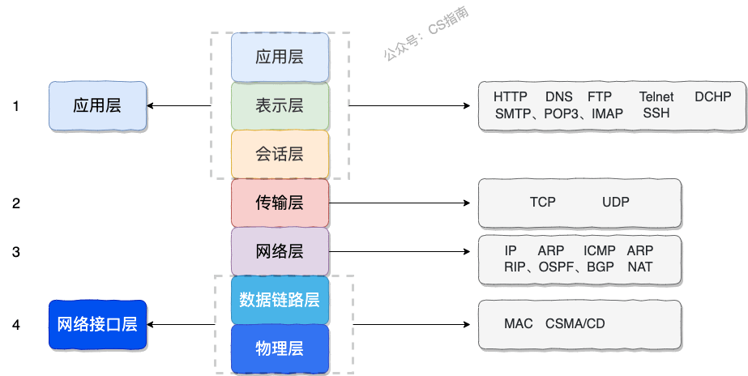

# 1. OSI和TCP/IP网络分层模型

OSI 的七层体系结构概念清楚，理论也很完整，但是它比较复杂而且不实用，而且有些功能在多个层中重复出现。

# 2. 存在OSI为何还会诞生TCP/IP
OSI模型是失败的模型，但是有助于了解网络基础知识。

1. 未能得到商业的推动
2. 体系庞大实现较为复杂，运行效率较低
3. 定制周期长，未能及时抢占市场
4. 层次划分不太合理，功能在多层次出现

# 3. TCP/IP四层模型
TCP/IP是目前被广泛使用的模型，可看成OSI模型的精简版。

**1. 应用层**：主要提供两个终端设备上两个应用的信息交换服务，也就是定义了信息交换格式，交互的数据称为报文。

**应用层常见的协议**：
1. HTTP：超文本传输协议，通过tcp/ip建立连接，是一个无状态协议，一般使用session记录状态。
2. SMTP：简单邮件传输（发送）协议
3. POP3/IMAP：邮件接收协议
4. FTP：文件传输协议，此协议建立两条数据连接，数据控制信息和文件数据两条连接。
5. SSH：安全网络传输协议，主要用于远程登录会话协议，较telnet协议，在传输过程中对数据进行加密。

**2. 传输层**：主要负责两个设备终端之间数据传输提供服务的。

**传输层协议**：
1. TCP：传输控制协议，面向连接的传输协议。
2. UDP：用户数据协议，无连接，尽最大努力传输数据给用户。

**3. 网络层**：负责将数据报文封装打包或分割传输到目标终端上，还负责网络路由选择（送货路线）。

**网络层协议**：
1. IP：网际协议，重要协议之一，主要负责寻址和数据包格式定义，协议分为两种IPv4和IPv6。
2. ARP：地址解析协议，主要负责逻辑地址和物理地址（MAC）之间转换问题。
3. NAT：网络地址转换协议，主要负责广域网WAN和局域网LAN之间地址转换问题。

**4. 网络接口层**：网络接口层可以看成链路层和物理层的合体

主要负责差错检测技术 ，多路访问协议（信道复用技术）等等。

# 4. Https更安全的协议
Https是更安全的超文本传输协议，在http基础上添加了SSL/TLS协议。默认端口为443。

## ①. SSL/TLS核心协议
SSL1.0和2.0版本存在缺陷，在3.0后进行了升级，并更名为TSL。TSL就是在SSL基础上进行升级。

## ②. SSL/TSL原理
核心为非对称加密。数据传输使用的是对称加密。主要传输过程如下：

使用非对称加密对对称加密秘钥进行加密，传输到客户端，客户端通过数字证书验证公钥的可靠性，然后客户端和服务端使用对称加密秘钥进行加解密数据传输。

数字证书验证过程如下：
1. 客户端C，服务端S，证书机构CA
2. C是信任CA的，CA向S颁发证书，并传送私钥加密的摘要。
3. S将颁发的证书和公钥一起发给C。
4. C得到证书用CA公钥进行签名验证得到哈希值，在用S公钥进行哈希运算得到哈希与证书哈希比较，即检验证书的可靠性。
5. 证书验证通过则信任S公钥。

**这是关于 [数字签名和数字证书原理](https://www.bilibili.com/video/BV18N411X7ty/) 的相关视频。**

# 5. Http1.0和Http1.1比较
1. 响应码：1.1较1.0新增了大量的响应码
2. 缓存：1.0缓存：在返回体重有最后一次修改标签和上一次获得资源路径，未修改返回304表示从缓存中拿。1.1添加了更细致控制属性，cache-control。
3. 长短连接：1.0默认短连接，1.1默认长链接。长连接在每次向服务器请求完后不会立刻关闭连接。但是在1.0和1.1中都可以同connection：keep-live/close设置长短连接。
4. Host头：1.0无此头信息，假如向https://www.temp.com/index.html请求，请求行 `GET /index.html HTTP/1.0` 这时`/index.html`就会产生歧义
在1.1之后会在请求头中添加`Host:temp.com`。
5. 带宽优化
   1. 范围请求：1.1之后在请求大文件时可以在请求头重使用Range继续下载被暂停的文件。响应部分数据的请求状态码为206，防止被缓存。
   2. 100状态码：1.1当请求大文件时，服务器可能不想响应，就会返回100状态。当收到100状态也可以继续要求下载大文件。1.0没有这个状态码，只能添加请求`头Expect:100-continue`
   3. 压缩：1.1之后添加更多的压缩选项。

# 6. 常见状态码
## 1XX 信息类状态码：接受的请求正在处理
这类状态码遇见较少，比如100。

## 2XX 成功状态码：请求正常处理完成
- 200 OK: 请求正常处理。
- 201 Created: 请求正常处理，并在服务器上创建新的资源。例如POST请求创建新用户。
- 202 Accepted: 请求已接收到，但还未处理。
- 203 No Content: 请求已处理，但无任何返回。

## 3XX 重定向状态码：需要进行附加操作完成请求
- 301 Moved Permanently: 资源被永远的重定向了。
- 302 Found: 资源被临时重定向。

## 4XX 客户端错误状态码： 服务器无法处理请求
- 400 Bad Request: 请求的HTTP存在问题，例如参数或者请求方法。
- 401 Unauthorized: 未认证却请求需要认证的资源。
- 403 Forbidden: 直接拒绝HTTP请求，防止非法请求。
- 404 Not Found: 请求资源在服务器尚未能找到。
- 409 Conflict: 请求的状态和服务器状态不一致。

## 5XX 服务端错误状态码：服务器处理请求处所出错
- 500 Internal Server Error: 服务端出错，通常是服务端出现bug。
- 501 Bad Gateway: 网关接收到请求装发给服务端，但是服务端返回一个错误响应。

