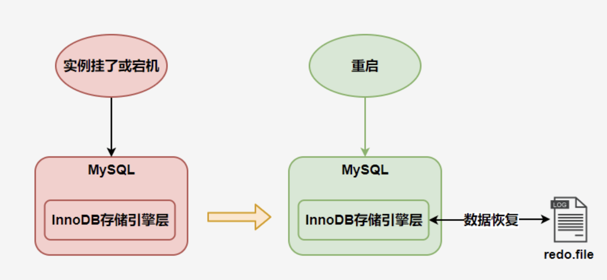
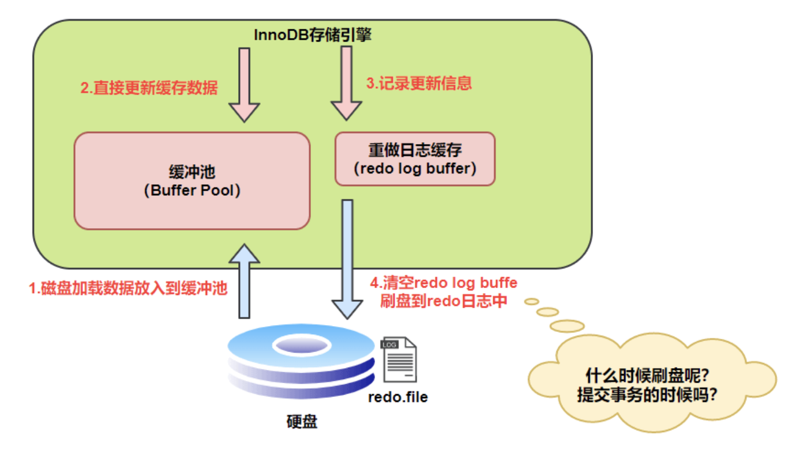
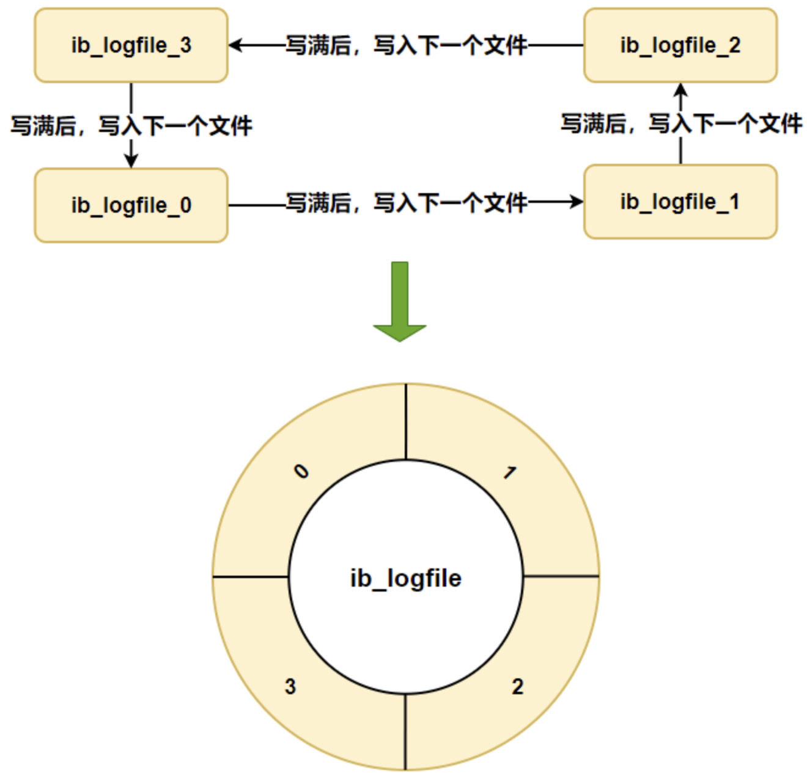
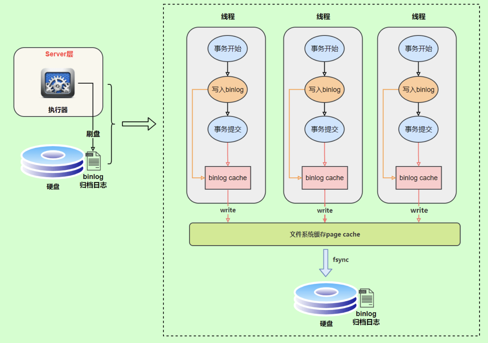
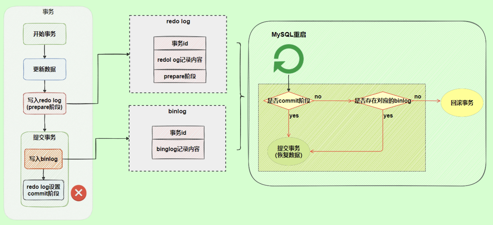

# 1. redo log

> InnoDB日志

## 1.1 作用

记录所有业数据的更改，它是数据库引擎奔溃的保证。
MySQL 实例挂了或宕机了，重启时，InnoDB存储引擎会使用redo log恢复数据，保证数据的持久性与完整性。

## 1.2 redo log 保存操作过程

## 1.3 刷盘时机

1. 设置输盘策略`innodb_flush_log_at_trx_commit`
    1. 0：事务提交不进行刷盘
    2. 1：每次提交进行刷盘
    3. 2：每次事务提交时都只把 redo log buffer 内容写入 page cache
2. 后台固定线程每隔一秒进行刷新
3. 当 redo log buffer 占用的空间即将达到 innodb_log_buffer_size 一半的时候，后台线程会主动刷盘。

## 1.4 日志文件组

硬盘上存储的 redo log 日志文件不只一个，而是以一个日志文件组的形式出现的，每个的redo日志文件大小都是一样的。比如可以配置为一组4个文件，
每个文件的大小是 1GB，整个 redo log 日志文件组可以记录4G的内容。

在个日志文件组中还有两个重要的属性，分别是 write pos、checkpoint

- write pos 是当前记录的位置，一边写一边后移
- checkpoint 是当前要擦除的位置，也是往后推移

# 2. binlog

> 所有引擎日志

## 2.1 作用

记录所有数据更新操作。主要用于数据备份和主从数据的一致性。

## 2.2 记录格式

### statement

说明：sql语句原生保存。
问题：sql存在函数，例如now()函数。

### row

说明：sql语句进行翻译，然后将更改前的行数据一起保存进去。
问题：存储体积较大。

### mixed

说明：以上两种方法混合使用。mysql会进行判断然后选择存储类型。

## 2.3 写入时机

binlog写日志流程：

- 上图的 write，是指把日志写入到文件系统的 page cache，并没有把数据持久化到磁盘，所以速度比较快
- 上图的 fsync，才是将数据持久化到磁盘的操作

可以通过`sync_binlog`参数设置

- 0：表示由系统决定合适写入磁盘。
- 1: 表示每次事务提交后写入。
- `n>1`：表示提交次数达到n后进行写入。

# 3. 两段提交

> 解决日志恢复数据不一致问题。

例如在一个事务中，redolog日志记录了，然后提交，在记录binlog一瞬叫引擎奔溃。重启进行数据恢复是，就会发现只有redolog日志数据，binlog并没有，这就导致数据不一致。

解决办法：
记录redo log时分为两个阶段，事物开始更新数据后记录redo log prepare，提交后记录binlog，然后是redo log commit。

重启恢复是进行判断：

> 回滚日志依赖于undo log