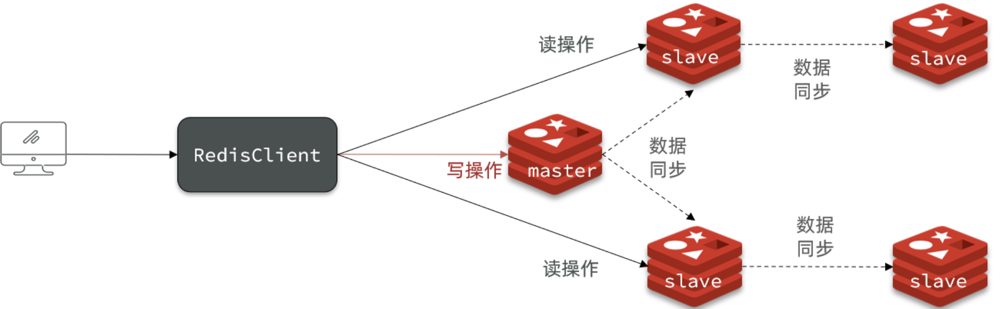

# 1. 持久化

Redis有两种持久化方案：

- RDB持久化
- AOF持久化

## 1.1 RDB

> RDB也被叫做Redis数据快照。简单来说就是把内存中的所有数据都记录到磁盘中。当Redis实例故障重启后，从磁盘读取快照文件，恢复数据。快照文件称为RDB文件，默认是保存在当前运行目录。

### 1.1.1 RDB概述

RDB持久化在四种情况下会执行：

- 执行save命令
- 执行bgsave命令
- Redis停机时
- 触发RDB条件时

save: 命令会导致主进程执行RDB，这个过程中其它所有命令都会被阻塞。只有在数据迁移时可能用到。

bgsave: 这个命令执行后会开启独立进程完成RDB，主进程可以持续处理用户请求，不受影响。

停机时: Redis停机时会执行一次save命令，实现RDB持久化。

RDB触发机制:

```conf
# 900秒内，如果至少有1个key被修改，则执行bgsave ， 如果是save "" 则表示禁用RDB
save 900 1  
save 300 10  
save 60 10000 

# 是否压缩 ,建议不开启，压缩也会消耗cpu，磁盘的话不值钱
rdbcompression yes

# RDB文件名称
dbfilename dump.rdb  

# 文件保存的路径目录
dir ./ 
```

### 1.1.2 RDB原理

> bgsave开始时会fork主进程得到子进程，子进程共享主进程的内存数据。完成fork后读取内存数据并写入 RDB 文件。

fork采用的是copy-on-write技术：

- 当主进程执行读操作时，访问共享内存；
- 当主进程执行写操作时，则会拷贝一份数据，执行写操作。


RDB缺点：

- RDB执行间隔时间长，两次RDB之间写入数据有丢失的风险
- fork子进程、压缩、写出RDB文件都比较耗时

## 1.2 AOF

> AOF全称为Append Only File（追加文件）。Redis处理的每一个写命令都会记录在AOF文件，可以看做是命令日志文件。

### 1.2.1 AOF概述

通过配置AOF：默认是关闭的

```conf
# 是否开启AOF功能，默认是no
appendonly yes
# AOF文件的名称
appendfilename "appendonly.aof"

# 表示每执行一次写命令，立即记录到AOF文件
appendfsync always 
# 写命令执行完先放入AOF缓冲区，然后表示每隔1秒将缓冲区数据写到AOF文件，是默认方案
appendfsync everysec 
# 写命令执行完先放入AOF缓冲区，由操作系统决定何时将缓冲区内容写回磁盘
appendfsync no
```

三种策略比较：


### 1.2.2 AOF重写

> 因为是记录命令，AOF文件会比RDB文件大的多。而且AOF会记录对同一个key的多次写操作，但只有最后一次写操作才有意义。通过执行bgrewriteaof命令，可以让AOF文件执行重写功能，用最少的命令达到相同效果。

相关配置：

```conf
# AOF文件比上次文件 增长超过多少百分比则触发重写
auto-aof-rewrite-percentage 100
# AOF文件体积最小多大以上才触发重写 
auto-aof-rewrite-min-size 64mb 
```

## 1.3 RDB和AOF对比


# 2. Redis主从

> 单节点Redis的并发能力是有上限的，要进一步提高Redis的并发能力，就需要搭建主从集群，实现读写分离。搭建教程 [Redis搭建](./Redis搭建.md)


## 2.1 主从数据同步

### 2.1.1 全量同步


如何判断是否为第一次同步：

- **Replication Id**：简称replid，是数据集的标记，id一致则说明是同一数据集。每一个master都有唯一的replid，slave则会继承master节点的replid
- **offset**
  ：偏移量，随着记录在repl_baklog中的数据增多而逐渐增大。slave完成同步时也会记录当前同步的offset。如果slave的offset小于master的offset，说明slave数据落后于master，需要更新。

> 因为slave原本也是一个master，有自己的replid和offset，当第一次变成slave，与master建立连接时，发送的replid和offset是自己的replid和offset。
>
> master判断发现slave发送来的replid与自己的不一致，说明这是一个全新的slave，就知道要做全量同步了。
>
> master会将自己的replid和offset都发送给这个slave，slave保存这些信息。以后slave的replid就与master一致了。


完整流程描述：

- slave节点请求增量同步
- master节点判断replid，发现不一致，拒绝增量同步
- master将完整内存数据生成RDB，发送RDB到slave
- slave清空本地数据，加载master的RDB
- master将RDB期间的命令记录在repl_baklog，并持续将log中的命令发送给slave
- slave执行接收到的命令，保持与master之间的同步

### 2.1.2 增量同步

> 全量同步需要先做RDB，然后将RDB文件通过网络传输个slave，成本太高了。因此除了第一次做全量同步，其它大多数时候slave与master都是做**增量同步**。


### 2.1.3 repl_backlog原理

master怎么知道slave与自己的数据差异在哪里呢?

这个文件是一个固定大小的数组，只不过数组是环形，也就是说**角标到达数组末尾后，会再次从0开始读写**，这样数组头部的数据就会被覆盖。

repl_baklog中会记录Redis处理过的命令日志及offset，包括master当前的offset，和slave已经拷贝到的offset：


随着不断有数据写入，master的offset逐渐变大，slave也不断的拷贝，追赶master的offset：


直到数组被填满：


此时，如果有新的数据写入，就会覆盖数组中的旧数据。不过，旧的数据只要是绿色的，说明是已经被同步到slave的数据，即便被覆盖了也没什么影响。因为未同步的仅仅是红色部分。

**但是出现网络问题或者从节点服务器问题，导致的长时间宕机。就会导致slave并未增量同步，就出现环形数组填满情况。**


如果此时master出现数据新增就会覆盖未同步的数据。

**repl_backlog大小是有限的，存满后会覆盖最早数据。如果slave断开太久，导致未同步数据被覆盖，则就无法做log数据同步，只能做全量同步。**

## 2.2 主从优化

可以从以下几个方面来优化Redis主从就集群：

- 在master中配置repl-diskless-sync yes启用无磁盘复制，避免全量同步时的磁盘IO。
- Redis单节点上的内存占用不要太大，减少RDB导致的过多磁盘IO
- 适当提高repl_baklog的大小，发现slave宕机时尽快实现故障恢复，尽可能避免全量同步
- 限制一个master上的slave节点数量，如果实在是太多slave，则可以采用主-从-从链式结构，减少master压力



# 3. 哨兵

> Redis提供了哨兵（Sentinel）机制来实现主从集群的自动故障恢复。搭建教程 [Redis搭建](./Redis搭建.md)

## 3.1 哨兵概述


哨兵的作用如下：

- **监控**：Sentinel 会不断检查您的master和slave是否按预期工作
- **自动故障恢复**：如果master故障，Sentinel会将一个slave提升为master。当故障实例恢复后也以新的master为主
- **通知**：Sentinel充当Redis客户端的服务发现来源，当集群发生故障转移时，会将最新信息推送给Redis的客户端

## 3.2 监控原理

Sentinel基于心跳机制监测服务状态，每隔1秒向集群的每个实例发送ping命令：

- 主观下线：如果某sentinel节点发现某实例未在规定时间响应，则认为该实例**主观下线**。
- 客观下线：若超过指定数量（quorum）的sentinel都认为该实例主观下线，则该实例**客观下线**。quorum值最好超过Sentinel实例数量的一半。


## 3.3 恢复原理

一旦发现master故障，sentinel需要在salve中选择一个作为新的master，选择依据是这样的：

- 首先会判断slave节点与master节点断开时间长短，如果超过指定值（down-after-milliseconds * 10）则会排除该slave节点
- 然后判断slave节点的slave-priority值，越小优先级越高，如果是0则永不参与选举
- 如果slave-prority一样，则判断slave节点的offset值，越大说明数据越新，优先级越高
- 最后是判断slave节点的运行id大小，越小优先级越高。

重新选举后切换流程：

- sentinel给备选的slave1节点发送slaveof no one命令，让该节点成为master
- sentinel给所有其它slave发送slaveof 192.168.150.101 7002 命令，让这些slave成为新master的从节点，开始从新的master上同步数据。
- 最后，sentinel将故障节点标记为slave，当故障节点恢复后会自动成为新的master的slave节点


## 3.4 RedisTemplate

> 在Sentinel集群监管下的Redis主从集群，其节点会因为自动故障转移而发生变化，Redis的客户端必须感知这种变化，及时更新连接信息。Spring的RedisTemplate底层利用lettuce实现了节点的感知和自动切换。

引入依赖：

```xml
<!--spring redis 依赖-->
<dependency>
    <groupId>org.springframework.boot</groupId>
    <artifactId>spring-boot-starter-data-redis</artifactId>
</dependency>
```

地址配置：

```yaml
spring:
  redis:
    sentinel:
      master: mymaster
      nodes:
        - 192.168.150.101:27001
        - 192.168.150.101:27002
        - 192.168.150.101:27003
```

配置读写策略：

```java

@Configuare
public class RedisConfig {

    // 略...

    @Bean
    public LettuceClientConfigurationBuilderCustomizer clientConfigurationBuilderCustomizer() {
        return clientConfigurationBuilder -> clientConfigurationBuilder.readFrom(ReadFrom.REPLICA_PREFERRED);
    }
}
```

这个bean中配置的就是读写策略，包括四种：

- MASTER：从主节点读取
- MASTER_PREFERRED：优先从master节点读取，master不可用才读取replica
- REPLICA：从slave（replica）节点读取
- REPLICA _PREFERRED：优先从slave（replica）节点读取，所有的slave都不可用才读取master

# 4. 分片集群

> 主从和哨兵可以解决高可用、高并发读的问题。但是依然有两个问题没有解决：1、海量数据存储问题，2、高并发写的问题。搭建教程 [Redis搭建](./Redis搭建.md)


分片集群特征：

- 集群中有多个master，每个master保存不同数据
- 每个master都可以有多个slave节点
- master之间通过ping监测彼此健康状态
- 客户端请求可以访问集群任意节点，最终都会被转发到正确节点

## 4.1 散列插槽

> Redis会把每一个master节点映射到0~16383共16384个插槽（hash slot）上。

数据key不是与节点绑定，而是与插槽绑定。redis会根据key的有效部分计算插槽值，分两种情况：

- key中包含"{}"，且“{}”中至少包含1个字符，“{}”中的部分是有效部分
- key中不包含“{}”，整个key都是有效部分

**例如：** key是num，那么就根据num计算，如果是{fish}num，则根据fish计算。计算方式是利用CRC16算法得到一个hash值，然后对16384取余，得到的结果就是slot值。

## 4.2 集群伸缩

### 4.2.1 扩展节点

> 现在需要扩展集群master的数量，新增一个master节点。

新增命令：`redis-cli --cluster add-node  192.168.150.101:7004 192.168.150.101:7001`

查看集群节点状态：`redis-cli -p 7001 cluster nodes`

### 4.2.2 分配插槽

> 新分配的节点是没有插槽的，需要手动非配一下。

我们可以将0~3000的插槽从7001转移到7004：

进行7001节点插槽分配：`redis-cli --cluter reshard 127.0.0.1:7001`

询问移动多少插槽：3000


填写目标节点id：`redis-cli -p 7001 cluster nodes`可以查看


询问从哪个节点移动过来的：


- all：代表全部，也就是三个节点各转移一部分
- 具体的id：目标节点的id
- done：没有了

这是一个多选项，最后输入`done`就行了。最后确认转移即可。

## 4.3 RedisTemplate分片集群

配置：

```yaml
spring:
  redis:
    cluster:
      nodes:
        - 192.168.150.101:7001
        - 192.168.150.101:7002
        - 192.168.150.101:7003
        - 192.168.150.101:8001
        - 192.168.150.101:8002
        - 192.168.150.101:8003
```


