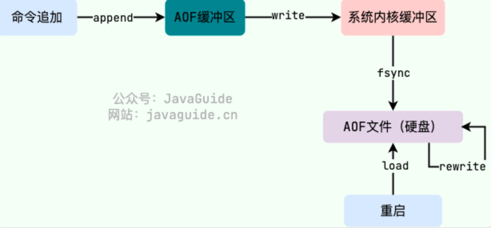

# 1. 什么是Redis

Redis是一个高性能的非关系型的键值对内存数据库，因为使用内存所以速度较传统数据库快很多，也可以对数据进行持久化。支持多种数据类型，这些数据类型可以进行交差集及丰富操作，这些操作是原子性的。

# 2. 数据类型

基础类型：String，List，Zset，Hash，Set。

特殊类型：HyperLogLogs（基数统计）、Bitmap（位存储）、geospatial（地理位置）

## 2.1 String

数据结构：二进制数据，可以存储任意数据。

使用场景：

- 缓存：缓存简单数据，用户信息，图片等。降低持久数据库压力。
- 计数器：单线程模型，多线程操作较为安全。
- session：分布式session。
- 分布式锁

## 2.2 List

数据结构：双向链表（或压缩列表）

扩展用法：

- lpush+lpop=栈
- lpush+rpop=队列
- lpush+ltrim=有限队列
- lpush+brpop=消息队列

使用场景：

- 时间轴：消息发布的先后顺序。
- 消息队列

## 2.3 Set

数据结构：无序集合（散列表）。

使用场景：

- 网站 UV 统计（数据量巨大的场景还是 HyperLogLog更适合一些）、文章点赞、动态点赞等场景。
- 共同好友(交集)、共同粉丝(交集)、共同关注(交集)、好友推荐（差集）、音乐推荐（差集）、订阅号推荐（差集+交集） 等场景
- 抽奖系统、随机点名等场景。

## 2.4 Hash

数据结构：Map集合（散列表）

使用场景：缓存：更为直观的缓存数据，如用户信息等。

## 2.5 Zset

数据结构：有序不重复集合（每个元素关联一个double类型数值进行排序）（跳表）

使用场景：排行榜

## 2.6 HyperLogLogs

数据结构：存储集合数据，此类型重在计算。

使用场景：基数统计（网站IP访问量）

## 2.7 Bitmap

数据结构：一个比特位数据存储，只存在两种状态。

使用场景：用户签到情况、活跃用户情况、用户行为统计

## 2.8 Geospatial

数据结构：经纬度加城市名称。

使用场景：附近的人

# 3. 除了缓存其他用途

分布式锁、消息队列和限流等，redis自带的数据结构可以轻松进行一些计算，例如排行榜、基数计算或坐标计算等。

# 4. 数据过期

## 4.1.如何判断数据是否过期

Redis通过一个叫做过期字典（hash）来判断数据是否过期。

## 4.2.Redis过期数据删除策略

Redis采用的是定期删除+惰性删除。

内存CPU特性定时删除节约内存资源占用高时间换空间定期删除定期随机清理，内存占用一般固定资源占用空间换时间惰性删除内存浪费资源占用较少，利用率高随机抽查、重点抽查

## 4.3.Redis内存淘汰策略

没有足够内存存储新增数据

- volatile-lru：从设置过期时间的数据中删除一段时间中最少使用的数据。
- volatile-random：从设置过期时间的数据中随机删除一些数据。
- volatile-ttl：从设置过期数据的即将过期数据中删除一些数据。
- volatile-lfu：从设置过期时间的数据中删除使用次数最少的数据。
- allkeys-lru：所有数据中删除最近使用最少的数据。
- allkeys-lfu：所有数据中删除使用次数最少的数据。
- no-eviction：直接返回OOM错误。（默认）

# 5.Redis持久化

RDB：通过配置时间，创建内存快照，保存在本地磁盘中。

Redis 提供了两个命令来生成 RDB 快照文件：

- save : 同步保存操作，会阻塞 Redis 主线程；
- bgsave : fork 出一个子进程，子进程执行，不会阻塞 Redis 主线程，默认选项

AOF：将对Redis中数据操作的指令缓存起来，通过配置时间保存到本地磁盘中。

AOF工作流程：



AOF保存策略：

- appendfsync always：操作写命令时，将命令同步到aof文件中，然后刷新到本磁盘中，然后返回。
- appendfsync everysec：每隔一段时间（1秒）执行一次aof保存到本地上。
- appendfsync no：关闭aof功能。

> 4.0后Redis优化持久化，支持混合双打。

# 6. Redis优化

## 6.1什么是Bigkey，存在什么风险，如何发现，解决办法。

bigkey：key对应的val值比较大。

风险：占用内存较大，影响性能。

发现：使用redis自带的参数--bigkeys进行检测或者分析RDB文件。

解决：

- 分割 bigkey
- 手动清理
- 采用合适的数据结构
- 开启 lazy-free（惰性删除/延迟释放）

## 6.2什么是 hotkey？存在什么风险，如何发现，解决办法。

> 如果一个 key 的访问次数比较多且明显多于其他 key 的话，那这个 key 就可以看作是 hotkey。例如在 Redis 实例的每秒处理请求达到
> 5000 次，而其中某个 key 的每秒访问量就高达 2000 次，那这个 key 就可以看作是 hotkey。

风险：占用大量CPU资源，导致redis宕机，从而导致mysql宕机。

发现：使用 Redis 自带的 --hotkeys 参数来查找。

解决：

- 读写分离：主节点处理写请求，从节点处理读请求。
- 使用 Redis Cluster：将热点数据分散存储在多个 Redis 节点上。
- 二级缓存：hotkey 采用二级缓存的方式进行处理，将 hotkey 存放一份到 JVM 本地内存中（可以用 Caffeine）。

## 6.3 使用批量操作减少网络传输

一个 Redis 命令的执行可以简化为以下 4 步：

- 发送命令
- 命令排队
- 命令执行
- 返回结果

其中，第 1 步和第 4 步耗费时间之和称为 Round Trip Time (RTT,往返时间) ，也就是数据在网络上传输的时间。

## 6.4 大量 key 集中过期问题

对于过期 key，Redis 采用的是 定期删除+惰性/懒汉式删除 策略。

## 6.5 慢查询

命令：SLOWLOG GET

我们知道一个 Redis 命令的执行可以简化为以下 4 步：

- 发送命令
- 命令排队
- 命令执行
- 返回结果

  Redis 慢查询统计的是命令执行这一步骤的耗时，慢查询命令也就是那些命令执行时间较长的命令。

## 6.6 内存碎片化

> 分配空间并未全部使用完。

查看：info memory

自动整理：直接通过 config set 命令将 activedefrag 配置项设置为 yes 即可。

具体什么时候清理需要通过下面两个参数控制：

```
# 内存碎片占用空间达到 500mb 的时候开始清理
config set active-defrag-ignore-bytes 500mb
# 内存碎片率大于 1.5 的时候开始清理
config set active-defrag-threshold-lower 50
```

不影响redis性能配置以下参数：

```
# 内存碎片清理所占用 CPU 时间的比例不低于 20%
config set active-defrag-cycle-min 20
# 内存碎片清理所占用 CPU 时间的比例不高于 50%
config set active-defrag-cycle-max 50
```

# 7. 生产环境常见问题

## 7.1缓存穿透

缓存穿透说简单点就是大量请求的 key 是不合理的，根本不存在于缓存中，也不存在于数据库中
。这就导致这些请求直接到了数据库上，根本没有经过缓存这一层，对数据库造成了巨大的压力，可能直接就被这么多请求弄宕机了。

解决办法：使用布隆过滤

将所有可能出现的值存入过滤器中，当用户发来请求时，判断是否存在，不存在直接返回错误，否则继续查缓存查数据库的步骤。

## 7.2缓存击穿

缓存击穿中，请求的 key 对应的是 热点数据 ，该数据 存在于数据库中，但不存在于缓存中（通常是因为缓存中的那份数据已经过期）
。这就可能会导致瞬时大量的请求直接打到了数据库上，对数据库造成了巨大的压力，可能直接就被这么多请求弄宕机了。

解决办法：设置热数据永不过期或者过期时间比较长。

将其存入缓存中并设置合理的过期时间比如秒杀场景下的数据在秒杀结束之前不过期。
请求数据库写数据到缓存之前，先获取互斥锁，保证只有一个请求会落到数据库上，减少数据库的压力。

## 7.3缓存雪崩

缓存在同一时间大面积的失效，导致大量的请求都直接落到了数据库上，对数据库造成了巨大的压力。
这就好比雪崩一样，摧枯拉朽之势，数据库的压力可想而知，可能直接就被这么多请求弄宕机了。

解决办法：

- 针对 Redis 服务不可用的情况：
    - 采用 Redis 集群，避免单机出现问题整个缓存服务都没办法使用。
    - 限流，避免同时处理大量的请求。
- 针对热点缓存失效的情况：
    - 设置不同的失效时间比如随机设置缓存的失效时间。
    - 设置二级缓存。

# 8. 缓存和数据库一致性

## 8.1 旁路缓存模式

## 8.2 读写穿透

## 8.3 异步缓存读写


