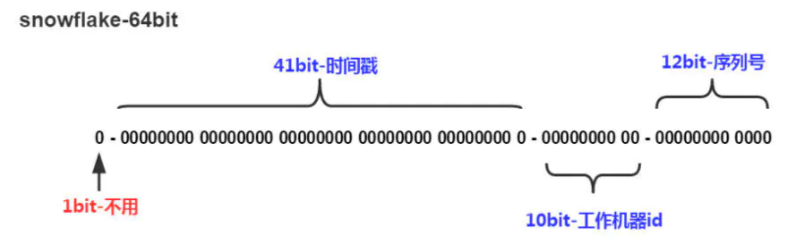

# 1. 分布式Id

> 当数据量较大时，单机就难以承受，这时就需要多机器来分担，如果Id再使用自增就会出现冲突问题。

## 1.1 雪花算法

> 雪花算法(SnowFlake),是Twitter官方给出的算法实现 是用Scala写的。其生成的结果是一个64bit大小整数。

1. 1bit,不用,因为二进制中最高位是符号位，1表示负数，0表示正数。生成的id一般都是用整数，所以最高位固定为0。 2. 41bit-时间戳，用来记录时间戳，毫秒级。
2. 10bit-工作机器id，用来记录工作机器id,其中高位5bit是数据中心ID其取值范围0-31，低位5bit是工作节点ID其取值范围0-31，两个组合起来最多可以容纳1024个节点。
3. 序列号占用12bit，每个节点每毫秒0开始不断累加，最多可以累加到4095，一共可以产生4096个ID。

# 2. 分布式缓存
