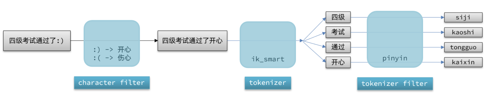
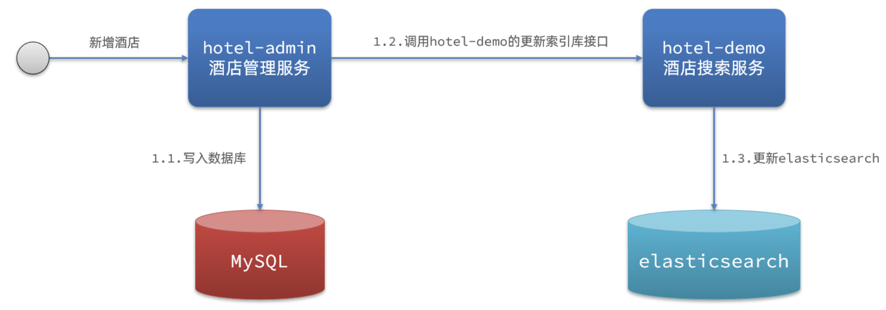
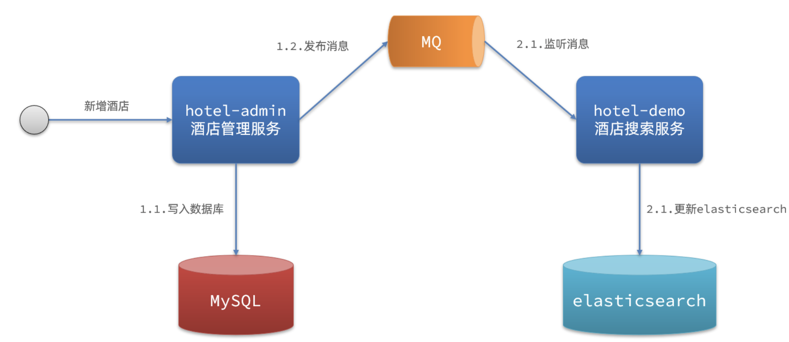
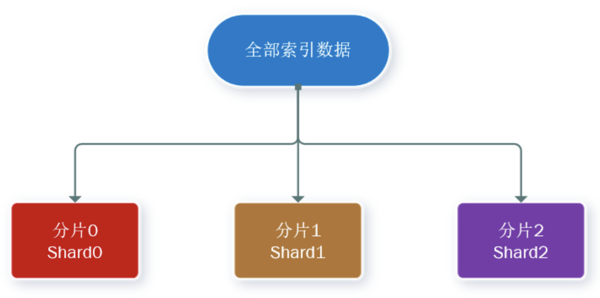
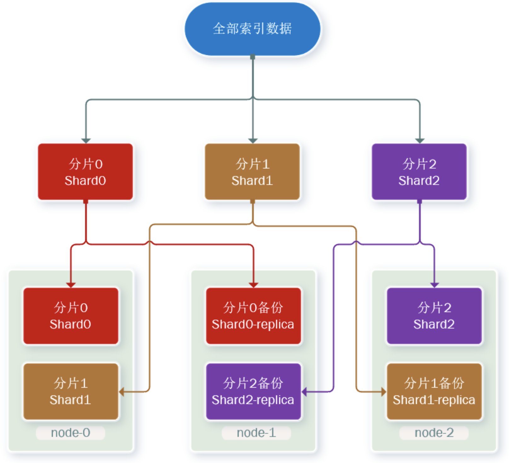
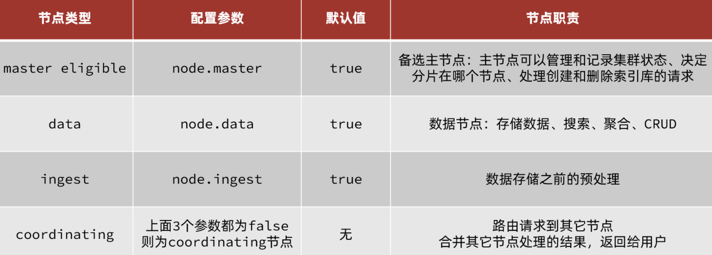
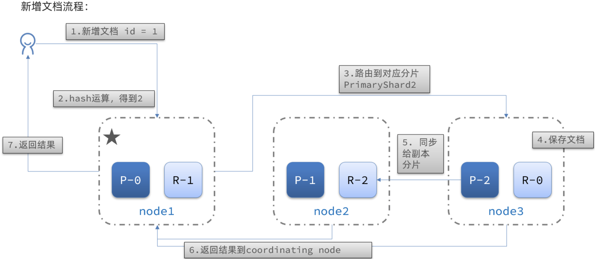
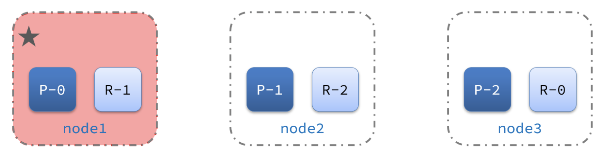
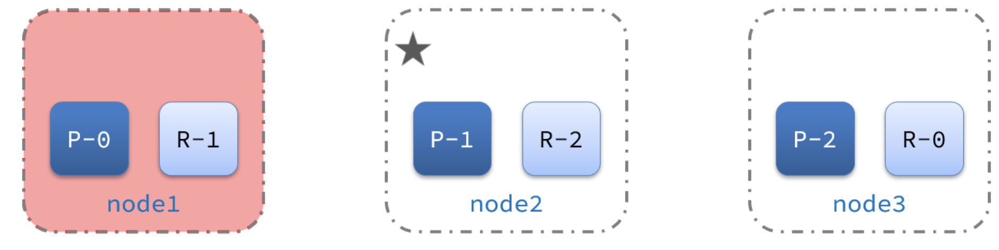
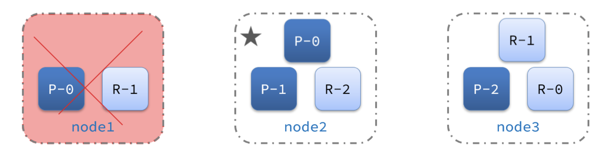

# 1. 概述

> elasticsearch是一款非常强大的开源搜索引擎，具备非常多强大功能，可以帮助我们从海量数据中快速找到需要的内容

倒排索引概念。

与Mysqlg概念相比：

| **MySQL** | **Elasticsearch** | **说明**                                                     |
| --------- | ----------------- | ------------------------------------------------------------ |
| Table     | Index             | 索引(index)，就是文档的集合，类似数据库的表(table)           |
| Row       | Document          | 文档（Document），就是一条条的数据，类似数据库中的行（Row），文档都是JSON格式 |
| Column    | Field             | 字段（Field），就是JSON文档中的字段，类似数据库中的列（Column） |
| Schema    | Mapping           | Mapping（映射）是索引中文档的约束，例如字段类型约束。类似数据库的表结构（Schema） |
| SQL       | DSL               | DSL是elasticsearch提供的JSON风格的请求语句，用来操作elasticsearch，实现CRUD |

# 2. 安装

## 2.1 单机安装

见CSDN博客：[安装ES和Kibana](https://blog.csdn.net/boling_cavalry/article/details/125196035)

## 2.2 集群安装

> 部署es集群可以直接使用docker-compose来完成

docker-compose文件:
```yaml
version: '2.2'

services:
  es01:
    image: elasticsearch:7.17.7
    container_name: es01
    environment:
      - node.name=es01
      - cluster.name=es-docker-cluster
      - discovery.seed_hosts=es02,es03
      - cluster.initial_master_nodes=es01,es02,es03
      - "ES_JAVA_OPTS=-Xms512m -Xmx512m"
    volumes: 
      - /Users/yujiangzhong/DockerData/EsCluster/es01/data:/usr/share/elasticsearch/data
      - /Users/yujiangzhong/DockerData/EsCluster/es01/plugin:/usr/share/elasticsearch/plugins
    ports:
      - 9201:9200
    networks:
      - elastic
  es02:
    image: elasticsearch:7.17.7
    container_name: es02
    environment:
      - node.name=es02
      - cluster.name=es-docker-cluster
      - discovery.seed_hosts=es01,es03
      - cluster.initial_master_nodes=es01,es02,es03
      - "ES_JAVA_OPTS=-Xms512m -Xmx512m"
    volumes:
      - /Users/yujiangzhong/DockerData/EsCluster/es02/data:/usr/share/elasticsearch/data
      - /Users/yujiangzhong/DockerData/EsCluster/es02/plugin:/usr/share/elasticsearch/plugins
    ports:
      - 9202:9200
    networks:
      - elastic
  es03:
    image: elasticsearch:7.17.7
    container_name: es03
    environment:
      - node.name=es03
      - cluster.name=es-docker-cluster
      - discovery.seed_hosts=es01,es02
      - cluster.initial_master_nodes=es01,es02,es03
      - "ES_JAVA_OPTS=-Xms512m -Xmx512m"
    volumes:
      - /Users/yujiangzhong/DockerData/EsCluster/es03/data:/usr/share/elasticsearch/data
      - /Users/yujiangzhong/DockerData/EsCluster/es03/plugin:/usr/share/elasticsearch/plugins
    networks:
      - elastic
    ports:
      - 9203:9200

networks:
  elastic:
    driver: bridge
```

文件目录执行：`docker-compose buid -d`等待启动即可

**kibana对集群不是太友好，官网推荐：** [Cerebro](https://github.com/lmenezes/cerebro)

设置分片和副本数：
```json
PUT /itcast
{
  "settings": {
    "number_of_shards": 3, // 分片数量
    "number_of_replicas": 1 // 副本数量
  },
  "mappings": {
    "properties": {
      // mapping映射定义 ...
    }
  }
}
```

# 3. 数据定义操作

## 3.1 索引库操作

> 索引库就类似数据库表，mapping映射就类似表的结构。

### 3.1.2 mapping

> 类似数据库的约束，或者说是类型也可以。

- type：字段数据类型，常见的简单类型有：
    - 字符串：text（可分词的文本）、keyword（精确值，例如：品牌、国家、ip地址）
    - 数值：long、integer、short、byte、double、float、
    - 布尔：boolean
    - 日期：date
    - 对象：object
- index：是否创建索引，默认为true
- analyzer：使用哪种分词器
- properties：该字段的子字段

### 3.1.2 索引库CRUD

#### 3.1.2.1 创建索引库

> 类似Mysql一样，创建表需要通过描述文本加一些类型和约束等。

**基本语法：**

- 请求方式：PUT
- 请求路径：/索引库名，可以自定义
- 请求参数：mapping映射

```json
/*格式*/
PUT /索引库名称
{
  "mappings": {
    "properties": {
      "字段名": {
        "type": "text",
        "analyzer": "ik_smart"
      },
      "字段名2": {
        "type": "keyword",
        "index": "false"
      },
      "字段名3": {
        "properties": {
          "子字段": {
            "type": "keyword"
          }
        }
      }
    }
  }
}
```

```json
/*示例*/
PUT /mall
{
  "mappings": {
    "properties": {
      "info": {
        "type": "text",
        "analyzer": "ik_smart"
      },
      "age": {
        "type": "int"
      },
      "email": {
        "type": "keyword",
        "index": "false"
      },
      "name": {
        "properties": {
          "firstName": {
            "type": "keyword"
          },
          "lastName": {
            "type": "keyword"
          }
        }
      }
    }
  }
}
```

#### 3.1.2.2 查询索引库

**基本语法**：

- 请求方式：GET
- 请求路径：/索引库名
- 请求参数：无

示例：`GET /mall`

#### 3.1.2.3 修改索引库

> 索引库一旦创建就不能修改，所以一般不会修改。但是可以添加mapping。

语法：

```json
PUT /索引库名/_mapping
{
  "properties": {
    "新字段名": {
      "type": "integer"
    }
  }
}
```

示例：

```json
put /mall/_mapping
{
  "properties": {
    "sex": {
      "type": "text"
    }
  }
}
```

#### 3.1.2.4 删除索引库

**语法：**

- 请求方式：DELETE
- 请求路径：/索引库名
- 请求参数：无

示例：`DELETE /mall`

## 3.2 文档操作

### 3.2.1 新增文档

```json
POST /索引库名/_doc/文档id
{
  "字段1": "值1",
  "字段2": "值2",
  "字段3": {
    "子属性1": "值3",
    "子属性2": "值4"
  }
  // ...
}
```
示例：
```json
POST /mall/_doc/1
{
  "sex":"wman",
  "age":18,
  "email":"wmanfish@email.com",
  "info":"CEO",
  "name":{
    "firstName":"fish",
    "lastName":"stack"
  }
}
```

### 3.2.2 查询文档

语法：`GET /{索引库名称}/_doc/{id}`

示例：`GET /mall/_doc/1`


### 3.2.3 修改文档

#### 3.2.3.1 全量修改文档

```json
PUT /{索引库名}/_doc/文档id
{
    "字段1": "值1",
    "字段2": "值2",
    // ... 略
}
```

示例：
```json
PUT /mall/_doc/1
{
  "sex":"wman",
  "age":20,
  "email":"fish@email.com",
  "info":"CEO",
  "name":{
    "firstName":"fish1",
    "lastName":"stack2"
  }
}
```

> 存在即修改，不存在就新增

#### 3.2.3.1 增量修改文档

> 只修改部分字段
语法
```json
POST /{索引库名}/_update/文档id
{
    "doc": {
         "字段名": "新的值",
    }
}
```

```json
POST /mall/_update/1
{
  "doc": {
    "age": 28
  }
}
```

### 3.2.4 删除文档

语法：`DELETE /{索引库名}/_doc/id值`

示例：`DELETE /mall/_doc/1`


# 4. RestApi增删改

> es官网提供了各种语言的客户端

[官网文档](https://www.elastic.co/guide/en/elasticsearch/client/index.html)

添加依赖：
```xml
<dependency>
    <groupId>org.elasticsearch.client</groupId>
    <artifactId>elasticsearch-rest-high-level-client</artifactId>
</dependency>
```

## 4.1 RestClient索引库操作

### 4.1.1 创建索引库

```java

@Slf4j
public class ElasticRestTest {

  String index = "{" +
          "  \"mappings\": {" +
          "    \"properties\": {" +
          "      \"id\": {" +
          "        \"type\": \"keyword\"" +
          "      }," +
          "      \"name\":{" +
          "        \"type\": \"text\"," +
          "        \"analyzer\": \"ik_max_word\"," +
          "        \"copy_to\": \"all\"" +
          "      }," +
          "      \"address\":{" +
          "        \"type\": \"keyword\"," +
          "        \"index\": false" +
          "      }," +
          "      \"price\":{" +
          "        \"type\": \"integer\"" +
          "      }," +
          "      \"score\":{" +
          "        \"type\": \"integer\"" +
          "      }," +
          "      \"brand\":{" +
          "        \"type\": \"keyword\"," +
          "        \"copy_to\": \"all\"" +
          "      }," +
          "      \"city\":{" +
          "        \"type\": \"keyword\"," +
          "        \"copy_to\": \"all\"" +
          "      }," +
          "      \"all\":{" +
          "        \"type\": \"text\"," +
          "        \"analyzer\": \"ik_max_word\"" +
          "      }" +
          "    }" +
          "  }" +
          "}";

  private RestHighLevelClient client;

  @BeforeEach
  void setUp() {
    this.client = new RestHighLevelClient(RestClient.builder(
            HttpHost.create("http://127.0.0.1:9200")
    ));
  }

  @AfterEach
  void tearDown() throws IOException {
    this.client.close();
  }

  // 创建索引库
  @Test
  void createHotelIndex() throws IOException {
    // 1.创建Request对象
    CreateIndexRequest request = new CreateIndexRequest("mall");
    // 2.准备请求的参数：DSL语句
    request.source(index, XContentType.JSON);
    // 3.发送请求
    client.indices().create(request, RequestOptions.DEFAULT);
  }
}
```

### 4.1.2 删除索引库

```java

public class ElasticRestTest {
    private RestHighLevelClient client;

    @BeforeEach
    void setUp() {
        this.client = new RestHighLevelClient(RestClient.builder(
                HttpHost.create("http://127.0.0.1:9200")
        ));
    }

    @AfterEach
    void tearDown() throws IOException {
        this.client.close();
    }

    // 删除索引
    @Test
    void testDeleteHotelIndex() throws IOException {
        // 1.创建Request对象
        DeleteIndexRequest request = new DeleteIndexRequest("mall");
        // 2.发送请求
        client.indices().delete(request, RequestOptions.DEFAULT);
    }
}

```

### 4.1.3 判断索引库是否

```java
public class ElasticRestTest {
  private RestHighLevelClient client;

  @BeforeEach
  void setUp() {
    this.client = new RestHighLevelClient(RestClient.builder(
            HttpHost.create("http://127.0.0.1:9200")
    ));
  }

  @AfterEach
  void tearDown() throws IOException {
    this.client.close();
  }

  // 判断索引库是否存在
  @Test
  void testExistsHotelIndex() throws IOException {
    // 1.创建Request对象
    GetIndexRequest request = new GetIndexRequest("mall");
    // 2.发送请求
    boolean exists = client.indices().exists(request, RequestOptions.DEFAULT);
    // 3.输出
    System.err.println(exists ? "索引库已经存在！" : "索引库不存在！");
  }
}
```

## 4.2 RestClient操作文档

### 4.2.1 新增文档

```java
public class SearchDocClientTest {
    private RestHighLevelClient client;

    @BeforeEach
    void setUp() {
        this.client = new RestHighLevelClient(RestClient.builder(
                HttpHost.create("http://127.0.0.1:9200")
        ));
    }

    @AfterEach
    void tearDown() throws IOException {
        this.client.close();
    }

    // 新增doc
    @Test
    void testAddDocument() throws IOException {
        // 1.根据id查询酒店数据
        Hotel hotel = new Hotel();
        hotel.setId(1234);
        hotel.setAddress("上海市浦东新区");
        hotel.setName("如家豪华酒店");
        hotel.setCity("上海");
        hotel.setBrand("如家");
        hotel.setPrice(589d);
        hotel.setScore(8);

        // 3.将Hotel转json
        String json = new ObjectMapper().writeValueAsString(hotel);

        // 1.准备Request对象
        IndexRequest request = new IndexRequest("mall").id(hotel.getId().toString());
        // 2.准备Json文档
        request.source(json, XContentType.JSON);
        // 3.发送请求
        client.index(request, RequestOptions.DEFAULT);
    }

}
```

### 4.2.2 查询文档

```java
public class SearchDocClientTest {
    private RestHighLevelClient client;

    @BeforeEach
    void setUp() {
        this.client = new RestHighLevelClient(RestClient.builder(
                HttpHost.create("http://127.0.0.1:9200")
        ));
    }

    @AfterEach
    void tearDown() throws IOException {
        this.client.close();
    }

    @Test
    public void getDoc() throws IOException {
        GetRequest getRequest = new GetRequest("mall","1234");

        GetResponse documentFields = client.get(getRequest, RequestOptions.DEFAULT);

        String sourceAsString = documentFields.getSourceAsString();

        Hotel hotel = new ObjectMapper().readValue(sourceAsString, Hotel.class);

        System.out.println(hotel);
    }

}

```

### 4.2.3 删除文档

```java
public class SearchDocClientTest {
    private RestHighLevelClient client;

    @BeforeEach
    void setUp() {
        this.client = new RestHighLevelClient(RestClient.builder(
                HttpHost.create("http://127.0.0.1:9200")
        ));
    }

    @AfterEach
    void tearDown() throws IOException {
        this.client.close();
    }

    @Test
    public void deleteDoc() throws IOException {
        DeleteRequest deleteRequest = new DeleteRequest("mall", "1234");

        DeleteResponse delete = client.delete(deleteRequest, RequestOptions.DEFAULT);

        System.out.println(delete.status());
    }

}
```


### 4.2.4 修改文档

全量修改和新增修改只有一个API，是根据id进行判断的。

```java
public class SearchDocClientTest {
    private RestHighLevelClient client;

    @BeforeEach
    void setUp() {
        this.client = new RestHighLevelClient(RestClient.builder(
                HttpHost.create("http://127.0.0.1:9200")
        ));
    }

    @AfterEach
    void tearDown() throws IOException {
        this.client.close();
    }

    @Test
    public void updateDoc() throws IOException {
        UpdateRequest update = new UpdateRequest("mall", "1234");

        update.doc(
                "price", 399.9
        );

        UpdateResponse response = client.update(update, RequestOptions.DEFAULT);

        System.out.println(response.status());
    }
}
```

## 4.3 批量操作文档

### 4.3.1 批量新增

```java
public class SearchDocClientTest {
    private RestHighLevelClient client;

    @BeforeEach
    void setUp() {
        this.client = new RestHighLevelClient(RestClient.builder(
                HttpHost.create("http://127.0.0.1:9200")
        ));
    }

    @AfterEach
    void tearDown() throws IOException {
        this.client.close();
    }

    @Test
    public void bulkAddDoc() throws IOException {
        List<Hotel> list = new ArrayList<>();
        for (int i = 0; i < 10; i++) {
            Hotel hotel = new Hotel();
            hotel.setId(1 + i);
            hotel.setAddress("上海市浦东新区" + i);
            hotel.setName("如家豪华酒店" + i);
            hotel.setCity("上海" + i);
            hotel.setBrand("如家" + i);
            hotel.setPrice(589.9d + i);
            hotel.setScore(i);
            list.add(hotel);
        }

        BulkRequest bulkRequest = new BulkRequest();

        ObjectMapper objectMapper = new ObjectMapper();

        for (Hotel hotel : list) {
            bulkRequest.add(
                    new IndexRequest("mall")
                            .id(hotel.getId().toString())
                            .source(objectMapper.writeValueAsString(hotel), XContentType.JSON)
            );
        }

        client.bulk(bulkRequest, RequestOptions.DEFAULT);
    }
}

```

### 4.3.2 批量修改

```java
public class SearchDocClientTest {
  private RestHighLevelClient client;

  @BeforeEach
  void setUp() {
    this.client = new RestHighLevelClient(RestClient.builder(
            HttpHost.create("http://127.0.0.1:9200")
    ));
  }

  @AfterEach
  void tearDown() throws IOException {
    this.client.close();
  }

  @Test
  public void bulkUpdateDoc() throws IOException {
    List<Hotel> list = new ArrayList<>();
    for (int i = 0; i < 10; i++) {
      Hotel hotel = new Hotel();
      hotel.setId(1 + i);
      hotel.setPrice(299.9d + i);
      list.add(hotel);
    }

    BulkRequest bulkRequest = new BulkRequest();

    for (Hotel hotel : list) {
      bulkRequest.add(
              new UpdateRequest("mall", hotel.getId().toString())
                      .doc(
                              "price", hotel.getPrice()
                      )
      );
    }
    client.bulk(bulkRequest, RequestOptions.DEFAULT);
  }
}
```

### 4.3.3 批量删除

```java
public class SearchDocClientTest {
  private RestHighLevelClient client;

  @BeforeEach
  void setUp() {
    this.client = new RestHighLevelClient(RestClient.builder(
            HttpHost.create("http://127.0.0.1:9200")
    ));
  }

  @AfterEach
  void tearDown() throws IOException {
    this.client.close();
  }

  @Test
  public void bulkDeleteDoc() throws IOException {
    List<Hotel> list = new ArrayList<>();
    for (int i = 0; i < 10; i++) {
      Hotel hotel = new Hotel();
      hotel.setId(1 + i);
      hotel.setPrice(299.9d + i);
      list.add(hotel);
    }

    BulkRequest bulkRequest = new BulkRequest();

    for (Hotel hotel : list) {
      bulkRequest.add(
              new DeleteRequest("mall").id(hotel.getId().toString())
      );
    }

    client.bulk(bulkRequest, RequestOptions.DEFAULT);
  }
}
```

# 5. DSL查询

常见查询类型：

- **查询所有**：查询出所有数据，一般测试用。例如：match_all
- **全文检索（full text）查询**：利用分词器对用户输入内容分词，然后去倒排索引库中匹配。例如：
  - match_query
  - multi_match_query
- **精确查询**：根据精确词条值查找数据，一般是查找keyword、数值、日期、boolean等类型字段。例如：
  - ids
  - range
  - term
- **地理（geo）查询**：根据经纬度查询。例如：
  - geo_distance
  - geo_bounding_box
- **复合（compound）查询**：复合查询可以将上述各种查询条件组合起来，合并查询条件。例如：
  - bool
  - function_score


基本查询语法：

```json
GET /indexName/_search
{
  "query": {
    "查询类型": {
      "查询条件": "条件值"
    }
  }
}
```

查询所有：无需参数
```json
// 查询所有
GET /mall/_search
{
  "query": {
    "match_all": {}
  }
}
```

## 5.1 全文检索查询

> 根据用户输入内容，进行分层，然后查询内容。所有被查询字段是可以分词的类型Text


基本语法：

- match：单字段查询
- multi_match：多字段查询，任意一个字段符合条件就算符合查询条件

match：
```json
GET /indexName/_search
{
  "query": {
    "match": {
      "FIELD": "TEXT"
    }
  }
}
```

multi_match:
```json
GET /indexName/_search
{
  "query": {
    "multi_match": {
      "query": "TEXT",
      "fields": ["FIELD1", " FIELD12"]
    }
  }
}
```

## 5.2 精确查询

精确查询一般是查找keyword、数值、日期、boolean等类型字段。所以**不会**对搜索条件分词。常见的有：

- term：根据词条精确值查询
- range：根据值的范围查询

### 5.2.1 term

```json
// term查询语法
GET /indexName/_search
{
  "query": {
    "term": {
      "FIELD": {
        "value": "VALUE"
      }
    }
  }
}
```

```json
GET /mall/_search
{
  "query": {
    "term": {
      "city":"上海"
    }
  }
}
```

### 5.2.2 range

```json
// range查询语法
GET /indexName/_search
{
  "query": {
    "range": {
      "FIELD": {
        "gte": 10, // 这里的gte代表大于等于，gt则代表大于
        "lte": 20 // lte代表小于等于，lt则代表小于
      }
    }
  }
}
```

```json
GET /mall/_search
{
  "query": {
    "range": {
      "score": {
        "gte": 3, 
        "lte": 5 
      }
    }
  }
}
```

## 5.2 地标查询

> 使用地标查询需要坐标字段

```json
// geo_bounding_box查询，这是矩形查询，通过两个点确定范文，在范文内既符合调价
GET /indexName/_search
{
  "query": {
    "geo_bounding_box": {
      "FIELD": {
        "top_left": { // 左上点
          "lat": 31.1,
          "lon": 121.5
        },
        "bottom_right": { // 右下点
          "lat": 30.9,
          "lon": 121.7
        }
      }
    }
  }
}
```

```json
// geo_distance 查询，以一点为圆心，指定半径画圆，在园内的符合条件
GET /indexName/_search
{
  "query": {
    "geo_distance": {
      "distance": "15km", // 半径
      "FIELD": "31.21,121.5" // 圆心
    }
  }
}
```

## 5.3 复合查询

合（compound）查询：复合查询可以将其它简单查询组合起来，实现更复杂的搜索逻辑。常见的有两种：

- fuction score：算分函数查询，可以控制文档相关性算分，控制文档排名
- bool query：布尔查询，利用逻辑关系组合多个其它的查询，实现复杂搜索


### 5.3.1 算法函数查询

> 当我们利用match查询时，文档结果会根据与搜索词条的关联度打分（_score），返回结果时按照分值降序排列。

语法：
```json
GET /indexName/_search
{
  "query": {
    "function_score": {
      "query": {...},
      "functions": [
        {
          "filter": {
            "term": {
              "brand": "如家5"
            }
          },
          "weight": 10
        }
      ],
      "boost_mode": "sum"
    }
  }
}
```


- **2原始查询**条件：query部分，基于这个条件搜索文档，并且基于BM25算法给文档打分，**原始算分**（query score)
- **3过滤条件**：filter部分，符合该条件的文档才会重新算分
- **4算分函数**：符合filter条件的文档要根据这个函数做运算，得到的**函数算分**（function score），有四种函数
  - weight：函数结果是常量
  - field_value_factor：以文档中的某个字段值作为函数结果
  - random_score：以随机数作为函数结果
  - script_score：自定义算分函数算法
- **5运算模式**：算分函数的结果、原始查询的相关性算分，两者之间的运算方式，包括：
  - multiply：相乘
  - replace：用function score替换query score
  - 其它，例如：sum、avg、max、min


```json
GET /mall/_search
{
  "query": {
    "function_score": {
      "query": {
        "match": {
          "all": "酒店"
        }
      },
      "functions": [
        {
          "filter": {
            "term": {
              "brand": "如家5"
            }
          },
          "weight": 10
        }
      ],
      "boost_mode": "sum"
    }
  }
}
```
过程：
- 查询复合是"酒店"的内容
- 对查询结果进行过滤，过滤条件是`brand="如家5"`的商家
- 重新进行算分，或者直接赋值`"weight": 10`
- 重新算分后的结果与原分的操作，直接相加`"boost_mode": "sum"`

### 5.3.2 布尔查询

布尔查询是一个或多个查询子句的组合，每一个子句就是一个**子查询**。子查询的组合方式有：

- must：必须匹配每个子查询，类似“与”
- should：选择性匹配子查询，类似“或”
- must_not：必须不匹配，**不参与算分**，类似“非”
- filter：必须匹配，**不参与算分**

示例：
```json
GET /hotel/_search
{
  "query": {
    "bool": {
      "must": [
        {"term": {"city": "上海" }}
      ],
      "should": [
        {"term": {"brand": "皇冠假日" }},
        {"term": {"brand": "华美达" }}
      ],
      "must_not": [
        { "range": { "price": { "lte": 500 } }}
      ],
      "filter": [
        { "range": {"score": { "gte": 45 } }}
      ]
    }
  }
}
```

# 6. 结果文档处理

## 6.1 排序

> ES默认是根据相关度算分（_score）来排序，但是也支持自定义方式对搜索 [结果排序](https://www.elastic.co/guide/en/elasticsearch/reference/current/sort-search-results.html) 。
> 可以排序字段类型有：keyword类型、数值类型、地理坐标类型、日期类型等。

### 6.1.1 普通字段

```json
GET /indexName/_search
{
  "query": {
    "match_all": {}
  },
  "sort": [
    {
      "FIELD": "desc"  // 排序字段、排序方式ASC、DESC
    }
  ]
}
```

### 6.1.2 地理坐标排序
```json
GET /indexName/_search
{
  "query": {
    "match_all": {}
  },
  "sort": [
    {
      "_geo_distance" : {
          "FIELD" : "纬度，经度", // 文档中geo_point类型的字段名、目标坐标点
          "order" : "asc", // 排序方式
          "unit" : "km" // 排序的距离单位
      }
    }
  ]
}
```

## 6.2 分页

> ES 默认情况下只返回top10的数据。而如果要查询更多数据就需要修改分页参数.

```json
GET /indexName/_search
{
  "query": {
    "match_all": {}
  },
  "from": 0, // 分页开始的位置，默认为0
  "size": 10, // 期望获取的文档总数
  "sort": [...]
}
```

> ES的分页存在问题，例如查询990~1000的数据，此时ES会查询前1000条数据，然后返回。如果是集群，多个节点都查询前1000条数据，然后再集中再返回。
> 由此可看ES的深度分页是很糟糕的。官方给了以下建议即解决方案：

- `from + size`：
  - 优点：支持随机翻页
  - 缺点：深度分页问题，默认查询上限（from + size）是10000
  - 场景：百度、京东、谷歌、淘宝这样的随机翻页搜索
- `after search`：
  - 优点：没有查询上限（单次查询的size不超过10000）
  - 缺点：只能向后逐页查询，不支持随机翻页
  - 场景：没有随机翻页需求的搜索，例如手机向下滚动翻页
- `scroll`：
  - 优点：没有查询上限（单次查询的size不超过10000）
  - 缺点：会有额外内存消耗，并且搜索结果是非实时的
  - 场景：海量数据的获取和迁移。从ES7.1开始不推荐，建议用 after search方案。

### 6.2.1 search after

示例
```json
// 查询第一页，每页三个值
GET /mall/_search
{
  "query": {
    "match_all": {}
  },
  "sort": [
    {
      "score": {
        "order": "desc"
      }
    }
  ],
  "from": 0,
  "size": 3
}
```

以上查询结果：
```json
{
  "took" : 0,
  "timed_out" : false,
  "_shards" : {
    "total" : 1,
    "successful" : 1,
    "skipped" : 0,
    "failed" : 0
  },
  "hits" : {
    "total" : {
      "value" : 11,
      "relation" : "eq"
    },
    "max_score" : null,
    "hits" : [
      {
        "_index" : "mall",
        "_type" : "_doc",
        "_id" : "10",
        "_score" : null,
        "_source" : {
          "id" : 10,
          "name" : "如家豪华酒店9",
          "address" : "上海市浦东新区9",
          "price" : 598.9,
          "score" : 9,
          "brand" : "如家9",
          "city" : "上海9"
        },
        "sort" : [
          9
        ]
      },
      {
        "_index" : "mall",
        "_type" : "_doc",
        "_id" : "9",
        "_score" : null,
        "_source" : {
          "id" : 9,
          "name" : "如家豪华酒店8",
          "address" : "上海市浦东新区8",
          "price" : 597.9,
          "score" : 8,
          "brand" : "如家8",
          "city" : "上海8"
        },
        "sort" : [
          8
        ]
      },
      {
        "_index" : "mall",
        "_type" : "_doc",
        "_id" : "1234",
        "_score" : null,
        "_source" : {
          "id" : 1234,
          "name" : "如家豪华酒店",
          "address" : "上海市浦东新区",
          "price" : 589.0,
          "score" : 8,
          "brand" : "如家",
          "city" : "上海"
        },
        "sort" : [
          8
        ]
      }
    ]
  }
}
```

查询下一页：
```json
GET /mall/_search
{
  "query": {
    "match_all": {}
  },
  // 指定上一页排序后最后的值
  "search_after": [
    8
  ],
  "sort": [
    {
      "score": {
        "order": "desc"
      }
    }
  ],
  // 无需form值，直接指定个数即可
  "size": 3
}
```

## 6.3 高亮

```json
GET /hotel/_search
{
  "query": {
    "match": {
      "FIELD": "TEXT" // 查询条件，高亮一定要使用全文检索查询
    }
  },
  "highlight": {
    "fields": { // 指定要高亮的字段
      "FIELD": {
        "pre_tags": "<em>",  // 用来标记高亮字段的前置标签
        "post_tags": "</em>" // 用来标记高亮字段的后置标签
      }
    }
  }
}
```

**注意：**
- 高亮是对关键字高亮，因此**搜索条件必须带有关键字**，而不能是范围这样的查询。
- 默认情况下，**高亮的字段，必须与搜索指定的字段一致**，否则无法高亮
- 如果要对非搜索字段高亮，则需要添加一个属性：required_field_match=false

# 7. 数据聚合

> 数据聚合是快速实现数据统计、分析和运算。

聚合主要分三种：

- **桶（Bucket）**聚合：用来对文档做分组
  - TermAggregation：按照文档字段值分组，例如按照品牌值分组、按照国家分组
  - Date Histogram：按照日期阶梯分组，例如一周为一组，或者一月为一组
- **度量（Metric）**聚合：用以计算一些值，比如：最大值、最小值、平均值等
  - Avg：求平均值
  - Max：求最大值
  - Min：求最小值
  - Stats：同时求max、min、avg、sum等
- **管道（pipeline）**聚合：其它聚合的结果为基础做聚合


> **注意：**参加聚合的字段必须是keyword、日期、数值、布尔类型


## 7.1 Bucket聚合

### 7.1.1 聚合
语法：
```json
GET /hotel/_search
{
  "size": 0,  // 设置size为0，结果中不包含文档，只包含聚合结果
  "aggs": { // 定义聚合
    "brandAgg": { //给聚合起个名字
      "terms": { // 聚合的类型，按照品牌值聚合，所以选择term
        "field": "brand", // 参与聚合的字段
        "size": 20 // 希望获取的聚合结果数量
      }
    }
  }
}
```

### 7.1.2 结果排序

> 默认情况下，Bucket聚合会统计Bucket内的文档数量，记为_count，并且按照_count降序排序.

```json
GET /hotel/_search
{
  "size": 0, 
  "aggs": {
    "brandAgg": {
      "terms": {
        "field": "brand",
        "order": {
          "_count": "asc" // 按照_count升序排列
        },
        "size": 20
      }
    }
  }
}
```

### 7.1.3 结果范文筛选

```json
GET /hotel/_search
{
  "query": {
    "range": {
      "price": {
        "lte": 200 // 只对200元以下的文档聚合
      }
    }
  }, 
  "size": 0, 
  "aggs": {
    "brandAgg": {
      "terms": {
        "field": "brand",
        "size": 20
      }
    }
  }
}
```

### 7.1.4 Metric聚合语法

```json
GET /hotel/_search
{
  "size": 0, 
  "aggs": {
    "brandAgg": { 
      "terms": { 
        "field": "brand", 
        "size": 20
      },
      "aggs": { // 是brands聚合的子聚合，也就是分组后对每组分别计算
        "score_stats": { // 聚合名称
          "stats": { // 聚合类型，这里stats可以计算min、max、avg等
            "field": "score" // 聚合字段，这里是score
          }
        }
      }
    }
  }
}
```

## 7.2 自动补全

> 当用户输入拼音字母时，输入框会自动补全。 [自动补全插件](https://github.com/medcl/elasticsearch-analysis-pinyin)

```json
// 测试pinyin插件
POST /_analyze
{
  "text": "世界属于三体",
  "analyzer": "pinyin"
}
```

### 7.2.1 自定义分词器

elasticsearch中分词器（analyzer）的组成包含三部分：

- character filters：在tokenizer之前对文本进行处理。例如删除字符、替换字符
- tokenizer：将文本按照一定的规则切割成词条（term）。例如keyword，就是不分词；还有ik_smart
- tokenizer filter：将tokenizer输出的词条做进一步处理。例如大小写转换、同义词处理、拼音处理等



```json
PUT /test
{
  "settings": {
    "analysis": {
      "analyzer": { // 自定义分词器
        "my_analyzer": {  // 分词器名称
          "tokenizer": "ik_max_word",
          "filter": "py"
        }
      },
      "filter": { // 自定义tokenizer filter
        "py": { // 过滤器名称
          "type": "pinyin", // 过滤器类型，这里是pinyin
		  "keep_full_pinyin": false,
          "keep_joined_full_pinyin": true,
          "keep_original": true,
          "limit_first_letter_length": 16,
          "remove_duplicated_term": true,
          "none_chinese_pinyin_tokenize": false
        }
      }
    }
  },
  "mappings": {
    "properties": {
      "name": {
        "type": "text",
        "analyzer": "my_analyzer",
        "search_analyzer": "ik_smart"
      }
    }
  }
}
```

测试：
```json
POST /_analyze
{
  "text": "三体黑暗森林",
  "analyzer": "my_analyzer"
}
```

### 7.2.2 自动补全查询

- 参与补全查询的字段必须是completion类型。
- 字段的内容一般是用来补全的多个词条形成的数组。


```json
// 创建索引库
PUT /test
{
  "mappings": {
    "properties": {
      "title":{
        "type": "completion"
      }
    }
  }
}
```
```json
// 新增文档
POST test/_doc
{
  "title": ["Sony", "WH-1000XM3"]
}
POST test/_doc
{
  "title": ["SK-II", "PITERA"]
}
POST test/_doc
{
  "title": ["Nintendo", "switch"]
}
```
```json
// 补全查询
GET /test/_search
{
  "suggest": {
    "title_suggest": {
      "text": "s",
      "completion": {
        "field": "title",
        "skip_duplicates": true,
        "size": 10
      }
    }
  }
}
```

# 8. 数据同步

> elasticsearch中的酒店数据来自于mysql数据库，因此mysql数据发生改变时，elasticsearch也必须跟着改变，这个就是elasticsearch与mysql之间的**数据同步**。

常见三种方式：
1. 同步调用


2. 异步通知



3. 监听binlog


# 9. 集群

## 9.1 分片备份

单机的elasticsearch做数据存储，必然面临两个问题：海量数据存储问题、单点故障问题。

- 海量数据存储问题：将索引库从逻辑上拆分为N个分片（shard），存储到多个节点
- 单点故障问题：将分片数据在不同节点备份（replica ）

相关概念：
* 集群（cluster）：一组拥有共同的 cluster name 的 节点。
* <font color="red">节点（node)</font>   ：集群中的一个 Elasticearch 实例
* <font color="red">分片（shard）</font>：索引可以被拆分为不同的部分进行存储，称为分片。在集群环境下，一个索引的不同分片可以拆分到不同的节点中



* 主分片（Primary shard）：相对于副本分片的定义。
* 副本分片（Replica shard）每个主分片可以有一个或者多个副本，数据和主分片一样。

> 如果每个分片在所有节点备份，就会导致节点会翻倍，可以采用在相会节点进行备份。



## 9.2 脑裂问题

集群中不同节点职责划分：



- master节点：对CPU要求高，但是内存要求第
- data节点：对CPU和内存要求都高
- coordinating节点：对网络带宽、CPU要求高


脑裂问题描述：
- 集群中存在三个eligible节点，n1,n2,n3，n1为主节点。
- n1宕机，与n2，n3失联。此时n2,n3重新选举，选n3节点为主节点。
- n1恢复又重新加入集群中，此时存在两个主节点，被称之为脑裂。

脑裂问题解决：
只有选票超过`(eligible节点数+1)/2`才能是主节点，所以一般eligible节点配置都为奇数。对应的配置`discovery.zen.minimum_master_nodes`，es7之后默认配置。

## 9.3 存储数据分片选择


**注意：**
- _routing默认是文档的id
- 算法与分片数量有关，因此索引库一旦创建，分片数量不能修改！

存储数据过程：



## 9.4 集群分布式查询

elasticsearch的查询分成两个阶段：

- scatter phase：分散阶段，coordinating node会把请求分发到每一个分片
- gather phase：聚集阶段，coordinating node汇总data node的搜索结果，并处理为最终结果集返回给用户

## 9.5 故障转移

当主节点出现宕机，es集群会立即重新选主。选主成功后会判断哪些分片不存在备份，然后把它们分片进行备份。








