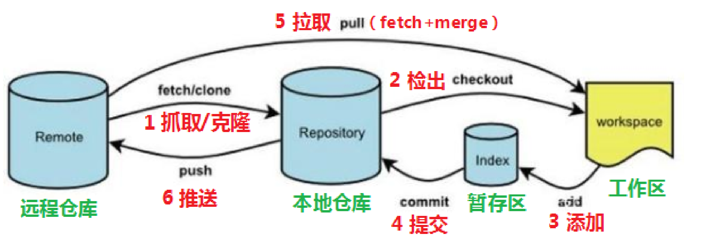
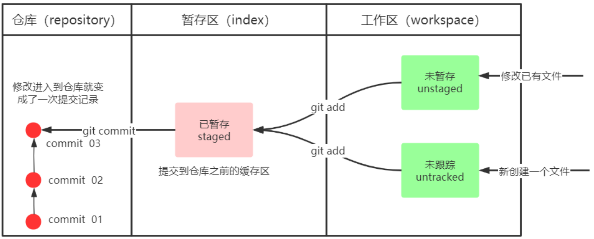
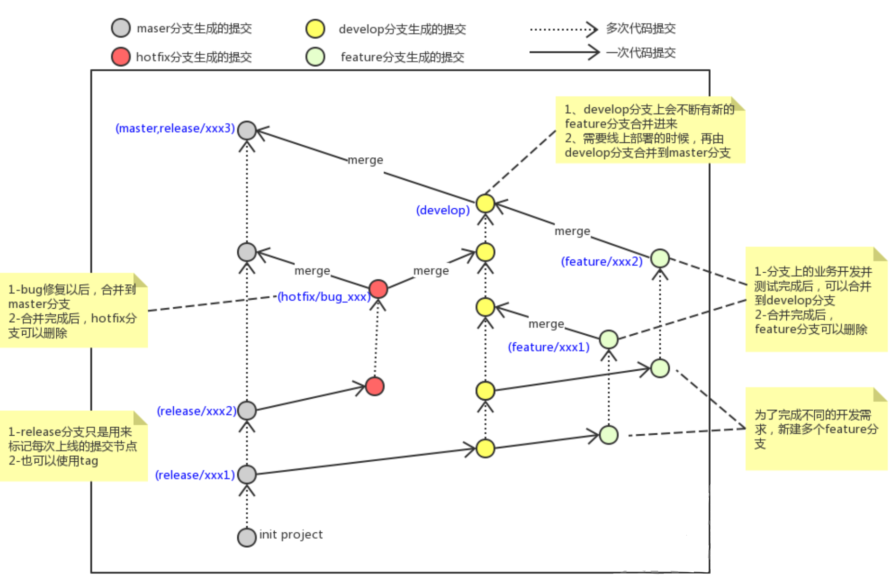
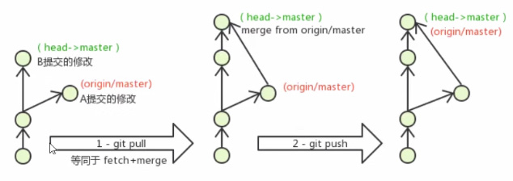

# 1. Git概述

> git是一个开源的分布式版本控制系统，可以有效、高速地处理从很小到非常大的项目版本管理。
> 
> Git GUI：git提供的图形化操作界面
> Git bash：git提供的命令行界面

git工作流程：



1. clone（克隆）: 从远程仓库中克隆代码到本地仓库
2. checkout （检出）:从本地仓库中检出一个仓库分支然后进行修订
3. add（添加）: 在提交前先将代码提交到暂存区
4. commit（提交）: 提交到本地仓库。本地仓库中保存修改的各个历史版本
5. fetch (抓取) ： 从远程库，抓取到本地仓库，不进行任何的合并动作，一般操作比较少。
6. pull (拉取) ： 从远程库拉到本地库，自动进行合并(merge)，然后放到到工作区，相当于fetch+merge
7. push（推送） : 修改完成后，需要和团队成员共享代码时，将代码推送到远程仓库

# 2. 配置

## 2.1 配置用户信息

```shell
# 设置用户名
git config --global user.name 'fish'
# 设置用邮箱
git config --golbal user.email 'git@fish.com'
# 查看用户名
git config --global user.name
# 查看用户名
git config --golbal user.email
```

## 2.2 配置别名

> 为过长的命令创建简短的别名

1. 创建`.bashrc`文件：可以用Git Bash创建`touch ~/.bashrc`
2. 在文件中输入以下配置
```shell
# 用于输出git提交日志
alias git-log='git log --pretty=oneline --all --graph --abbrev-commit' 
# 用于输出当前目录所有文件及基本信息
alias ll='ls -al'
```
3. 打开Git Bash使配置生效：`source ~/.bashrc`

# 3. 创建本地库

1. 创建文件夹project
2. 进入文件夹project
3. 在当前文件夹打开Git bash或者终端（Mac）
4. 使用命令`git init`
5. 会在当前生成一个隐藏文件夹.git

# 4. 基本命令

> 通过命令改变文件状态：未跟踪，未暂存，未提交、已提交



1. `git status`：查看工作区状态
2. `git add **`：添加文件到暂存区
   1. `git add .`：添加所有文件
   2. `git add test.txt`：添加指定文件
3. `git commit -m '记录内容'`：提交暂存区内容到本地仓库
4. `git log [option]`：查看日志
   1. option：
      1. --all：显示所有分支
      2. --pretty=oneline：提交信息一行显示
      3. --abbrev-commit：缩短commit id
      4. --graph：以图的形式显示
5. `git reset --hard commitId`：回退到指定提交地方`git log`可查看commit id
6. `git reflog`：查看所有提交信息，包括已删除信息

## 4.1 添加忽略文件

> 项目中不是所有文件都是需要git来管理的，比如IDEA的.idea内文件。所有这时就需要添加忽略文件。
> 在项目中创建.gitignore文件，在文件中配置忽略文件即可，配置如下

```gitignore
# 指定文件，忽略文件下所有
.idea

# 忽略以.iml为后缀的文件
*.iml

# 忽略doc文件夹下所有以pdf后缀的文件
doc/**/*.pdf
```

# 5. 分支

## 5.1 常建明命令

1. `git branch`：查看当前分支
2. `git branch 分支名`：创建分支
3. `git checkout 分支名`：切换分支
4. `git checkout -b 分支名`：创建并切换分支
5. `git merge 分支名称`：合并当前分支到指定分支
6. `git branch -d 分支名`：检查删除分支，不能删除当前分支
7. `git branch -D 分支名`：不做任何检查，强制删除，不能删除当前分支

## 5.2 冲突解决

> 多个分支对同一文件同一行做出修改并提交，这是就会产生冲突，因为git并不知道以谁为最终版本。
> 就会让用户来解决冲突，步骤如下

1. 处理冲突文件，把冲突地方最终代码保留下来，冲突删除
2. 冲突解决文件夹入暂存区
3. 然后提交到本地仓库

## 5.3 分支规范（非强制）

master：生产分支
dev：开发分支
feature/XXX：从dev上创建的分支，并行开发分支
hotfix/XXX：从master上创建的分支，解决bug分支。
pre：预上线分支
test：测试分支



# 6. 远程仓库

常用命令：
1. `git remote add <远端名称> <仓库路径>`：关联本地仓库和远程仓库
   1. 远端名称：默认为origin
   2. 仓库路径：由远程仓库提供
2. `git remote`：查看远程仓库
3. `git push [-f] [--set-upstream] [远端名称 [本地分支名][:远端分支名] ]`：推送本地仓库内容到远程仓库中
   1. 本地分支和远程分支相同直接写本地即可`git push origin master`
   2. `-f`表示强制覆盖
   3. `git push --set-upstream origin master`推送并和远端分支建立关系
   4. `git push`当前分支和远端分支关系已建立，可直接推送
4. `git branch -vv`：本地分支与远端分支对应关系
5. `git clone <仓库路径> [本地目录]`：从远端克隆项目到本地，本地目录可忽略
6. `git fetch [远程名称] [分支名称]`：将远端更新内容抓取到本地，不知道远端名称和分支名称则抓取所有分支
7. `git pull [远程名称] [分支名称]`：等同于fetch+merge，拉取远端内容到本地并进行合并

冲突解决：

