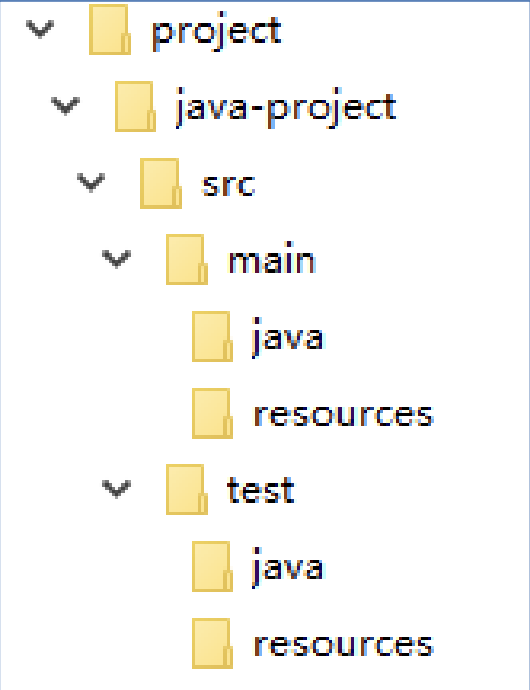
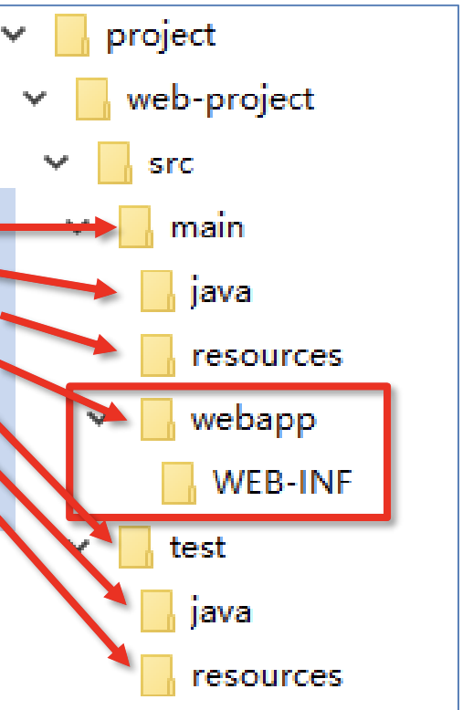
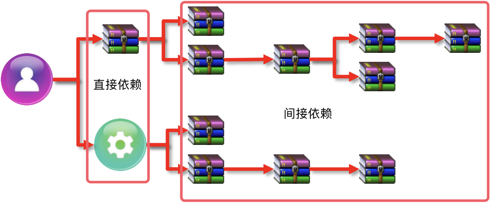
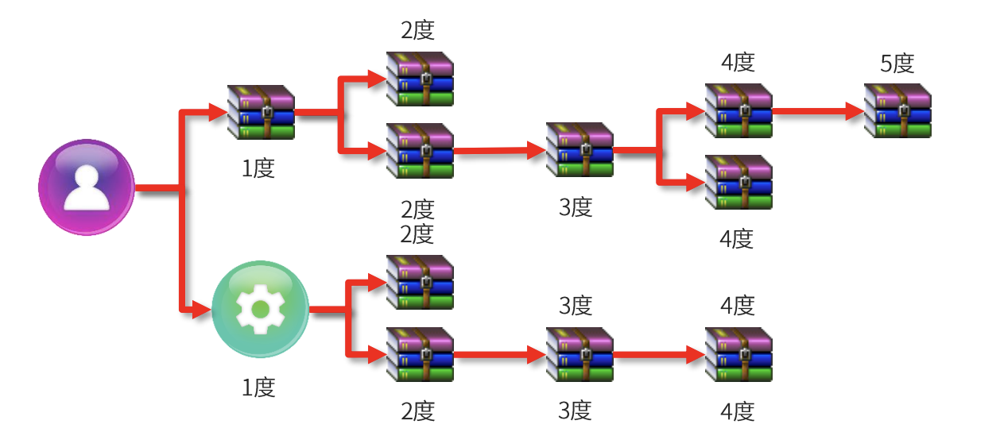
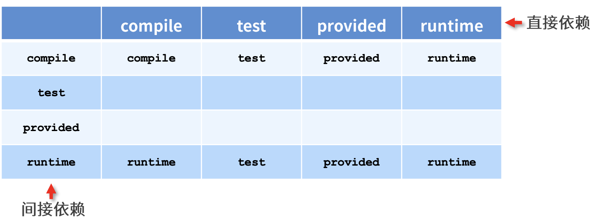
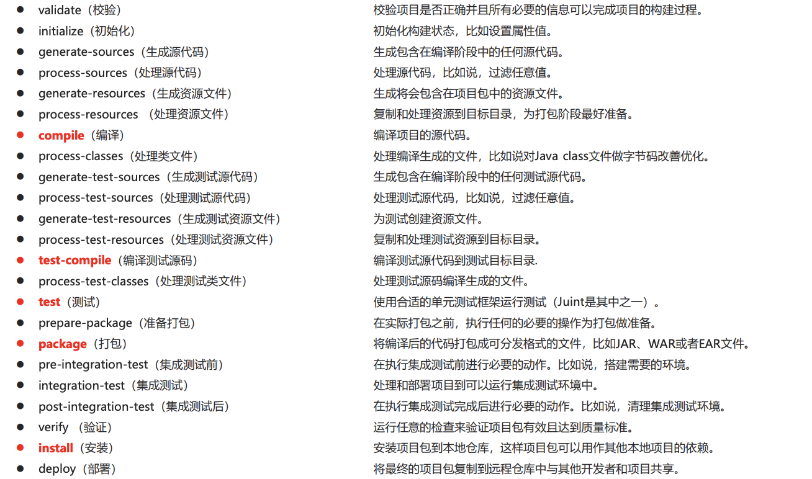

# 1. Maven简介

> maven是一个项目管理工具，将项目开发和管理分开。主要功能是构建项目、依赖管理和统一开发结构。

# 2. 仓库

> 仓库分为本地仓库、私库和远程仓库。

本地仓库默认位置：`<localRepository>${user.home}/.m2/repository</localRepository>`，可以自定义位置。

远程仓库默认位置：
```xml
<repositories>
    // 此远程仓库为Maven维护仓库，访问速度一般较慢。
    <repository>
        <id>central</id>
        <name>Central Repository</name>
        <url>https://repo.maven.apache.org/maven2</url>
        <layout>default</layout>
        <snapshots>
            <enabled>false</enabled>
        </snapshots>
    </repository>
</repositories>
```

配置远程仓库镜像网站：
```xml
<!--配置镜像网站-->
<mirrors>
    <!--具体镜像配置-->
    <mirror>
        <!-- 此镜像唯一标识 -->
        <id>nexus-aliyun</id>
        <!--需要对哪个仓库进行镜像，替换哪个仓库 -->
        <mirrorOf>central</mirrorOf>
        <!--镜像名称-->
        <name>Nexus aliyun</name>
        <!-- 镜像URL -->
        <url>http://maven.aliyun.com/nexus/content/groups/public</url>
    </mirror>
</mirrors>
```

# 3. 项目结构

> 每个Maven项目都存在一个`pom.xml`文件

默认Java项目结构：



默认JavaWeb项目目录：



`pom.xml`简单结构：
```xml
<?xml version="1.0" encoding="UTF-8"?>
<project
        xmlns="http://maven.apache.org/POM/4.0.0"
        xmlns:xsi="http://www.w3.org/2001/XMLSchema-instance"
        xsi:schemaLocation="http://maven.apache.org/POM/4.0.0 http://maven.apache.org/maven-v4_0_0.xsd">
    <modelVersion>4.0.0</modelVersion>
    <groupId>com.test</groupId>
    <artifactId>project-java</artifactId>
    <version>1.0</version>
    <packaging>jar</packaging>
    <dependencies>
        <dependency>
            <groupId>junit</groupId>
            <artifactId>junit</artifactId>
            <version>4.12</version>
        </dependency>
    </dependencies>
</project>
```

项目构建常用命令：
```shell
mvn compile   #编译
mvn clean     #清理
mvn test      #测试
mvn package   #打包
mvn install   #安装本地仓库
```

插件创建项目命令：
```shell
# 指令
mvn archetype:generate
    # 项目groupId
    -DgroupId={project-packaging}
    # 项目artifactId
    -DartifactId={project-name}
    -DarchetypeArtifactId=maven-archetype-quickstart
    # 版本
    -Dversion={version}
    -DinteractiveMode=false
```

插件创建Java项目：
```shell
mvn archetype:generate 
  -DgroupId=com.test
  -DartifactId=java-project 
  -DarchetypeArtifactId=maven-archetype-quickstart 
  -Dversion=0.0.1-snapshot 
  -DinteractiveMode=false
````

插件创建JavaWeb项目：
```shell
mvn archetype:generate 
  -DgroupId=com.test
  -DartifactId=web-project 
  -DarchetypeArtifactId=maven-archetype-webapp 
  -Dversion=0.0.1-snapshot 
  -DinteractiveMode=false
```

# 4. 插件

添加tomcat运行插件：
```xml
<build>
    <plugins>
        <plugin>
            <!--插件坐标-->
            <groupId>org.apache.tomcat.maven</groupId>
            <artifactId>tomcat7-maven-plugin</artifactId>
            <version>2.1</version>
            <configuration>
                <port>80</port>
                <path>/</path>
            </configuration>
        </plugin>
    </plugins>
</build>
```

> 插件可以绑定指定的生命周期，在执行到对应周期就会运行，配置如下
```xml
<build>
   <plugins>
      <plugin>
         <!--插件坐标-->
         <groupId>org.apache.maven.plugins</groupId>
         <artifactId>maven-source-plugin</artifactId>
         <version>2.2.1</version>
         <!--配置属性-->
         <executions>
            <execution>
               <!--目标-->
               <goals>
                  <goal>jar</goal>
               </goals>
               <!--周期-->
               <phase>generate-test-resources</phase>
            </execution>
         </executions>
      </plugin>
   </plugins>
</build>
```

# 5. 依赖管理

主要配置：
```xml
<!--当前项目所有的依赖-->
<dependencies>
    <!--具体依赖-->
    <dependency>
        <!--依赖groupId-->
        <groupId>junit</groupId>
        <!--依赖artifactId-->
        <artifactId>junit</artifactId>
        <!--版本号-->
        <version>4.12</version>
    </dependency>
</dependencies>
```

## 5.1 依赖传递

> 依赖具有传递性的，依赖又分为直接依赖和间接传递

直接依赖：项目中直接建立的依赖关系



间接依赖：项目依赖所依赖的依赖关系




## 5.2 依赖冲突

> 相同依赖不同版本

1. 层级越深优先级就越低。
2. 相同层级配置顺序靠后覆盖前者。
3. 当依赖相同层级靠前会覆盖后者。

## 5.3 依赖配置

1. 可选依赖
> 隐藏当前依赖，当本项目被依赖时此依赖不会被依赖

```xml

<dependency>
    <groupId>junit</groupId>
    <artifactId>junit</artifactId>
    <version>4.12</version>
    <!--配置可选依赖-->
    <optional>true</optional>
</dependency>
``` 
2. 排除依赖

> 将不在依赖此依赖

```xml
<dependency>
    <groupId>junit</groupId>
    <artifactId>junit</artifactId>
    <version>4.12</version>
    <!--配置排除依赖-->
    <exclusions>
        <!--具体排除配置-->
        <exclusion>
            <!--依赖坐标-->
            <groupId>org.hamcrest</groupId>
            <artifactId>hamcrest-core</artifactId>
        </exclusion>
    </exclusions>
</dependency>
```

3. 依赖范围即传递性

> 依赖的默认范围为任何地方，也可以同`<scope>`标签配置

范围说明：
1. 主程序范围（main文件夹）
2. 测试范围（test文件夹）
3. 是否参与打包（package指令）

|scope|主程序|测试代码|打包|示例|
|---|---|---|---|---|
|compile(默认)|✅|✅|✅|log4j|
|test|❎|✅|❎|junit|
|provided|✅|✅|❎|servlet-api|
|runtime|❎|❎|✅|jdbc|

依赖传递性：直接依赖与间接依赖范围不一致导致的问题，最终结果如下图




# 6. 生命周期

> 生命周期指的就是在一次构建过程中所经历的事件：compile、test-compile、test、package、install

项目构建生命周期主要有以下三套：

1. clean清理周期（清理）
   1. pre-clean：清理构建内容前执行
   2. clean：清理构建内容
   3. post-clean：清理构建内容后执行
2. default构建周期（核心工作：编译、测试、打包、部署）
   
3. site周期（生成报告，发布站点）
   1. pro-site：生成文档前执行
   2. site：生成项目文档
   3. post-site：生成项目文当后执行
   4. site-deploy:生成文档部署到指定服务器上

