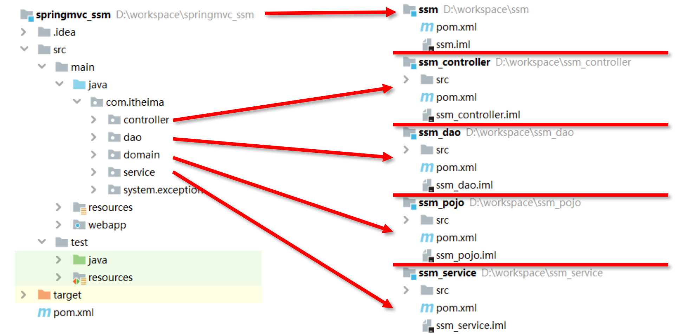
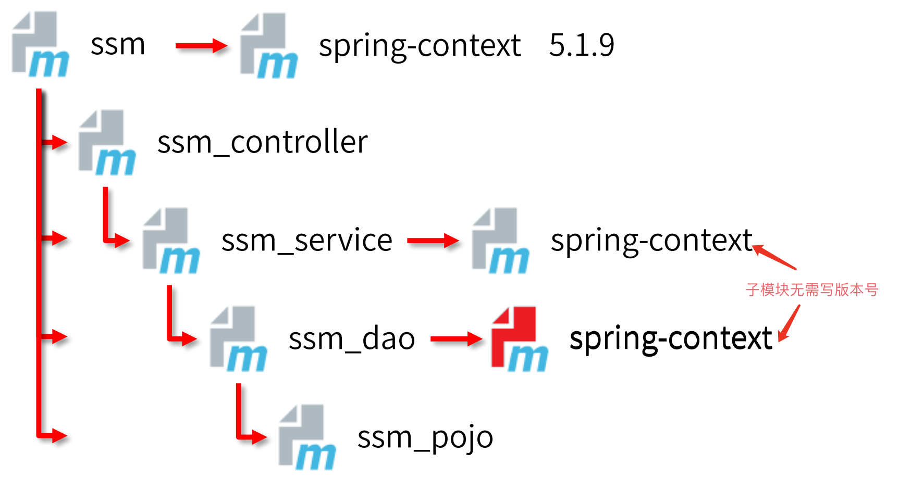
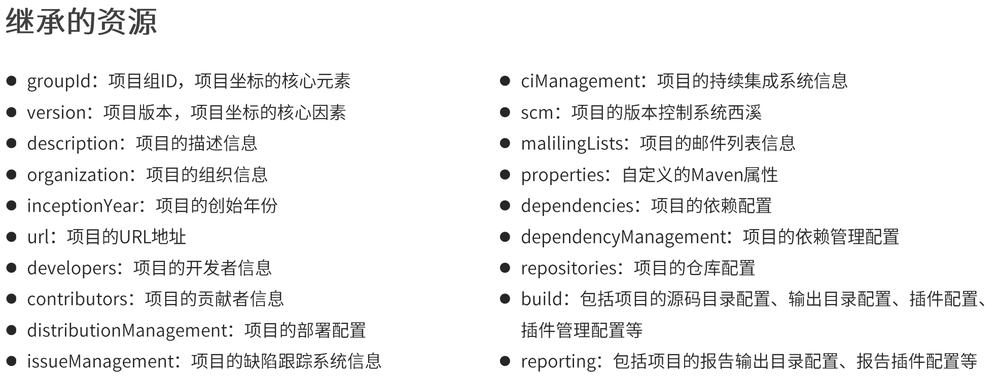
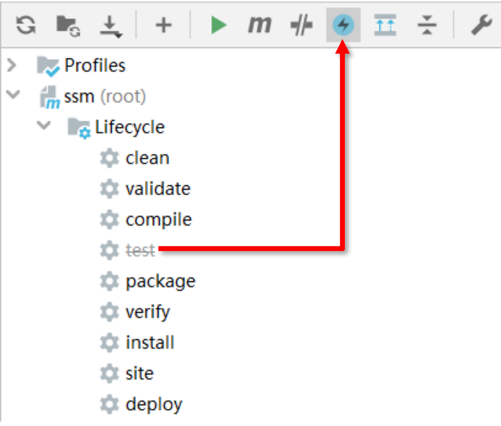
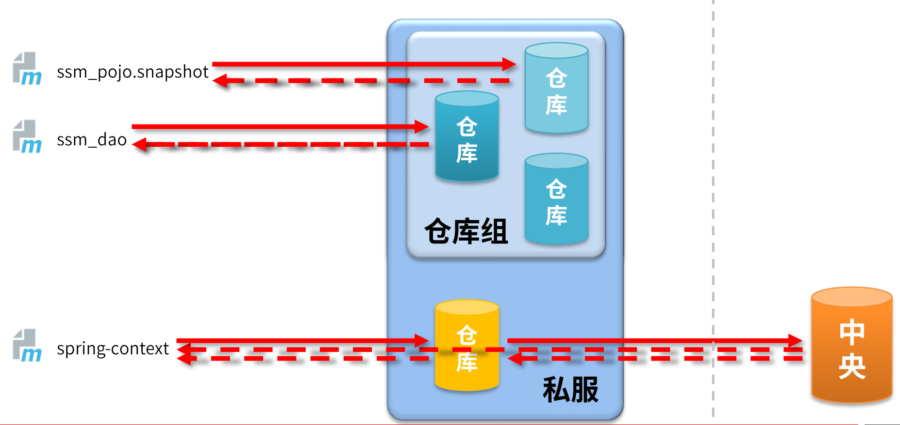

# 1. 分模块开发

> 将一个大型项目分解成多个小项目，进行单独维护



# 2. 聚合

> 多模块由单独一个项目管理，防止未能及时更新修改，这就叫聚合。此项目没有任何功能，只做模块管理。

创建管理项目：

创建一个项目，只保留pom文件：

```xml
<?xml version="1.0" encoding="UTF-8"?>
<project xmlns="http://maven.apache.org/POM/4.0.0"
         xmlns:xsi="http://www.w3.org/2001/XMLSchema-instance"
         xsi:schemaLocation="http://maven.apache.org/POM/4.0.0 http://maven.apache.org/xsd/maven-4.0.0.xsd">
    <modelVersion>4.0.0</modelVersion>

    <groupId>cn.fishland</groupId>
    <artifactId>ssm</artifactId>
    <version>1.0-SNAPSHOT</version>

    <!--表示此项目为一个管理项目-->
    <packaging>pom</packaging>

    <!--管理列表-->
    <modules>
        <module>../ssm_controller</module>
        <module>../ssm_dao</module>
        <module>../ssm_pojo</module>
        <module>../ssm_service</module>
    </modules>

</project>
```

# 3. 继承

> 建立模块中继承关系，父类统一管理子类依赖，子类继承父类依赖配置。



创建步骤：
1. 在父模块pom文件中添加配置
```xml
<!--声明依赖管理-->
<dependencyManagement>
    <!--依赖类配-->
    <dependencies>
        <!--具体依赖-->
        <dependency>
            <groupId>org.springframework</groupId>
            <artifactId>spring-context</artifactId>
            <version>5.1.9.RELEASE</version>
        </dependency>
    <dependencies>
<dependencyManagement>
```
2. 在子模块中添加配置
```xml
<!--继承的模块-->
<parent>
    <groupId>com.itheima</groupId>
    <artifactId>ssm</artifactId>
    <version>1.0-SNAPSHOT</version>
    <!--父工程pom文件路径 -->
    <relativePath>../ssm/pom.xml</relativePath>
</parent>
```

3. 子模块依赖使用
```xml
<dependencies>
    <dependency>
        <groupId>org.springframework</groupId>
        <artifactId>spring-context</artifactId>
    </dependency>
</dependencies>
```

继承的其他资源：



# 4. 属性

> 类似类中属性

1. 自定义属性

在pom文件中：
```xml
<!--自定义属性-->
<properties>
    <spring.version>5.1.9.RELEASE</spring.version>
</properties>
```

```xml
<dependency>
    <groupId>org.springframework</groupId>
    <artifactId>spring-context</artifactId>
    <!--使用-->
    <version>${spring.version}</version>
</dependency>
```

2. 内置属性

maven内置的属性，例如version，可直接使用：`${version}`

3. 读取配置文件值：`${settings.XXX}`例如`${settings.localRepository}`
4. Java系统属性：通过`mvn help:system`命令获得属性，然后在xml中调用`${user.home}`
5. 环境变量配置，同Java系统属性

# 5. 添加配置文件

> 将一些配置文件单独出来，直接通过`${XXX|XXX.XX}`调用

```xml
<!--添加外部资源-->
<resources>
    <resource>
        <!--设定配置文件对应的位置目录，支持使用属性动态设定路径-->
        <directory>${project.basedir}/src/main/resources</directory>
        <!--开启对配置文件的资源加载过滤-->
        <filtering>true</filtering>
    </resource>
</resources>
```

# 6. 多环境配置

> 不同的环境可以通过不同配置来实现，这样就可以自由的进行切换，命令`mvn 指令 –P 环境定义id`示例`mvn install –P pro_env`

```xml
<!--创建多环境-->
<profiles>
    <!--定义具体的环境：生产环境-->
    <profile>
        <!--定义环境对应的唯一名称-->
        <id>pro_env</id>
        <!--定义环境中换用的属性值-->
        <properties>
            <jdbc.url>jdbc:mysql://127.1.1.1:3306/ssm_db</jdbc.url>
        </properties>
        <!--设置默认启动-->
        <activation>
            <activeByDefault>true</activeByDefault>
        </activation>
    </profile>
    <!--定义具体的环境：开发环境-->
    <profile>
        <id>dep_env</id>
        <properties>
            <jdbc.url>jdbc:mysql://127.2.2.2:3306/ssm_db</jdbc.url>
        </properties>
    </profile>
</profiles>
```

# 7. 跳过测试test

1. 命令跳过：`mvn 指令 –D skipTests`
2. IDEA操作界面：



3. 配置插件跳过：

```xml
<plugin>
    <artifactId>maven-surefire-plugin</artifactId>
    <version>2.22.1</version>
    <configuration>
        <!--设置跳过测试-->
        <skipTests>true</skipTests>
        <!--包含的测试用例-->
        <includes>
            <include>**/User*Test.java</include>
        </includes>
        <!--排除的测试用例-->
        <excludes>
            <exclude>**/User*TestCase.java</exclude>
        </excludes>
    </configuration>
</plugin>
```

# 8. 私服仓库

> 私服一般是公司私有服务，管理者自研依赖



> Nexus：是一个开箱即用的maven私服产品  [Nexus](https://help.sonatype.com/repomanager3/product-information/download)
> 
> 启动：`nexus.exe /run nexus`
> 
> 默认访问：`http://localhost:8081`
> 
> 配置文件：nexus-default.properties
> 
> nexus服务器配置：nexus.vmoptions

访问私服配置：

设置私服信息`setting.xml`：
```xml
<!--访问权限-->
<servers>
    <server>
        <id>fish-release</id>
        <username>admin</username>
        <password>admin</password>
    </server>
    <server>
        <id>fish-snapshots</id>
        <username>admin</username>
        <password>admin</password>
    </server>
</servers>
```
```xml
<mirrors>
    <mirror>
        <id>nexus-fish</id>
        <!--镜像所有-->
        <mirrorOf>*</mirrorOf>
        <url>http://localhost:8081/repository/maven-public/</url>
    </mirror>
</mirrors>
```

发布到私服设置`pom.xml`：
```xml
<distributionManagement>
    <repository>
        <!--setting中的server配置id，仓库名称-->        
        <id>fish-release</id>
        <url>http://localhost:8081/repository/fish-release/</url>
    </repository>
    <snapshotRepository>
        <!--setting中的server配置id，仓库名称-->
        <id>fish-snapshots</id>
        <url>http://localhost:8081/repository/fish-snapshots/</url>
    </snapshotRepository>
</distributionManagement>
```
> 发布命令：`mvn deploy`
