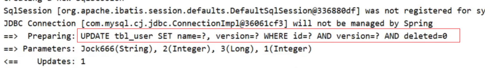

# 1. 入门案例

> MybatisPlus是对Mybatis进行简化，通过简单的配置就能进行简单CRUD。

1.添加依赖

```xml

<dependency>
    <groupId>com.baomidou</groupId>
    <artifactId>mybatis-plus-boot-starter</artifactId>
    <version>3.4.1</version>
</dependency>
```

2. Mapper接口继承BaseMapper

```java
// 需要添加注解被Spring容器管理，不添加此注解就需要在启动类上添加@MapperScan("xxx.x..")
@Mapper
public interface UserDao extends BaseMapper<User> {

    @Select("select * from user")
    List<User> selectAll();
}
```

> 如果未发现表，那就需要在实体类上添加@TableName注解

```java

@TableName("user")
public class User {

    private Long id;
    private String name;
    private Integer age;
    private String email;
    @JsonFormat(pattern = "yyyy-MM-dd HH:mm:ss")
    private Date birthday;

    // get set toString
}
```

3.测试

```java

@SpringBootTest
class ApplicationTests {

    @Autowired
    UserDao userDao;

    @Test
    void contextLoads() {
        System.out.println(userDao.selectAll());
        System.out.println(userDao.selectById(1617790416520863746L));
    }
}
```

## 1.1 简单CRUD

```java

@SpringBootTest
class ApplicationTests {

    @Autowired
    UserDao userDao;

    @Test
    void contextSave() {
        User user = new User();
        user.setName("yh");
        user.setAge(18);
        user.setEmail("yh@email.com");
        user.setBirthday(new Date());
        System.out.println(userDao.insert(user));
        System.out.println(user);
    }

    @Test
    void contextDelete() {
        System.out.println(userDao.deleteById(1617790566173523969L));
    }

    @Test
    void contextUpdate() {
        User user = new User();
        user.setId(1617790416520863746L);
        user.setName("yh");
        user.setAge(3);
        user.setEmail("yh@email.com");
        System.out.println(userDao.updateById(user));
        System.out.println(user);
    }

    @Test
    void contextSelect() {
        System.out.println(userDao.selectAll());
        System.out.println(userDao.selectById(1617790416520863746L));
    }

}
```

# 2. 分页

1. 设置拦截器

```java

@Configuration
public class MybatisPlusConfig {
    @Bean
    public MybatisPlusInterceptor mybatisPlusInterceptor() {
        //1 创建MybatisPlusInterceptor拦截器对象
        MybatisPlusInterceptor mpInterceptor = new MybatisPlusInterceptor();
        //2 添加分页拦截器
        mpInterceptor.addInnerInterceptor(new PaginationInnerInterceptor());
        return mpInterceptor;
    }
}
```

2. 分页查询

```java

@SpringBootTest
class ApplicationTests {

    @Autowired
    UserDao userDao;

    //分页查询
    @Test
    void testSelectPage() {
        //1 创建IPage分页对象,设置分页参数,1为当前页码，3为每页显示的记录数
        IPage<User> page = new Page<>(1, 3);
        //2 执行分页查询
        userDao.selectPage(page, null);
        //3 获取分页结果
        System.out.println("当前页码值：" + page.getCurrent());
        System.out.println("每页显示数：" + page.getSize());
        System.out.println("一共多少页：" + page.getPages());
        System.out.println("一共多少条数据：" + page.getTotal());
        System.out.println("数据：" + page.getRecords());
    }
}
```

# 3. DQL操作

## 3.1 根据单条件查询

> 使用Wrapper实现类QueryWrapper和LambdaQueryWrapper进行查询。`lt()`方法类似`<`

```java

@SpringBootTest
class ApplicationTests {

    @Autowired
    UserDao userDao;

    @Test
    void testSelect() {
        QueryWrapper<User> wrapper = new QueryWrapper<>();
        wrapper.lt("age", 18);
        List<User> users = userDao.selectList(wrapper);
        System.out.println("数据：" + users);
    }

    @Test
    void testSelectLambda() {
        QueryWrapper<User> wrapper = new QueryWrapper<>();
        wrapper.lambda().lt(User::getAge, 18);
        List<User> users = userDao.selectList(wrapper);
        System.out.println("数据：" + users);
    }

    @Test
    void testSelectLambda1() {
        LambdaQueryWrapper<User> wrapper = new LambdaQueryWrapper<>();
        wrapper.lt(User::getAge, 18);
        List<User> users = userDao.selectList(wrapper);
        System.out.println("数据：" + users);
    }
}
```

## 3.2 多条件查询

```java

@SpringBootTest
class ApplicationTests {

    @Autowired
    UserDao userDao;

    // 多条件
    @Test
    void testSelectLambda2() {
        LambdaQueryWrapper<User> wrapper = new LambdaQueryWrapper<>();
        wrapper.lt(User::getAge, 18);
        wrapper.gt(User::getAge, 1);

        // 支持链式编程
        // wrapper.lt(User::getAge, 18).gt(User::getAge, 1);
        List<User> users = userDao.selectList(wrapper);
        System.out.println("数据：" + users);
    }

    // 多条件
    @Test
    void testSelectLambda3() {
        LambdaQueryWrapper<User> wrapper = new LambdaQueryWrapper<>();
        // 支持链式编程，默认是and，可以使用or()
        wrapper.lt(User::getAge, 18).or().gt(User::getAge, 1);
        List<User> users = userDao.selectList(wrapper);
        System.out.println("数据：" + users);
    }
}
```

> 多条件之间默认是and，也可以通过`or()`方法实现or。

## 3.3 null判断

> 在多个查询条件中可能存在没有输入的条件，这时就需要大量的`if`判断，MP对此进行了简化。

> 接收页面条件时不能再用实体类，例如查询年龄范围肯定会传入两个值，这时实体类就没法存储。这时就需要创建vo

```java

@Data
@EqualsAndHashCode(callSuper = true)
@NoArgsConstructor
@AllArgsConstructor
public class UserQuery extends User {

    private Integer age2;
}
```

```java

@SpringBootTest
class ApplicationTests {

    @Autowired
    UserDao userDao;

    // 多条件
    @Test
    void testSelect1() {
        //模拟页面传递过来的查询数据
        UserQuery uq = new UserQuery();
        uq.setAge(10);
        uq.setAge2(30);

        LambdaQueryWrapper<User> lqw = new LambdaQueryWrapper<User>();
        // 只有当第一个条件为true后，查询才会成立进行查询
        lqw.lt(null != uq.getAge2(), User::getAge, uq.getAge2());
        lqw.gt(null != uq.getAge(), User::getAge, uq.getAge());
        List<User> userList = userDao.selectList(lqw);
        System.out.println(userList);
    }
}
```

## 3.4 查询投影

> MP默认查询表所有，如果只查询想要列可以通过方法来控制的。

```java

@SpringBootTest
class ApplicationTests {

    @Autowired
    UserDao userDao;

    @Test
    void testGetAll() {
        LambdaQueryWrapper<User> lqw = new LambdaQueryWrapper<User>();
        lqw.select(User::getId, User::getName, User::getAge);
        List<User> userList = userDao.selectList(lqw);
        System.out.println(userList);
    }

    @Test
    void testGetAll() {
        QueryWrapper<User> lqw = new QueryWrapper<User>();
        // QueryWrapper需要手动编写列名
        lqw.select("id", "name", "age", "tel");
        List<User> userList = userDao.selectList(lqw);
        System.out.println(userList);
    }
}
```

## 3.5 聚合查询

```java

@SpringBootTest
class ApplicationTests {

    @Autowired
    UserDao userDao;

    @Test
    void testGetAll() {
        QueryWrapper<User> lqw = new QueryWrapper<User>();
        // lqw.select("count(*) as count"); 
        // SELECT count(*) as count FROM user

        // lqw.select("max(age) as maxAge"); 
        // SELECT max(age) as maxAge FROM user 

        // lqw.select("min(age) as minAge");
        // SELECT min(age) as minAge FROM user

        // lqw.select("sum(age) as sumAge"); 
        // SELECT sum(age) as sumAge FROM user

        lqw.select("avg(age) as avgAge");
        // SELECT avg(age) as avgAge FROM user 
        List<Map<String, Object>> userList = userDao.selectMaps(lqw);
        System.out.println(userList);
    }
}
```

## 3.6 分组查询

```java

@SpringBootTest
class ApplicationTests {

    @Autowired
    UserDao userDao;

    @Test
    void testGetAll() {
        QueryWrapper<User> lqw = new QueryWrapper<User>();
        lqw.select("count(*) as count,tel");
        lqw.groupBy("tel");
        List<Map<String, Object>> list = userDao.selectMaps(lqw);
        System.out.println(list);
    }
}
```

## 3.7 等值查询

```java

@SpringBootTest
class ApplicationTests {

    @Autowired
    UserDao userDao;

    @Test
    void testGetAll() {
        LambdaQueryWrapper<User> lqw = new LambdaQueryWrapper<User>();
        lqw.eq(User::getName, "Jerry").eq(User::getPassword, "jerry");
        User loginUser = userDao.selectOne(lqw);
        System.out.println(loginUser);
    }
}
```

> - selectList：查询结果为多个或者单个
> - selectOne:查询结果为单个

## 3.8 范围查询

```java

@SpringBootTest
class ApplicationTests {

    @Autowired
    UserDao userDao;

    @Test
    void testGetAll() {
        LambdaQueryWrapper<User> lqw = new LambdaQueryWrapper<User>();
        lqw.between(User::getAge, 10, 30);
        // SELECT id,name,password,age,tel FROM user WHERE (age BETWEEN ? AND ?) 
        List<User> userList = userDao.selectList(lqw);
        System.out.println(userList);
    }
}
```

> - gt():大于(>)
> - ge():大于等于(>=)
> - lt():小于(<)
> - lte():小于等于(<=)
> - between():between ? and ?

## 3.9 模糊查询

```java

@SpringBootTest
class ApplicationTests {

    @Autowired
    UserDao userDao;

    @Test
    void testGetAll() {
        LambdaQueryWrapper<User> lqw = new LambdaQueryWrapper<User>();
        lqw.likeLeft(User::getName, "J");
        //SELECT id,name,password,age,tel FROM user WHERE (name LIKE ?) 
        List<User> userList = userDao.selectList(lqw);
        System.out.println(userList);
    }
}
```

## 3.10 排序查询

```java

@SpringBootTest
class ApplicationTests {

    @Autowired
    UserDao userDao;

    @Test
    void testGetAll() {
        LambdaQueryWrapper<User> lwq = new LambdaQueryWrapper<>();
        /*
         * condition ：条件，返回boolean， 当condition为true，进行排序，如果为false，则不排序
         * isAsc:是否为升序，true为升序，false为降序
         * columns：需要操作的列
         */
        lwq.orderBy(true, false, User::getId);
        userDao.selectList(lw);
    }
}
```

- orderBy排序
    - condition:条件，true则添加排序，false则不添加排序
    - isAsc:是否为升序，true升序，false降序
    - columns:排序字段，可以有多个
- orderByAsc/Desc(单个column):按照指定字段进行升序/降序
- orderByAsc/Desc(多个column):按照多个字段进行升序/降序
- orderByAsc/Desc
    - condition:条件，true添加排序，false不添加排序
    - 多个columns：按照多个字段进行排序

# 4. 映射兼容问题

## 4.1 列名与属性名可不同

> 使用`@TableField`注解表明与哪个表列名映射

```java

@TableName("user")
public class User {

    private Long id;

    @TableField("user_name")
    private String name;

    private Integer age;

    private String email;

    private Date birthday;

}
```

## 4.2 表中未定义属性

> 有时并不是所有属性都是在表中定义的，例如多表查询时，实体类中一般定义的不是对象Id而是对象，这时就可以通过@TableField注解的exist属性完成。

```java

@TableName("user")
public class User {

    private Long id;
    private String name;
    private Integer age;
    private String email;
    private Date birthday;

    @TableField(exist = false)
    private Role role;
}
```

## 4.3 限制列表查询权限

> 铭感列一般是不需要查询返回的，这时就需要限制列表查询。可以通过@TableField注解的select属性完成。

```java

@TableName("user")
public class User {

    private Long id;
    private String name;
    @TableField(select = false)
    private String password;
    private Integer age;
    private String email;
    private Date birthday;
}
```

## 4.4 表名不同步

```java
// 显示设置表名
@TableName("user")
public class User {

    private Long id;
    private String name;
    @TableField(select = false)
    private String password;
    private Integer age;
    private String email;
    private Date birthday;
}
```

# 5. DML

## 5.1 Id策略

> 针对不同的业务需求，Id的生成策略也是不同的。MP主要提供了以下一些策略。

- NONE（默认）: 不设置id生成策略，MP自动生成
- AUTO: 使用数据库自增
- INPUT:用户手工输入id
- ASSIGN_ID:雪花算法生成id(可兼容数值型与字符串型)
- ASSIGN_UUID:以UUID生成算法作为id生成策略

### 5.1.1 AUTO

```java

@TableName("user")
public class User {

    @TableId(value = "id", type = IdType.AUTO)
    private Long id;
    private String name;
    private Integer age;
    private String email;
    private Date birthday;

}
```

### 5.1.2 INPUT

```java

@TableName("user")
public class User {

    @TableId(value = "id", type = IdType.INPUT)
    private Long id;
    private String name;
    private Integer age;
    private String email;
    private Date birthday;

}
```

> 需要手动输入Id，如果未设置id将抛出异常。

### 5.1.3 ASSIGN_ID

> 雪花算法相关查看

[雪花算法](../../Distributed/分布式相关解决方案.md#11-雪花算法)

```java

@TableName("user")
public class User {

    @TableId(value = "id", type = IdType.ASSIGN_ID)
    private Long id;
    private String name;
    private Integer age;
    private String email;
    private Date birthday;

}
```

### 5.1.4 ASSIGN_UUID

> 使用此策略需要将主键类型改为字符串，同样数据库也是，长度不能小于32位。

```java

@TableName("user")
public class User {

    @TableId(value = "id", type = IdType.ASSIGN_UUID)
    private String id;
    private String name;
    private Integer age;
    private String email;
    private Date birthday;

}
```

## 5.2 批量操作

### 5.2.1 批量删除

```java

@SpringBootTest
class ApplicationTests {

    @Autowired
    UserDao userDao;

    @Test
    void testDelete() {
        List<Long> list = new ArrayList<>();
        list.add(1402551342481838081L);
        list.add(1402553134049501186L);
        list.add(1402553619611430913L);
        // 批量删除
        userDao.deleteBatchIds(list);
    }
}
```

### 5.2.2 批量查询

```java

@SpringBootTest
class ApplicationTests {

    @Autowired
    UserDao userDao;

    @Test
    void testDelete() {
        List<Long> list = new ArrayList<>();
        list.add(1L);
        list.add(3L);
        list.add(4L);
        // 批量查询
        userDao.selectBatchIds(list);
    }
}
```

## 5.3 逻辑删除

> 一些数据在删除过程中，并不是真正的直接删除掉，而是通过设置字段的值来标记其处于删除状态。所以删除其实就是修改。

```java

@TableName("user")
public class User {

    @TableId(value = "id", type = IdType.ASSIGN_UUID)
    private String id;
    private String name;
    private Integer age;
    private String email;
    private Date birthday;
    @TableLogic(value = "0", delval = "1")
    //value为正常数据的值，delval为删除数据的值
    private Integer deleted;

}
```

> 既然是逻辑删除，那查询是否受影响了，显然MP已经帮我们处理了。

## 5.4 乐观锁

> 通过添加version字段来实现乐观锁，MP通过`@Version`注解简化这一操作。

1. 添加注解

```java

@TableName("user")
public class User {

    @TableId(value = "id", type = IdType.ASSIGN_UUID)
    private String id;
    private String name;
    private Integer age;
    private String email;
    private Date birthday;
    @TableLogic(value = "0", delval = "1")
    //value为正常数据的值，delval为删除数据的值
    private Integer deleted;

    @Version
    private Integer version;

}
```

2. 设置拦截器

```java

@Configuration
public class MybatisPlusConfig {
    @Bean
    public MybatisPlusInterceptor mybatisPlusInterceptor() {
        // 创建MybatisPlusInterceptor拦截器对象
        MybatisPlusInterceptor mpInterceptor = new MybatisPlusInterceptor();

        // 添加分页拦截器
        mpInterceptor.addInnerInterceptor(new PaginationInnerInterceptor());

        // 添加乐观锁拦截器
        mpInterceptor.addInnerInterceptor(new OptimisticLockerInnerInterceptor());
        return mpInterceptor;
    }

}
```

3. 测试

> 要想实现乐观锁，首先第一步应该是拿到表中的version，然后拿version当条件在将version加1更新回到数据库表中，所以我们在查询的时候，需要对其进行查询

```java

@SpringBootTest
class Mybatisplus03DqlApplicationTests {
    @Autowired
    private UserDao userDao;

    @Test
    void
    testUpdate() {
        User user = new User();
        user.setId(3L);
        user.setName("Jock666");
        user.setVersion(1);
        userDao.updateById(user);
    }
}
```



> 从sql语句可以看出，MP会把version+1更新到表中，但是在条件中对比的还是未+1的version。
>
> 所以更新带有乐观锁的数据步骤是先查询再更新，需要带上version属性，不然乐观锁会失效。
>
> version值不相等，更新返回行数会为0。

# 6. 逆向工程

> 依照数据库的字段自动生成实体类和Mapper

1. 依赖

> SpringBoot版本使用`2.5.1`其他版本可能会出现问题。

```xml

<dependencies>
    <!--spring webmvc-->
    <dependency>
        <groupId>org.springframework.boot</groupId>
        <artifactId>spring-boot-starter-web</artifactId>
    </dependency>

    <!--mybatisplus-->
    <dependency>
        <groupId>com.baomidou</groupId>
        <artifactId>mybatis-plus-boot-starter</artifactId>
        <version>3.4.1</version>
    </dependency>

    <!--druid-->
    <dependency>
        <groupId>com.alibaba</groupId>
        <artifactId>druid</artifactId>
        <version>1.1.16</version>
    </dependency>

    <!--mysql-->
    <dependency>
        <groupId>mysql</groupId>
        <artifactId>mysql-connector-java</artifactId>
        <scope>runtime</scope>
    </dependency>

    <!--test-->
    <dependency>
        <groupId>org.springframework.boot</groupId>
        <artifactId>spring-boot-starter-test</artifactId>
        <scope>test</scope>
    </dependency>

    <!--lombok-->
    <dependency>
        <groupId>org.projectlombok</groupId>
        <artifactId>lombok</artifactId>
        <version>1.18.12</version>
    </dependency>

    <!--代码生成器-->
    <dependency>
        <groupId>com.baomidou</groupId>
        <artifactId>mybatis-plus-generator</artifactId>
        <version>3.4.1</version>
    </dependency>

    <!--velocity模板引擎-->
    <dependency>
        <groupId>org.apache.velocity</groupId>
        <artifactId>velocity-engine-core</artifactId>
        <version>2.3</version>
    </dependency>
</dependencies>
```

2. 编写生成类

```java
public class CodeGenerator {
    public static void main(String[] args) {
        //1.获取代码生成器的对象
        AutoGenerator autoGenerator = new AutoGenerator();

        //设置数据库相关配置
        DataSourceConfig dataSource = new DataSourceConfig();
        dataSource.setDriverName("com.mysql.cj.jdbc.Driver");
        dataSource.setUrl("jdbc:mysql://localhost:33060/BookManager?serverTimezone=UTC");
        dataSource.setUsername("root");
        dataSource.setPassword("root");
        autoGenerator.setDataSource(dataSource);

        //设置全局配置
        GlobalConfig globalConfig = new GlobalConfig();
        globalConfig.setOutputDir(System.getProperty("user.dir") + "/SpringBoot2/src/main/java");    //设置代码生成位置
        globalConfig.setOpen(false);    //设置生成完毕后是否打开生成代码所在的目录
        globalConfig.setAuthor("xiaoyu");    //设置作者
        globalConfig.setFileOverride(true);     //设置是否覆盖原始生成的文件
        globalConfig.setMapperName("%sDao");    //设置数据层接口名，%s为占位符，指代模块名称
        globalConfig.setIdType(IdType.ASSIGN_ID);   //设置Id生成策略
        autoGenerator.setGlobalConfig(globalConfig);

        //设置包名相关配置
        PackageConfig packageInfo = new PackageConfig();
        packageInfo.setParent("com.aaa");   //设置生成的包名，与代码所在位置不冲突，二者叠加组成完整路径
        packageInfo.setEntity("domain");    //设置实体类包名
        packageInfo.setMapper("dao");   //设置数据层包名
        autoGenerator.setPackageInfo(packageInfo);

        //策略设置
        StrategyConfig strategyConfig = new StrategyConfig();
//        strategyConfig.setInclude("tbl_user");  //设置当前参与生成的表名，参数为可变参数
//        strategyConfig.setTablePrefix("tbl_");  //设置数据库表的前缀名称，模块名 = 数据库表名 - 前缀名  例如： User = tbl_user - tbl_
        strategyConfig.setRestControllerStyle(true);    //设置是否启用Rest风格
        strategyConfig.setVersionFieldName("version");  //设置乐观锁字段名
        strategyConfig.setLogicDeleteFieldName("deleted");  //设置逻辑删除字段名
        strategyConfig.setEntityLombokModel(true);  //设置是否启用lombok
        autoGenerator.setStrategy(strategyConfig);
        //2.执行生成操作
        autoGenerator.execute();
    }
}

```

> 直接运行以上代码即可。