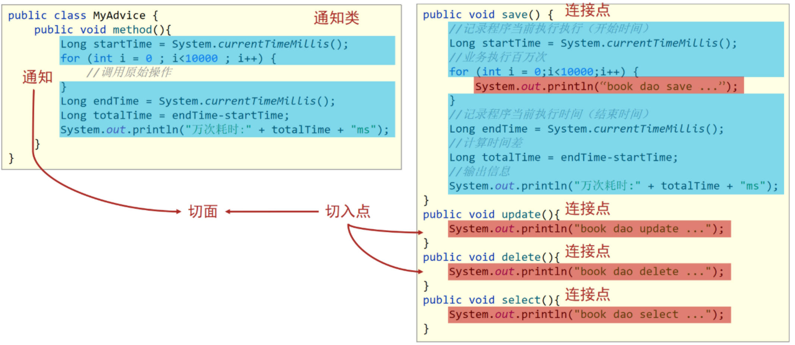
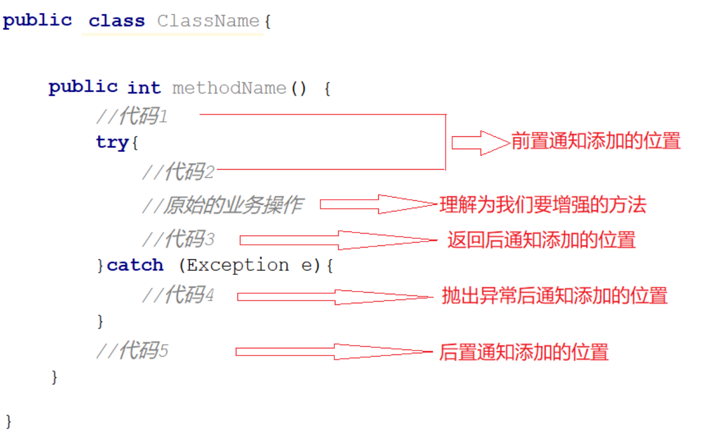
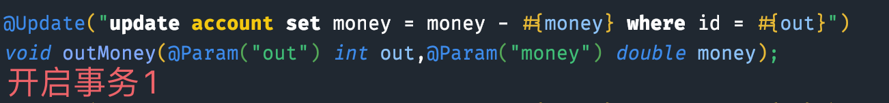
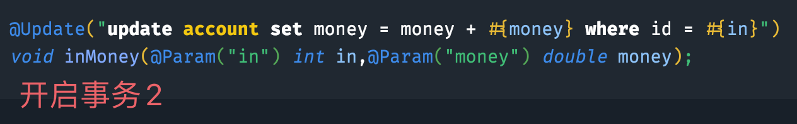
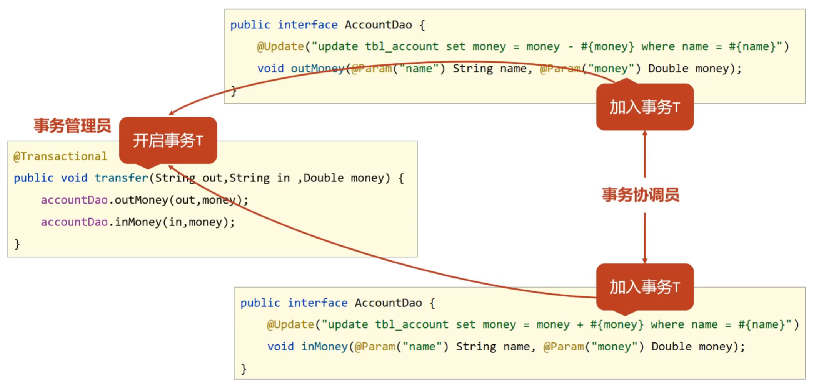
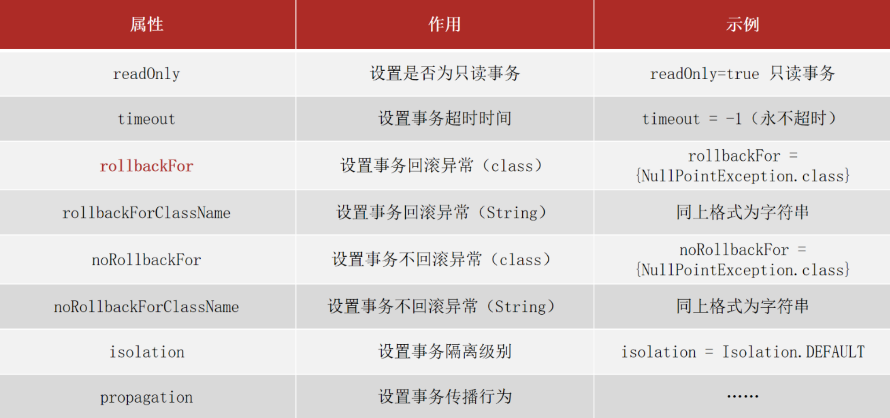

# 1. AOP
> AOP一种编程思想，在不改变源代码前提下对其进行功能增强。

AOP专业术语：
1. 连接点：待增强方法
2. 切入点：被增强方法
3. 通知类：编写增强方法的类
4. 通知：增强方法
5. 切面：通知增强连接点的关系描述
6. 目标类：需要被代理的类
7. 代理：通过代理目标对象创建的对象



# 2. 入门
准备类：
```java
public interface UserDao {
    void insert();

    void add();
}

@Repository
public class UserDaoImpl implements UserDao {
    public void insert() {
        System.out.println("UserDaoImpl insert run...");
    }

    public void add() {
        System.out.println("UserDaoImpl add run...");
    }
}
```


1.添加依赖：SpringAOP是依赖Aspect开源框架，所以需要添加依赖。
```xml
<dependencies>
    <dependency>
        <groupId>org.springframework</groupId>
        <artifactId>spring-context</artifactId>
        <version>5.2.10.RELEASE</version>
    </dependency>
    <dependency>
        <groupId>org.aspectj</groupId>
        <artifactId>aspectjweaver</artifactId>
        <version>1.9.4</version>
    </dependency>
</dependencies>
```

2.编写通知类及通知等：
```java
// 装配组件注解
@Component
// 通知类注解
@Aspect
public class DaoAdvice {

    // 切入点
    @Pointcut("execution(void cn.fishland.dao.UserDao.insert())")
    public void pt() {
    }

    // 切面
    @Before("pt()") // 方法执行前
    // 通知
    public void showTime() {
        System.out.println(System.currentTimeMillis());
    }
}
```

3.主配置类开启AOP：
```java
@Configuration
// 开启AOP功能
@EnableAspectJAutoProxy
@ComponentScan("cn.fishland")
public class AppConfig {
}
```

4.测试：
```java
public class Application {
    public static void main(String[] args) {
        AnnotationConfigApplicationContext context = new AnnotationConfigApplicationContext(AppConfig.class);
        UserDao bean = context.getBean(UserDao.class);
        bean.insert();
        System.out.println("=========================");
        bean.add();
    }
}
```

# 3. AOP工作流程

1. 容器加载bean和通知类，但是此时被增强类并未创建。
2. 加载切入点，只加载被应用的切入点。
3. 为增强类创建代理类，未增强类创建原始类。
4. 通过容器获得bean

# 4. AOP详细配置

## 4.1 切入点表达式

> 切入点通常配置的较多，如果单独配置会出现很多，这时就有通配符等解决办法。

### 4.1.1 语法格式

`@Pointcut("动作关键字(访问修饰符 返回值 包名.类/接口名.方法名(参数) 异常名)"));`

1. 动作关键字：execution表示执行到切入点
2. 访问修饰符：一般不写，通常情况下被增强方法修饰符都是public，当然也可以其他
3. 返回值：不可省略
4. 包名.类/接口名.方法名(参数)：类的全路径名称加方法和参数
5. 异常：可省略

示例：`@Pointcut("execution(void cn.fishland.dao.UserDao.insert())")`

> 关于方法配接口还是实现类，其实是都可以的，但是通常使用的是接口方法路径名，配实现类的话耦合度较高。

### 4.1.2 通配符

1. `*`：表示任意个符号

示例：`execution（public * cn.fishland.*.UserService.find*(*))`

表示返回值任意，cn.fishland包下任意包的UserService接口的以find开头的方法，形参为一个。

2. `..`：表示多个连续符号

示例`execution（public User cn..UserService.findById(..))`

匹配返回值为User，cn包下任意包下UserService接口的findById方法，参数为任意个。

3. `+`：表示匹配子类

示例：`execution(* *..*Service+.*(..))`

返回值任意，任意包下以Service结尾的子类的任一方法，参数任意个。

**符号表示单个单词或者标识符，例如cn、fishland、User都是的**

### 4.1.3 配置规范

1. 切入点类**通常描述接口**
2. 访问修饰符一般省略
3. 增删改返回值使用精确类型，查询使用通配符*
4. 包尽量不使用..通配符，可以使用*通配符，尽量精确包名
5. 类或接口名书写一般采用*加结尾，例如服务层`*Service`
6. 方法名，动词精确匹配，名称采用匹配


## 4.2 通知类

> 通知类型处理示例中的前置通知外还有其他四种，后置通知、环绕通知、返回后通知和异常通知。



测试类：
```java
public interface UserDao {
    void insert();

    void add();

    void select();
}

@Repository
public class UserDaoImpl implements UserDao {
    public void insert() {
        System.out.println("UserDaoImpl insert run...");
    }

    public void add() {
        int x = 1 / 0;
        System.out.println("UserDaoImpl add run...");
    }

    public void select() {
        System.out.println("UserDaoImpl select run...");
    }
}
```

多种通知类型配置：
```java
@Component
// 通知类注解
@Aspect
public class DaoAdvice {

    // 切入点
    @Pointcut("execution(void cn.fishland.dao.UserDao.insert())")
    public void ptInsert() {
    }

    // 切入点
    @Pointcut("execution(void cn.fishland.dao.UserDao.add())")
    public void ptAdd() {
    }

    // 切入点
    @Pointcut("execution(void cn.fishland.dao.UserDao.select())")
    public void ptSelect() {
    }

    // 前置通知
    @Before("ptInsert()")
    public void before() {
        System.out.println("insert method before...");
    }

    // 返回后通知
    @AfterReturning("ptInsert()")
    public void afterReturning() {
        System.out.println("insert method afterReturning...");
    }

    // 后置通知
    @After("ptInsert()")
    public void after() {
        System.out.println("insert method after...");
    }

    // 异常通知
    @AfterThrowing("ptAdd()")
    public void afterThrowing() {
        System.out.println("add method after...");
    }

    // 环绕通知
    @Around("ptSelect()")
    public Object around(ProceedingJoinPoint pjp) throws Throwable {
        System.out.println("select method around before...");
        Object proceed = pjp.proceed();
        System.out.println("select method around after...");
        return proceed;
    }
}
```

环绕通知注意：
1. 环绕通知需要有参数ProceedingJoinPoint用于操作目标类方法
2. 环绕通知最好有返回值，切入点有参数，环绕通知必须有，切入点为void，环绕通知可以为Object或void
3. 需要对目标方法调用进行异常处理

# 5. 通知获得参数

> 在为切入点进行功能增强时，不仅仅增加一些功能，还需要对数据进行处理，主要的处理为切入点参数、返回值和异常数据。

1. 切入点参数：所有通知都适合获取
   1. JoinPoint：前置、返回后、异常后和后置
   2. ProceedingJoinPoint：环绕通知
2. 切入点返回值：前置和异常后没有返回值，后置方法可有可无，所以适合获得返回值的是有返回后和环绕。
   1. 返回后通知
   2. 环绕通知
3. 异常：只适合环绕和异常后
   1. 异常后通知
   2. 环绕通知

## 5.1 切入点参数

```java
@Component
// 通知类注解
@Aspect
public class DaoAdvice {
    // 切入点
    @Pointcut("execution(void cn.fishland.dao.UserDao.add(..))")
    public void ptAdd() {
    }

    // 前置通知
    @Before("ptAdd()")
    public void before(JoinPoint joinPoint) {
        System.out.println("before advice get args=" + Arrays.toString(joinPoint.getArgs()));
    }

    // 返回后通知
    @AfterReturning("ptAdd()")
    public void afterReturning(JoinPoint joinPoint) {
        System.out.println("afterReturning advice get args=" + Arrays.toString(joinPoint.getArgs()));
    }

    // 异常后通知
    @AfterThrowing("ptAdd()")
    public void afterThrow(JoinPoint joinPoint) {
        System.out.println("afterThrow advice get args=" + Arrays.toString(joinPoint.getArgs()));
    }

    // 后置通知
    @After("ptAdd()")
    public void after(JoinPoint joinPoint) {
        System.out.println("after advice get args=" + Arrays.toString(joinPoint.getArgs()));
    }

    // 环绕通知
    @Around("ptAdd()")
    public Object around(ProceedingJoinPoint point) {
        Object proceed = null;
        try {
            System.out.println("around advice get args="+Arrays.toString(point.getArgs()));
            proceed = point.proceed();
            System.out.println("around advice end...");
        } catch (Throwable e) {
            e.printStackTrace();
        }
        return proceed;
    }
}

@Repository
public class UserDaoImpl implements UserDao {

   public void add(User user) {
      System.out.println("UserDaoImpl add...");
      for (int i = 0; i < 10000; i++) {
         System.out.print("wait" + i + " ");
      }
      System.out.println();
      // 去掉下面注释，会访问异常后通知
      // throw new RuntimeException("....");
   }
}

```

## 5.2 切入点返回值

```java
@Component
// 通知类注解
@Aspect
public class DaoAdvice {
    // 切入点
    @Pointcut("execution(* cn.fishland.dao.UserDao.getBy*(..))")
    public void ptGet() {
    }

    // 返回后通知获得返回值
    @AfterReturning(value = "ptGet()", returning = "user")
    public void getAfterReturning(User user) {
        System.out.println("getAfterReturning return param=" + user.toString());
    }

    // 环绕通知获得返回值
    @Around(value = "ptGet()")
    public Object getAround(ProceedingJoinPoint joinPoint) {
        Object proceed = null;
        try {
            proceed = joinPoint.proceed();
            System.out.println("getAround return param=" + proceed.toString());
        } catch (Throwable e) {
            e.printStackTrace();
        }
        return proceed;
    }
}

@Repository
public class UserDaoImpl implements UserDao {
   public User getById(int id) {
      User user = new User();
      user.setId(1);
      user.setName("fish");
      System.out.println("UserDaoImpl getById...");
      return user;
   }
}

```

## 5.3 获得异常

```java
@Component
// 通知类注解
@Aspect
public class DaoAdvice {

    // 切入点
    @Pointcut("execution(* cn.fishland.dao.UserDao.update(..))")
    public void ptUpdate() {
    }

    // 异常后获得异常
    @AfterThrowing(value = "ptUpdate()", throwing = "e")
    public void updateAfterThrowing(Throwable e) {
        System.out.println("updateAfterThrowing exception e=" + e.getMessage());
    }

    // 环绕获得异常
    @Around("ptUpdate()")
    public Object updateAround(ProceedingJoinPoint joinPoint) {
        Object proceed = null;
        try {
            proceed = joinPoint.proceed();
        } catch (Throwable e) {
            System.out.println("updateAround exception e=" + e.getMessage());
        }
        return proceed;
    }

}

@Repository
public class UserDaoImpl implements UserDao {
   public void update(User user) {
      System.out.println("UserDaoImpl update...");
      throw new NullPointerException("UserDaoImpl update exception");
   }
}

```

# 6. AOP简单应用

## 6.1 计算Dao耗时

> 计算每次操作数据库的方法耗时

```java
@Repository
public class UserDaoImpl implements UserDao {

   @Override
   public User getById(int id) {
      System.out.println("UserDaoImpl getById...");
      for (int i = 0; i < 10000; i++) {
         System.out.print(i + ",");
      }
      System.out.println();
      return null;
   }

   @Override
   public List<User> getAll() {
      System.out.println("UserDaoImpl getAll...");
      for (int i = 0; i < 10000; i++) {
         System.out.print(i + ",");
      }
      System.out.println();
      return null;
   }
}

@Component
// 通知类注解
@Aspect
public class DaoAdvice {
   // 切入点
   @Pointcut("execution(* cn.fishland.dao.UserDao.get*(..))")
   public void ptGet() {
   }

   // 环绕通知
   @Around("ptGet()")
   public Object getAround(ProceedingJoinPoint joinPoint) {
      Object proceed = null;
      try {
         long l = System.currentTimeMillis();
         proceed = joinPoint.proceed();
         // 计算耗时
         System.out.println("use time:" + (System.currentTimeMillis() - l));
      } catch (Throwable e) {
         System.out.println("updateAround exception e=" + e.getMessage());
      }
      return proceed;
   }

}
```

## 6.1 预处理参数

> 去掉参数的前后空格，使用环绕通知

```java
public interface UserDao {
   User getByName(String name);
}

@Repository
public class UserDaoImpl implements UserDao {
    @Override
    public User getByName(String name) {
        System.out.println("UserDaoImpl getByName name=" + name);
        return null;
    }
}

@Component
// 通知类注解
@Aspect
public class DaoAdvice {
   // 切入点
   @Pointcut("execution(* cn.fishland.dao.UserDao.get*(..))")
   public void ptGet() {
   }

   // 前置通知处理参数问题
   @Around("ptGet()")
   public Object getAround(ProceedingJoinPoint joinPoint) {
      Object proceed = null;
      try {
         Object[] args = joinPoint.getArgs();
         // 处理所有String类型
         for (int i = 0; i < args.length; i++) {
            if (args[i].getClass().equals(String.class)) {
                // 去除参数前后空格
               args[i] = ((String) args[i]).trim();
            }
         }

         proceed = joinPoint.proceed(args);
      } catch (Throwable e) {
         e.printStackTrace();
      }
      return proceed;
   }
}

```

# 7. AOP管理事务

> 事务在数据库中很重要，主要用于处理一些异常导致的数据问题。在Spring中提供两种事务使用方式，声明事务和编程事务。

## 7.1 简单案例

> 同时操作两行数据，模拟转账，一个用户钱减少另一个增加。

```java
public interface AccountMapper {

    @Update("update account set money = money - #{money} where id = #{out}")
    void outMoney(@Param("out") int out,@Param("money") double money);

    @Update("update account set money = money + #{money} where id = #{in}")
    void inMoney(@Param("in") int in,@Param("money") double money);
}

@Service
public class AccountServiceImpl implements AccountService {

   @Autowired
   AccountMapper accountMapper;

   @Transactional
   public boolean trnsfer(int out, int in, Double money) {

      accountMapper.outMoney(out, money);

      // 此处出现异常，事务就会自动回滚，数据都不会进行修改
      int i = 1 / 0;

      accountMapper.inMoney(in, money);

      return true;
   }
}

@Configuration
@ComponentScan("cn.fishland")
@PropertySource("classpath:jdbc.properties")
@Import({JdbcConfig.class, MybatisConfig.class})
// 开启事务管理
@EnableTransactionManagement
public class Appconfig {

   // 装配事务管理
   @Bean
   public PlatformTransactionManager platformTransactionManager(DataSource dataSource) {
      DataSourceTransactionManager dataSourceTransactionManager = new DataSourceTransactionManager();
      dataSourceTransactionManager.setDataSource(dataSource);
      return dataSourceTransactionManager;
   }
}


// 测试
public class Application {
   public static void main(String[] args) {
      AnnotationConfigApplicationContext context = new AnnotationConfigApplicationContext(Appconfig.class);
      AccountService accountService = context.getBean(AccountService.class);
      accountService.trnsfer(1, 2, 100d);
   }
}
```

> 事务注解可以放在类方法上也可放在类上，实现类和接口类都行，**一般放在实现类上**。

## 7.2 事务角色

> 事务角色分为事务管理员和事务协调员

在不添加事务管理的情况下：

1. 开启事务一，运行后自动提交



2. 开始事务二，运行后自动提交



3. 当以上一二步骤之间出现异常，事务一正常提交，并不会回滚。

当添加Spring事务之后：

事务管理员会把单独的事务一和二统一起来管理，事务协调员代指dao或业务层。



## 7.3 事务注解属性



1. readOnly：true只读事务，false读写事务。
2. timeout：设置事务超时时长单位为秒。-1表示不设置时长
3. rollbackFor：设置出现指定异常进行回滚。
   1. 并不是所有异常都会进行回滚，只有RuntimeException和Error这两个异常及其子类才会进行回滚。
4. noRollbackFor：设置出现指定异常不进行回滚
5. rollbackForClassName：同rollbackFor，值为异常全类名字符串
6. noRollbackForClassName：同于noRollbackFor，只不过属性为异常的类全名字符串
7. isolation：设置事务隔离级别
   1. DEFAULT :默认隔离级别, 会采用数据库的隔离级别
   2. READ_UNCOMMITTED : 读未提交
   3. READ_COMMITTED : 读已提交
   4. REPEATABLE_READ : 重复读取
   5. SERIALIZABLE: 串行化

## 7.4 事务传播行为

> 提出问题，在进行转账后需要添加事务，无论是否成功都需要添加日志，如果正常添加就会出现问题。

正常思路问题代码：
```java
public interface LogService {

    List<Account> getAll();

    boolean add(Log log);
}

@Service
public class LogServiceImpl implements LogService {

   @Autowired
   LogMapper logMapper;

   public List<Account> getAll() {
      return logMapper.selectAll();
   }

   @Transactional
   public boolean add(Log log) {
      return logMapper.insert(log) == 1;
   }
}

@Service
public class AccountServiceImpl implements AccountService {

   @Autowired
   AccountMapper accountMapper;

   @Autowired
   LogService logService;

   @Transactional
   public boolean trnsfer(int out, int in, Double money) {
      boolean flag = false;
      try {
         accountMapper.outMoney(out, money);
         // 出现异常后所有事务都会回滚，日志也不会提交
         int x = 1 / 0;
         accountMapper.inMoney(in, money);
         flag = true;
         return true;
      } finally {
         logService.add(new Log("trnsfer money " + flag, new Date()));
      }
   }
}
```

> 解决思路，日志操作事务与转账操作分开，是单独的事务。Spring中用到的是事务传播行为。

设置一下事务传播行为即可：
```java
@Service
public class LogServiceImpl implements LogService {

    @Autowired
    LogMapper logMapper;

    public List<Account> getAll() {
        return logMapper.selectAll();
    }

    // 开启一个新的事务
    @Transactional(propagation = Propagation.REQUIRES_NEW)
    public boolean add(Log log) {
        return logMapper.insert(log) == 1;
    }
}
```

事务传播行为：

|传播属性|说明|
|---|---|
|Required（默认值）|当前存在事务就加入，不存在就创建|
|Support|当前存在事务就加入，不存在就以非事务形式执行|
|Mandatory|当前存在事务就加入，不存在事务就报错|
|Required_new|无论当前是否存在事务，都会新建事务|
|no_support|以非事务形式运行，当前存在事务就挂起|
|never|以非事务形式运行，当前存在事务就报错|
|nested|当前存在事务就在嵌套事务中运行，不存在就执行Required传播行为|


