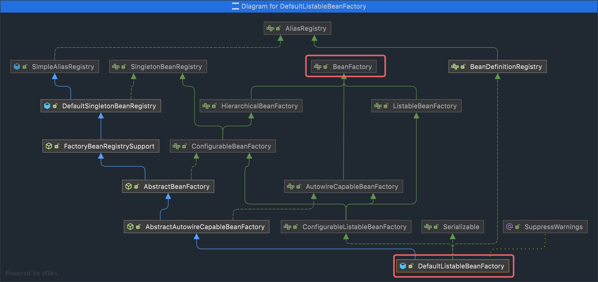
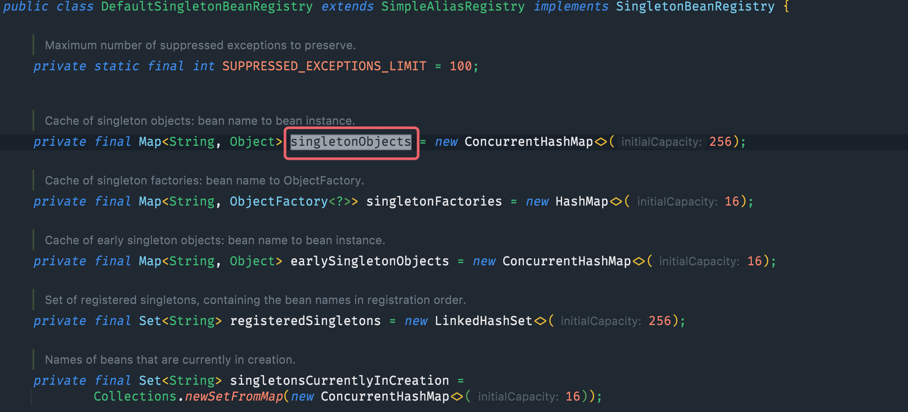
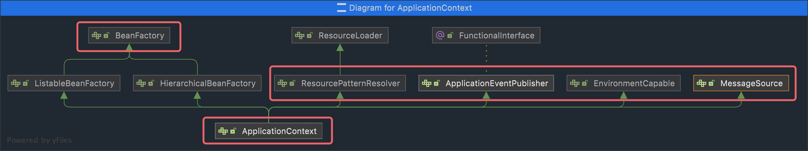

# 1. 容器接口

> BeanFactory是ApplicationContext的父接口，是Spring核心容器，ApplicationContext是BeanFactory主要实现。

## 1.1 BeanFactory

> 主要提供的方法`getBean`，依赖注入、控制反转和bean生命周期都是子类来实现的。
>
> 主要的实现类是DefaultListableBeanFactory，此类不仅仅实现了BeanFactory，还扩展了很多方法。




> DefaultSingletonBeanRegistry类主要是用来管理单例对象集合的，最终的单例对象都存在与`singletonObjects`Map集合中。



**通过反射获得singletonObjects：**

```java

@SpringBootTest
class ApplicationTests {
    @Autowired
    ConfigurableApplicationContext context;

    @Test
    void beanFactoryTest() throws Exception {
        Field field = DefaultSingletonBeanRegistry.class.getDeclaredField("singletonObjects");
        field.setAccessible(true);
        Map<String, Object> fieldMap = (Map<String, Object>) field.get(context.getBeanFactory());
        fieldMap.forEach((k, v) -> {
            // 显示容器中的单例对象
            System.out.println(k + "=" + v);
        });
    }
}
```

## 1.1 ApplicationContext

> 它是Spring容器主要实现容器之一，间接继承BeanFactory。



扩展功能：

- MessageSource：国际化
- ResourcePatternResolver：获得配置文件内容
- EnvironmentCapable：获得环境变量
- ApplicationEventPublisher：事件订阅发布

### 1.1.1 MessageSource

在resources目录下创建多语言文件：

- messages.properties
- messages_en.properties
- messages_ja.properties
- messages_zh.properties

文件内容中写上：`hi=XXXX`

测试：

```java

@SpringBootTest
class ApplicationTests {
    @Autowired
    ConfigurableApplicationContext context;

    @Test
    void contextMessage() {
        System.out.println(context.getMessage("hi", null, Locale.CHINA));
        System.out.println(context.getMessage("hi", null, Locale.JAPANESE));
        System.out.println(context.getMessage("hi", null, Locale.ENGLISH));
    }
}
```

### 1.1.2 ResourcePatternResolver

> 查找配置资源

```java

@SpringBootTest
class ApplicationTests {
    @Autowired
    ConfigurableApplicationContext context;

    @Test
    void resourceTest() throws IOException {
        // 获得配置文件
        Resource[] resources = context.getResources("classpath:application.yml");
        for (Resource resource : resources) {
            System.out.println(resource.getFilename());
        }
    }

    @Test
    void resourceTest1() throws IOException {
        // 获得jar包中所有配置文件
        Resource[] resources = context.getResources("classpath*:META-INF/spring.factories");
        for (Resource resource : resources) {
            System.out.println(resource.toString());
        }
    }
}
```

### 1.1.2 EnvironmentCapable

> 配置信息，环境变量或项目配置信息。

```java

@SpringBootTest
class ApplicationTests {
    @Autowired
    ConfigurableApplicationContext context;

    @Test
    void environmentTest() throws IOException {
        // 不区分大小写
        System.out.println(context.getEnvironment().getProperty("java_home"));
        System.out.println(context.getEnvironment().getProperty("server.port"));
    }
}
```

### 1.1.2 ApplicationEventPublisher

> 用于发布事件。此功能主要用于解耦。例如用户发布内容审核通过，这时需要发消息提醒，但是不能绑定发送功能类，具体的实现可能会变，这种方式解耦最好。

```java
// 自定义事件类
public class UserEvent extends ApplicationEvent {

    public UserEvent(Object source) {
        super(source);
    }

}

@Component
public class Compoent1 {

    @Autowired
    ApplicationEventPublisher context;

    public void save() {
        System.out.println("save success");
        // 类似异步发消息，模拟发送事件
        context.publishEvent(new UserEvent(this));
    }

}

@Component
public class Compoent2 {

    // 需要加@EventListener注解表名这是一个事件监听方法，形参为事件类。
    @EventListener
    public void sendMsg(UserEvent event) {
        System.out.println(event);
        System.out.println("send msg...");
    }
}
```

# 2. Bean声明周期


