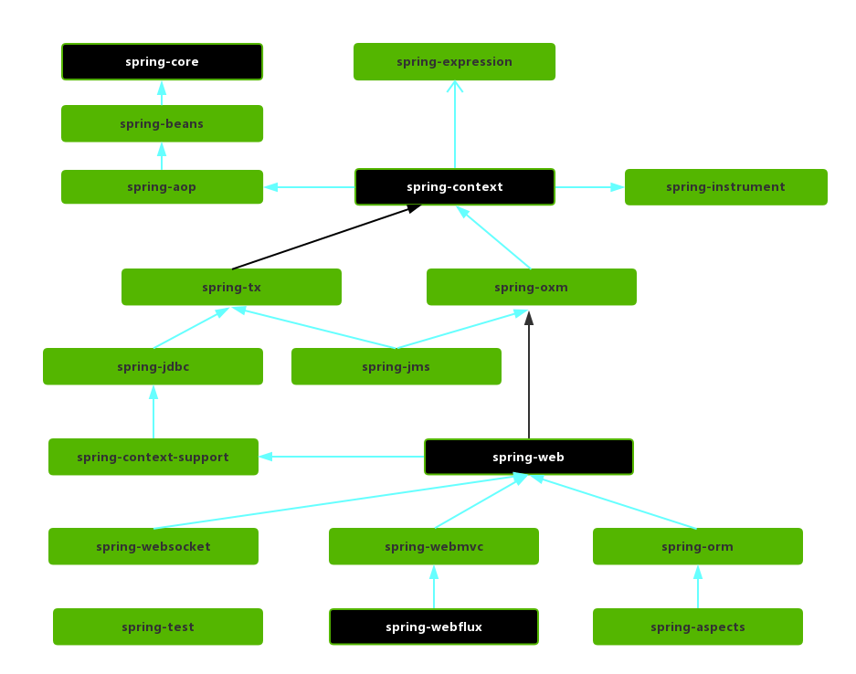
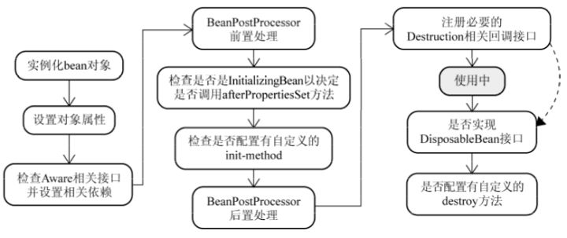

# 什么是Spring
Spring 是一款开源的轻量级 Java 开发框架，旨在提高开发人员的开发效率以及系统的可维护性。

我们一般说 Spring 框架指的都是 Spring Framework，它是很多模块的集合，使用这些模块可以很方便地
协助我们进行开发，比如说 Spring 支持 IoC（Inverse of Control:控制反转）和
AOP(Aspect-Oriented Programming:面向切面编程)、可以很方便地对数据库进行访问、可以很方便地集
成第三方组件（电子邮件，任务，调度，缓存等等）、对单元测试支持比较好、支持 RESTful Java应用程序的开发。

# spring包括的模块
spring4:


spring5:


**_5版本移除portlet，新增webflux模块_**

spring各模块依赖关系图：



## Core Container
- spring-core ：Spring 框架基本的核心工具类。
- spring-beans ：提供对 bean 的创建、配置和管理等功能的支持。
- spring-context ：提供对国际化、事件传播、资源加载等功能的支持。
- spring-expression ：提供对表达式语言（Spring Expression Language） SpEL 的支持，只依赖于 core 模块，不依赖于其他模块，可以单独使用。

## AOP
- spring-aspects ：该模块为与AspectJ的集成提供支持。
- spring-aop ：提供了面向切面的编程实现。
- spring-instrument ：提供了为 JVM 添加代理（agent）的功能。 具体来讲，它为 Tomcat 提供了一个织入代理，能够为Tomcat传递类文件，就像这些
文件是被类加载器加载的一样。没有理解也没关系，这个模块的使用场景非常有限。

## Data Access/Integration
- spring-jdbc ：提供了对数据库访问的抽象 JDBC。不同的数据库都有自己独立的 API 用于操作数据库，而 Java 程序只需要和 JDBC API 交互，这样就屏蔽了数据库的影响。
- spring-tx ：提供对事务的支持。
- spring-orm ： 提供对 Hibernate、JPA 、iBatis 等 ORM 框架的支持。
- spring-oxm ：提供一个抽象层支撑 OXM(Object-to-XML-Mapping)，例如：JAXB、Castor、XMLBeans、JiBX 和 XStream 等。
- spring-jms : 消息服务。自 Spring Framework 4.1 以后，它还提供了对 spring-messaging 模块的继承。

## Web
- spring-web ：对 Web 功能的实现提供一些最基础的支持。
- spring-webmvc ： 提供对 Spring MVC 的实现。
- spring-websocket ： 提供了对 WebSocket 的支持，WebSocket 可以让客户端和服务端进行双向通信。
- spring-webflux ：提供对WebFlux的支持。WebFlux是Spring Framework 5.0中引入的新的响应式框架。与Spring MVC不同，它不需要Servlet API，是完全异步。

## Message
- spring-messaging 是从 Spring4.0 开始新加入的一个模块，主要职责是为 Spring 框架集成一些基础的报文传送应用。

## Test
Spring 团队提倡测试驱动开发（TDD）。有了控制反转 (IoC)的帮助，单元测试和集成测试变得更简单。

Spring 的测试模块对 JUnit（单元测试框架）、TestNG（类似 JUnit）、Mockito（主要用来 Mock 对象）、PowerMock（解决 Mockito 的问题比如无法
模拟 final, static， private 方法）等等常用的测试框架支持的都比较好。

# spring, spring mvc, sprong boot之间的区别
spring：提供核心支持，spring-core是框架的核心其他模块基本上都依赖此模块。
spring mvc：spring的一个模块，可以快速构建javaWeb项目，将逻辑，数据和显示分开进行开发（MVC）。
springboot：简化配置，开箱即用。

# Spring IoC

## 将类加到容器中的注解
- @Component ：通用的注解，可标注任意类为 Spring 组件。如果一个 Bean 不知道属于哪个层，可以使用@Component 注解标注。
- @Repository : 对应持久层即 Dao 层，主要用于数据库相关操作。
- @Service : 对应服务层，主要涉及一些复杂的逻辑，需要用到 Dao 层。
- @Controller : 对应 Spring MVC 控制层，主要用户接受用户请求并调用 Service 层返回数据给前端页面。

## @Component和@Bean区别
- @Componentz注解类，@Bean注解方法
- @Bean自定义性强，可以加载第三方类到容器中。@Component就不行。

## 注入Bean注解
spring注解：@Autowired
jdk注解：@Resource，@Inject

## @Autowired和@Resource
@Autowired：spring内置注解，默认byType注入，需要名称注入最好搭配@Qualifier。
@Resource：jdk注解，默认byName注入，可使用name属性进行配置。

## spring中Bean的作用域
- singleton : IoC 容器中只有唯一的 bean 实例。Spring 中的 bean 默认都是单例的，是对单例设计模式的应用。
- prototype : 每次获取都会创建一个新的 bean 实例。也就是说，连续 getBean() 两次，得到的是不同的 Bean 实例。
- request （仅 Web 应用可用）: 每一次 HTTP 请求都会产生一个新的 bean（请求 bean），该 bean 仅在当前 HTTP request 内有效。
- session （仅 Web 应用可用） : 每一次来自新 session 的 HTTP 请求都会产生一个新的 bean（会话 bean），该 bean 仅在当前 HTTP session 内有效。
- application/global-session （仅 Web 应用可用）： 每个 Web 应用在启动时创建一个 Bean（应用 Bean），，该 bean 仅在当前应用启动时间内有效。
- websocket （仅 Web 应用可用）：每一次 WebSocket 会话产生一个新的 bean。

## Bean是线程安全的吗
不是，但是大部分Bean都是无状态的，没有共享属性。如果需要存储值可以使用ThreadLocal。

## Bean生命周期
- Bean 容器找到配置文件中 Spring Bean 的定义。
- Bean 容器利用 Java Reflection API 创建一个 Bean 的实例。
- 如果涉及到一些属性值 利用 set()方法设置一些属性值。
- 如果 Bean 实现了 BeanNameAware 接口，调用 setBeanName()方法，传入 Bean 的名字。
- 如果 Bean 实现了 BeanClassLoaderAware 接口，调用 setBeanClassLoader()方法，传入 ClassLoader对象的实例。
- 如果 Bean 实现了 BeanFactoryAware 接口，调用 setBeanFactory()方法，传入 BeanFactory对象的实例。
- 与上面的类似，如果实现了其他 *.Aware接口，就调用相应的方法。
- 如果有和加载这个 Bean 的 Spring 容器相关的 BeanPostProcessor 对象，执行postProcessBeforeInitialization() 方法
- 如果 Bean 实现了InitializingBean接口，执行afterPropertiesSet()方法。
- 如果 Bean 在配置文件中的定义包含 init-method 属性，执行指定的方法。
- 如果有和加载这个 Bean 的 Spring 容器相关的 BeanPostProcessor 对象，执行postProcessAfterInitialization() 方法
- 当要销毁 Bean 的时候，如果 Bean 实现了 DisposableBean 接口，执行 destroy() 方法。
- 当要销毁 Bean 的时候，如果 Bean 在配置文件中的定义包含 destroy-method 属性，执行指定的方法。



# Spring AOP
AOP(Aspect-Oriented Programming:面向切面编程)能够将那些与业务无关，却为业务模块所共同调用的逻辑或责任（例如事务处理、日志管理、权限控制等）
封装起来，便于减少系统的重复代码，降低模块间的耦合度，并有利于未来的可拓展性和可维护性。

专业术语：

|术语|含义|
|---|---|
|目标(Target)|被通知的对象|
|代理(Proxy)	|向目标对象应用通知之后创建的代理对象|
|连接点(JoinPoint)|目标对象的所属类中，定义的所有方法均为连接点|
|切入点(Pointcut)|被切面拦截 / 增强的连接点（切入点一定是连接点，连接点不一定是切入点）|
|通知(Advice)|增强的逻辑 / 代码，也即拦截到目标对象的连接点之后要做的事情|
|切面(Aspect)|切入点(Pointcut)+通知(Advice)|
|Weaving(织入)|将通知应用到目标对象，进而生成代理对象的过程动作|

## Spring AOP和AspectJ AOP区别
Spring AOP属于运行时增强，而 AspectJ 是编译时增强。 Spring AOP 基于代理(Proxying)，而 AspectJ 基于字节码操作(Bytecode Manipulation)。
Spring AOP已经集成了 AspectJ ，AspectJ 应该算的上是 Java 生态系统中最完整的 AOP 框架了。AspectJ 相比于 Spring AOP 功能更加强大，但是
Spring AOP相对来说更简单，两者性能差异不大。但是，当切面太多的话，最好选择 AspectJ ，它比 Spring AOP 快很多。

## AspectJ定义的通知
- Before（前置通知）：目标对象的方法调用之前触发
- After （后置通知）：目标对象的方法调用之后触发
- AfterReturning（返回通知）：目标对象的方法调用完成，在返回结果值之后触发
- AfterThrowing（异常通知） ：目标对象的方法运行中抛出 / 触发异常后触发。AfterReturning 和 AfterThrowing 两者互斥。
- Around：（环绕通知）around可以翻译成到处,向各处。编程式控制目标对象的方法调用。环绕通知是所有通知类型中可操作范围最大的一种，因为它可以直接拿到目标对象，以及要执行的方法，所以环绕通知可以任意的在目标对象的方法调用前后搞事，甚至不调用目标对象的方法

## 多切面执行顺序控制
1.@Order(1)注解，数值越小优先级越高。
2.实现Ordered 接口重写 getOrder 方法。
```java
@Component
@Aspect
public class LoggingAspect implements Ordered {

    // ....

    @Override
    public int getOrder() {
        // 返回值越小优先级越高
        return 1;
    }
}
```

# Spring事务
## Spring两种事务管理方式
1. 编程式事务

```java
// 使用TransactionTemplate实现编程式事务
@Autowired
private TransactionTemplate transactionTemplate;
public void testTransaction() {
    transactionTemplate.execute(new TransactionCallbackWithoutResult() {
        @Override
        protected void doInTransactionWithoutResult(TransactionStatus transactionStatus) {
            try {
                // ....  业务代码
            } catch (Exception e){
                //回滚
                transactionStatus.setRollbackOnly();
            }
        }
    });
}

// 使用TransactionManager实现编程式事务
@Autowired
private PlatformTransactionManager transactionManager;

public void testTransaction() {

        TransactionStatus status = transactionManager.getTransaction(new DefaultTransactionDefinition());
        try {
        // ....  业务代码
        transactionManager.commit(status);
        } catch (Exception e) {
        transactionManager.rollback(status);
        }
        }
```
2. 声明式事务
方法或者类上添加@Transactional注解即可，或者在xml配置文件中配置。

## Spring事务接口简介
PlatformTransactionManager：事物管理器
TransactionDefinition：事物属性定义
TransactionStatus：事物运行状态

- PlatformTransactionManager
> 定义的接口，其实现类可以根据开发者自定义，Spring为各个平台提供了具体事务管理器实现类。（DataSourceTransactionManager，HibernateTransactionManager）

- TransactionDefinition
> 定义事务的一些属性，在Spring中把事务操作细化很多，包括多方法事务之间的处理等等。
主要属性：
  - 隔离级别
  - 传播行为
  - 回滚规则
  - 是否只读
  - 事物超时

- TransactionStatus
> 主要获得事物的是否新事物、是否有恢复点、设置只回滚，是否为只回滚，是否完成。


## @Transaction
方法：只能注解在public方法上，否则会失效。
类：类中所有的public方法生效
接口：不推荐，注解不会被继承，因为代理的不确定性，在接口上失效的可能性较大。

常用属性：

|属性名|说明|
|---|---|
|propagation|事务的传播行为，默认值为 REQUIRED，可选的值在上面介绍过|
|isolation|事务的隔离级别，默认值采用 DEFAULT，可选的值在上面介绍过|
|timeout|事务的超时时间，默认值为-1（不会超时）。如果超过该时间限制但事务还没有完成，则自动回滚事务。|
|readOnly|指定事务是否为只读事务，默认值为 false。|
|rollbackFor|用于指定能够触发事务回滚的异常类型，并且可以指定多个异常类型。|

## @Transaction失效场景
1. 用在非public方法上
2. propagation，rollbackFor属性设置错误，不会回归导致事务失效
3. 同类中非事务注解方法调用事务注解方法时，事务注解的方法也会失效。主要和动态代理有关。
4. 异常被catch处理了，这样也会导致事务失效。
5. 数据库不支持事务。
6. 事务注解的类不在Spring中管理。

## @Transactional(rollbackFor = Exception.class)注解
当不配置rollbackFor时，事务默认在遇到RuntimeException时进行回滚。当配置了rollbackFor = Exception.class时，以让事务在遇到非运行时异常时也回滚。

## @Transaction事务传播行为
> 事务传播行为是为了解决业务层方法之间调用的事务问题。Spring中定义了7中事务传播行为。

### 1. Propagation.REQUIRED（事务默认传播行为）
当前事务存在则加入，不存在则创建新的事务。
- 如果外部不存在事务，则被Propagation.REQUIRED设置的事务会创建事务，事务之间独立，互不干扰。
- 如果外部事务被Propagation.REQUIRED设置，则所有方法共用同一事务。

### 2. Propagation.REQUIRES_NEW
创建一个新的事务，如果当前存在事务，则把当前事务挂起。也就是说不管外部方法是否开启事务，Propagation.REQUIRES_NEW修饰的内部方法会新开启自己的事务，且开启的事务相互独立，互不干扰。
> 如果外部被REQUIRED设置的事务调用REQUIRES_NEW设置的事务，当后者方法异常出现回滚，前者方法不会回滚。因为REQUIRES_NEW新增事务是独立的。
> 不过如果后者方法抛回滚异常，前者还是会回滚的。

### 3. Propagation.PROPAGATION_NESTED
如果当前存在事务，就在嵌套事务内执行；如果当前没有事务，就执行与TransactionDefinition.PROPAGATION_REQUIRED类似的操作。
- 在外部方法开启事务的情况下,在内部开启一个新的事务，作为嵌套事务存在。
- 如果外部方法无事务，则单独开启一个事务，与 PROPAGATION_REQUIRED 类似。

### 4. Propagation.PROPAGATION_MANDATORY
如果当前存在事务，则加入事务。不存在事务时，则抛出异常。

### 5. Propagation.PROPAGATION_SUPPORTS
如果当前存在事务，则加入事务。不存在事务时，以无事务形式执行。

### 6. Propagation.PROPAGATION_NOT_SUPPORTED

以非事务方式运行，如果当前存在事务，则把当前事务挂起。

### 7. Propagation.PROPAGATION_NEVER
以非事务方式运行，如果当前存在事务，则抛出异常。

## 隔离级别
Spring定义了5种隔离级别。

### 1. TransactionDefinition.ISOLATION_DEFAULT
使用后端数据库默认的隔离级别，MySQL 默认采用的 REPEATABLE_READ 隔离级别 Oracle 默认采用的 READ_COMMITTED 隔离级别.

### 2. TransactionDefinition.ISOLATION_READ_UNCOMMITTED
最低的隔离级别，使用这个隔离级别很少，因为它允许读取尚未提交的数据变更，可能会导致脏读、幻读或不可重复读。

### 3. TransactionDefinition.ISOLATION_READ_COMMITTED
允许读取并发事务已经提交的数据，可以阻止脏读，但是幻读或不可重复读仍有可能发生。

### 4. TransactionDefinition.ISOLATION_REPEATABLE_READ
对同一字段的多次读取结果都是一致的，除非数据是被本身事务自己所修改，可以阻止脏读和不可重复读，但幻读仍有可能发生。

### 5. TransactionDefinition.ISOLATION_SERIALIZABLE
最高的隔离级别，完全服从 ACID 的隔离级别。所有的事务依次逐个执行，这样事务之间就完全不可能产生干扰，也就是说，该级别可以防止脏读、不可重复读以及幻读。但是这将严重影响程序的性能。通常情况下也不会用到该级别。

## 事务超时属性
所谓事务超时，就是指一个事务所允许执行的最长时间，如果超过该时间限制但事务还没有完成，则自动回滚事务。在 TransactionDefinition 中以 int 的值来表示超时时间，其单位是秒，默认值为-1，这表示事务的超时时间取决于底层事务系统或者没有超时时间。

## 事务只读属性
对于只有读取数据查询的事务，可以指定事务类型为 readonly，即只读事务。只读事务不涉及数据的修改，数据库会提供一些优化手段，适合用在有多条数据库查询操作的方法中。

在mysql中每执行一条sql都会启用autocommit新建事务，但是在类似报表大数据查询时，时差可能会导致多表之间数据的不一致。这时就可以开启只读事务保证读取
数据的一致性。

## 回滚规则
默认情况下在遇到Error和运行时异常才会进行回滚，检查时异常不会回滚。

