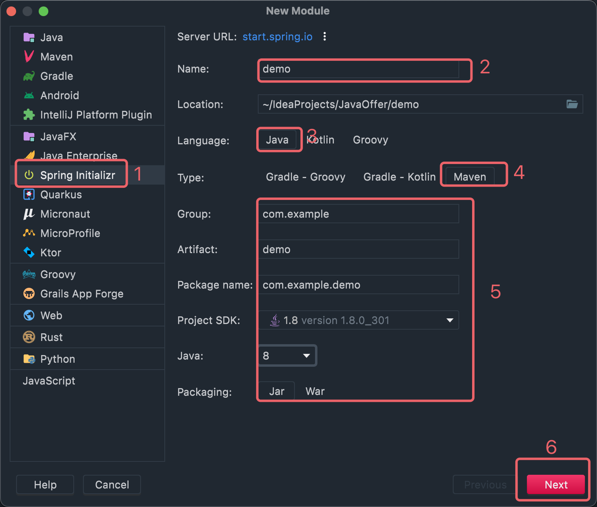
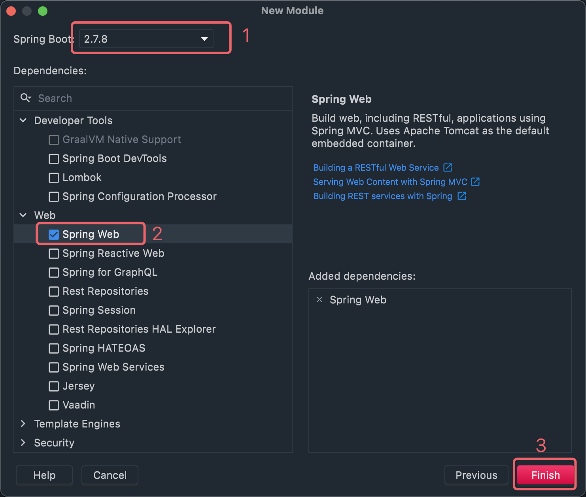

# 1. SpringBoot

> SpringBoot是由Pivotal团队提供的全新框架，其设计目的是用来简化Spring应用的初始搭建以及开发过程。

## 1.1 入门案例

1. 新建工程，如下：





2. 等待依赖加载，直接运行启动类即可：

```java

@SpringBootApplication
public class Application {
    public static void main(String[] args) {
        SpringApplication.run(Application.class, args);
    }
}
```

**通过以上步骤就直接运行一个Web项目了，什么都不用配，简直逆天。**

项目自动创建后生成的东西：

```java
// SpringBoot注解
@SpringBootApplication
public class Application {
    public static void main(String[] args) {
        SpringApplication.run(Application.class, args);
    }
}
```

```xml

<project>
    <modelVersion>4.0.0</modelVersion>
    <!--继承-->
    <parent>
        <groupId>org.springframework.boot</groupId>
        <artifactId>spring-boot-starter-parent</artifactId>
        <version>2.7.8</version>
        <relativePath/>
    </parent>

    <groupId>cn.fishland</groupId>
    <artifactId>SpringBoot</artifactId>
    <version>0.0.1-SNAPSHOT</version>

    <properties>
        <java.version>1.8</java.version>
    </properties>

    <dependencies>
        <!--继承依赖-->
        <dependency>
            <groupId>org.springframework.boot</groupId>
            <artifactId>spring-boot-starter-web</artifactId>
        </dependency>

        <!--继承依赖-->
        <dependency>
            <groupId>org.springframework.boot</groupId>
            <artifactId>spring-boot-starter-test</artifactId>
            <scope>test</scope>
        </dependency>
    </dependencies>

    <build>
        <plugins>
            <!--SpringBootMaven插件-->
            <plugin>
                <groupId>org.springframework.boot</groupId>
                <artifactId>spring-boot-maven-plugin</artifactId>
            </plugin>
        </plugins>
    </build>
</project>
```

官网创建项目：

[SpringBoot](https://spring.io/projects/spring-boot)


## 1.2 切换Jetty服务器

修改配置：

```xml

<dependencies>
    <dependency>
        <groupId>org.springframework.boot</groupId>
        <artifactId>spring-boot-starter-web</artifactId>
        <exclusions>
            <!--排除默认tomcat服务器-->
            <exclusion>
                <artifactId>spring-boot-starter-tomcat</artifactId>
                <groupId>org.springframework.boot</groupId>
            </exclusion>
        </exclusions>
    </dependency>

    <!--添加jetty服务器-->
    <dependency>
        <groupId>org.springframework.boot</groupId>
        <artifactId>spring-boot-starter-jetty</artifactId>
    </dependency>

    <dependency>
        <groupId>org.springframework.boot</groupId>
        <artifactId>spring-boot-starter-test</artifactId>
        <scope>test</scope>
    </dependency>
</dependencies>
```

# 2. 配置文件

> SpringBoot配置文件支持三种，分别为properties、yml和yaml三种。但是名称都是application不能变。

## 2.1 三种配置优先级

> `properties > yml > yaml`

yml和yaml语法规则：

- 大小写敏感
- 属性层级关系使用多行描述，每行结尾使用冒号结束
- 使用缩进表示层级关系，同层级左侧对齐，只允许使用空格（不允许使用Tab键）空格的个数并不重要，只要保证同层级的左侧对齐即可。
- 属性值前面添加空格（属性名与属性值之间使用冒号+空格作为分隔）
- `#`表示注释

```yaml
enterprise:
  name: itcast
  age: 16
  tel: 4006184000
  subject:
    - Java
    - 前端
    - 大数据
```

## 2.2 读取yml配置

1. @Value读取

```yaml
fish:
  info: springboot
```

```java

@Controller
public class HomeController {

    @Value("${fish.info}")
    private String fishInfo;

    @RequestMapping("/test")
    @ResponseBody
    public String test(String name) {
        System.out.println("name=" + name);
        System.out.println("fishInfo=" + fishInfo);
        return "Hello SpringBoot!";
    }
}
```

2. 注入Environment读取

```yaml
less:
  data: fish
```

```java

@Controller
public class HomeController {

    @Autowired
    private Environment env;

    @RequestMapping("/test")
    @ResponseBody
    public String test(String name) {
        System.out.println("name=" + name);
        System.out.println("Environment lessData=" + env.getProperty("less.data"));
        return "Hello SpringBoot!";
    }
}
```

3. 自定义类

```yaml
enterprise:
  name: itcast
  age: 16
  tel: 4006184000
  subject:
    - Java
    - 前端
    - 大数据
```

```java

@Component
@ConfigurationProperties(prefix = "enterprise")
public class Enterprise {
    private String name;
    private int age;
    private String tel;
    private String[] subject;

    public Enterprise() {
    }

    // get set toString ...
}

@Controller
public class HomeController {

    @Autowired
    private Enterprise enterprise;

    @RequestMapping("/test")
    @ResponseBody
    public String test(String name) {
        System.out.println("name=" + name);
        System.out.println("enterprise=" + enterprise);
        return "Hello SpringBoot!";
    }
}
```

## 2.3 多环境配置

> 面对不同环境，配置文件是不相同。但是不能每次切换环境就修改配置文件，这样比较繁琐。SpringBoot支持多环境配置。

### 2.3.1 yml多环境

> yml在同一个文件中使用`---`分割多环境配置

```yaml
#设置启用的环境
spring:
  profiles:
    active: dev #表示使用的是开发环境的配置

---

#开发
spring:
  profiles: dev #给开发环境起的名字
server:
  port: 80

---

#生产
spring:
  profiles: pro #给开发环境起的名字
server:
  port: 81

---

#测试
spring:
  profiles: test #给开发环境起的名字
server:
  port: 82

```

较新版本启用环境配置可能是下面的：

```yaml
#开发
spring:
  config:
    activate:
      on-profile: dev
```

### 2.3.2 peoperties多环境

> properties是分开在不同配置文件中的

application.properties

```properties
spring.profiles.active=test
```

application-dev.properties

```properties
server.port=80
```

application-pro.properties

```properties
server.port=81
```

application-test.properties

```properties
server.port=82
```

### 2.3.3 命令行配置

> SpringBoot项目打包成jar直接可以使用`java -jar xxx.jar`运行，也可以添加参数

修改端口：`java -jar xxx.jar --server.port=88 --spring.profiles.active=test`

### 2.3.4 配置文件优先级

- 1级：classpath：application.yml
- 2级：classpath：config/application.yml
- 3级：jar包同目录下 ：application.yml
- 4级：jar包同目录下 ：config/application.yml

优先级：**4级>3级>2级>1级**

# 3. 整合Junit

> 以下配合需要测试类和项目启动类都在相同包路径，否则就需要在`@SpringBootTest`中添加启动类`@SpringBootTest(classes = Application.class)`

1. 导入Junit依赖
2. 编写测试类

```java
// 添加此注解即可
@SpringBootTest
class ApplicationTests {

    @Autowired
    UserService userService;

    @Test
    void contextLoads() {
        System.out.println(userService);
    }

}
```

# 4. 整合Mybatis

## 4.1 整合Mybatis示例

1. 添加依赖

```xml

<dependency>
    <groupId>org.mybatis.spring.boot</groupId>
    <artifactId>mybatis-spring-boot-starter</artifactId>
    <version>2.2.2</version>
</dependency>
```

```xml

<dependency>
    <groupId>mysql</groupId>
    <artifactId>mysql-connector-java</artifactId>
    <version>8.0.30</version>
</dependency>
```

2.添加数据源配置

```yaml
server:
  port: 80
spring:
  # 数据源配置
  datasource:
    driver-class-name: com.mysql.cj.jdbc.Driver
    url: jdbc:mysql://localhost:33060/SSM?serverTimezone=UTC
    username: root
    password: root

```

3. 编写Mapper

> mapper被扫描到有两种，1.在接口类上加`@Mapper`注解，2.在启动类上加`@MapperScan("cn.xxx.xxx")`注解

```java
// 让Spring扫描到
@Mapper
public interface UserDao {

    @Select("select * from user")
    List<User> selectAll();
}
```

4. 测试

```java

@SpringBootTest
class ApplicationTests {

    @Autowired
    UserDao userDao;

    @Test
    void contextLoads() {
        System.out.println(userDao.selectAll());
    }

}
```

## 4.2 使用Druid数据源

1. 添加依赖

```xml

<dependency>
    <groupId>com.alibaba</groupId>
    <artifactId>druid</artifactId>
    <version>1.2.15</version>
</dependency>
```

2. 添加配置

```yaml
server:
  port: 80
spring:
  # 数据源配置
  datasource:
    driver-class-name: com.mysql.cj.jdbc.Driver
    url: jdbc:mysql://localhost:33060/SSM?serverTimezone=UTC
    username: root
    password: root
    type: com.alibaba.druid.pool.DruidDataSource # 指定数据库连接池
```

3. 测试：看日志辨别连接池

```java

@SpringBootTest
class ApplicationTests {

    @Autowired
    UserDao userDao;

    @Test
    void contextLoads() {
        System.out.println(userDao.selectAll());
    }

}
```

# 5. 静态资源访问

```java
// 表名为配置类，自动加载到容器中
@Configuration
public class WebConfig implements WebMvcConfigurer {

    /**
     * 静态资源过滤。
     *
     * @param registry SpringMVC提供。
     */
    @Override
    public void addResourceHandlers(ResourceHandlerRegistry registry) {
        // 第一个参数为请求Url，第二个表示为本地资源文件夹路径。
        registry.addResourceHandler("/static/**").addResourceLocations("classpath:/static/");
    }

    /** 自定义拦截器 */
    @Autowired
    UserInterceptor userInterceptor;

    /**
     * 添加拦截器。
     *
     * @param registry SpringMVC提供。
     */
    @Override
    public void addInterceptors(InterceptorRegistry registry) {
        // 添加拦截器，拦截的url
        registry.addInterceptor(userInterceptor).addPathPatterns("/user", "/user/*");
    }
}

// 加入容器
@Component
public class UserInterceptor implements HandlerInterceptor {

    /**
     * 方法(Controller的方法)执行前执行。
     *
     * @param request  请求对象
     * @param response 返回对象
     * @param handler  Controller方法对象（HandlerMethod）
     * @return true继续执行，false直接调到afterCompletion方法。
     * @throws Exception 异常
     */
    @Override
    public boolean preHandle(HttpServletRequest request, HttpServletResponse response, Object handler) throws Exception {
        System.out.println(((HandlerMethod) handler).getMethod().getName() + "执行前执行...");
        return true;
    }

    /**
     * 方法(Controller的方法)执行成功后执行。
     *
     * @param request      请求对象
     * @param response     返回对象
     * @param handler      Controller方法对象（HandlerMethod）
     * @param modelAndView Controller方法对象（HandlerMethod）返回值。
     * @throws Exception 异常
     */
    @Override
    public void postHandle(HttpServletRequest request, HttpServletResponse response, Object handler, ModelAndView modelAndView) throws Exception {
        System.out.println(((HandlerMethod) handler).getMethod().getName() + "执行完成后执行，返回参数=" + new ObjectMapper().writeValueAsString(modelAndView));
    }

    /**
     * 方法(Controller的方法)执行后执行。
     *
     * @param request  请求对象
     * @param response 返回对象
     * @param handler  Controller方法对象（HandlerMethod）
     * @param ex       Controller方法对象（HandlerMethod）出现的异常对象
     * @throws Exception 异常
     */
    @Override
    public void afterCompletion(HttpServletRequest request, HttpServletResponse response, Object handler, Exception ex) throws Exception {
        if (ex != null) {
            System.out.println(((HandlerMethod) handler).getMethod().getName() + "执行后执行, 异常信息：" + ex.getMessage());
        } else {
            System.out.println(((HandlerMethod) handler).getMethod().getName() + "执行后执行");

        }
    }
}
```

# 6. 拦截器

```java
// SpringBoot会自动扫描添加到容器中
@RestControllerAdvice
public class ExceptionAdvice {

    /**
     * 拦截位置的所有异常。
     * <p>
     * `@ExceptionHandler(Exception.class)`：表示这一个桶通知，参数表示此通知应用在哪个异常上，包括其子类。
     *
     * @param e 异常对象
     * @return 友好的统一返回对象
     */
    @ExceptionHandler(Exception.class)
    public RequestResult exceptionAdvice(Exception e) {
        // 调试可以打开，便于异常快速处理
        // e.printStackTrace();

        // 短信或邮件通知维护人员
        // 短信或邮件通知开发人员
        return new RequestResult(RequestCode.SYS_ERROR, "系统出现问题，请稍后再试");
    }

}
```


