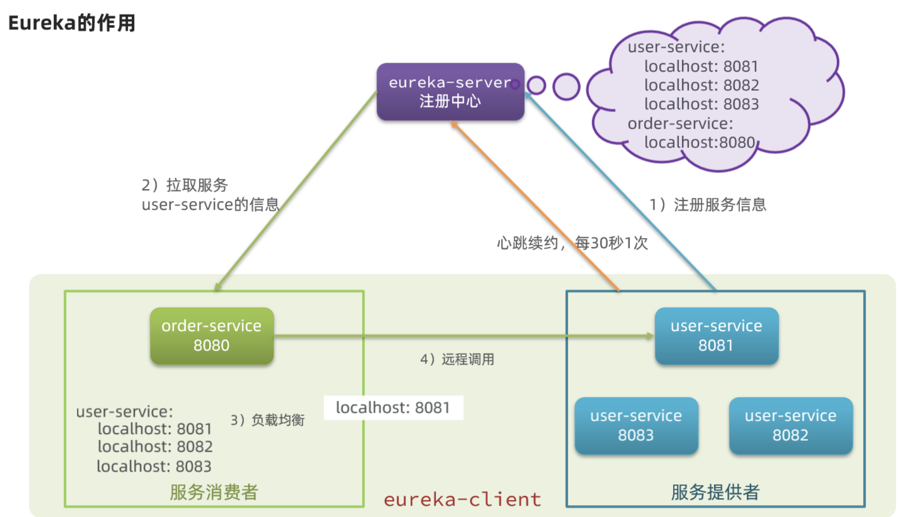

# 1. 简单入门

1.新建服务注册项目

```xml
<!--依赖-->
<dependency>
    <groupId>org.springframework.cloud</groupId>
    <artifactId>spring-cloud-starter-netflix-eureka-server</artifactId>
</dependency>
```

2.配置、启动类测试

```yml
# 配置文件
server:
  port: 10086

spring:
  application:
    name: eureka-server

eureka:
  client:
    service-url:
      defaultZone: http://127.0.0.1:10086/eureka
```

```java
// 需要添加此注解表名为服务注册 
@EnableEurekaServer
@SpringBootApplication
public class EurekaApplication {
    public static void main(String[] args) {
        SpringApplication.run(EurekaApplication.class, args);
    }
}

// 启动后访问`http://127.0.0.1:10086`可查看注册信息
```

3.mall-user服务和mall-order

```yaml
# order服务配置
server:
  port: 12411

spring:
  application:
    name: mall-order
  datasource:
    driver-class-name: com.mysql.cj.jdbc.Driver
    url: jdbc:mysql://localhost:33060/mall_order
    username: root
    password: root
    type: com.alibaba.druid.pool.DruidDataSource

eureka:
  client:
    service-url:
      defaultZone: http://127.0.0.1:10086/eureka

mybatis-plus:
  configuration:
    map-underscore-to-camel-case: false #关闭驼峰
    log-impl: org.apache.ibatis.logging.stdout.StdOutImpl # 开启日志
```

```yaml
# user服务配置
server:
  port: 12401

spring:
  application:
    name: mall-user
  datasource:
    driver-class-name: com.mysql.cj.jdbc.Driver
    url: jdbc:mysql://localhost:33060/mall_user
    username: root
    password: root
    type: com.alibaba.druid.pool.DruidDataSource

eureka:
  client:
    service-url:
      defaultZone: http://127.0.0.1:10086/eureka

mybatis-plus:
  configuration:
    map-underscore-to-camel-case: false #关闭驼峰
    log-impl: org.apache.ibatis.logging.stdout.StdOutImpl # 日志，调试开启
```

```xml

<dependency>
    <groupId>org.springframework.cloud</groupId>
    <artifactId>spring-cloud-starter-netflix-eureka-client</artifactId>
</dependency>
```

启动类：

```java
// 表示为服务提供和消费者
@EnableEurekaClient
@SpringBootApplication
public class UserApplication {
    public static void main(String[] args) {
        SpringApplication.run(UserApplication.class, args);
    }
}

// 表示为服务提供和消费者
@EnableEurekaClient
@SpringBootApplication
public class OrderApplication {

    public static void main(String[] args) {
        SpringApplication.run(OrderApplication.class, args);
    }

    // 装配RestTemplate远程调用类
    @Bean
    // 开启负载均衡
    @LoadBalanced
    public RestTemplate restTemplate() {
        return new RestTemplate();
    }
}

// mall-order服务调用mall-user
@Service
public class OrderServiceImpl implements OrderService {

    @Autowired
    OrderDao orderDao;

    @Autowired
    RestTemplate restTemplate;

    @Override
    public OrderUser getById(long id) {
        Order order = orderDao.selectById(id);
        OrderUser orderUser = new OrderUser();
        BeanUtils.copyProperties(order, orderUser);
        // 远程调用
        User user = restTemplate.getForObject("http://mall-user/user/" + order.getUserId(), User.class);
        orderUser.setUser(user);
        return orderUser;
    }
}
```

## 1.1 Eureka概述

> Eureka最为人所熟知的就是注册中心。



1. order如何通过服务名称获得user服务名称的。
    1. user服务启动，会自动将信息提供给Eureka注册中，此过程叫服务注册。
    2. Eureka注册中心收到注册信息，会保存服务名和实际地址映射关系。
    3. order也会走过以上两步，但是当远程调用user服务时，会向Eureka注册中心拉取消息。这个过程叫服务发现。
2. order如何在多个相同服务中选取user服务。
    1. 通过赋值均衡策略进行访问
3. 如何确定服务是否健康
    1. 注册服务每个30秒向服务发送健康消息，这称之为心跳。
    2. 当注册中心在一段时间内未能收到心跳，机会将服务剔除。服务拉取就不会存在不健康服务。

> 服务提供者也是服务消费者


