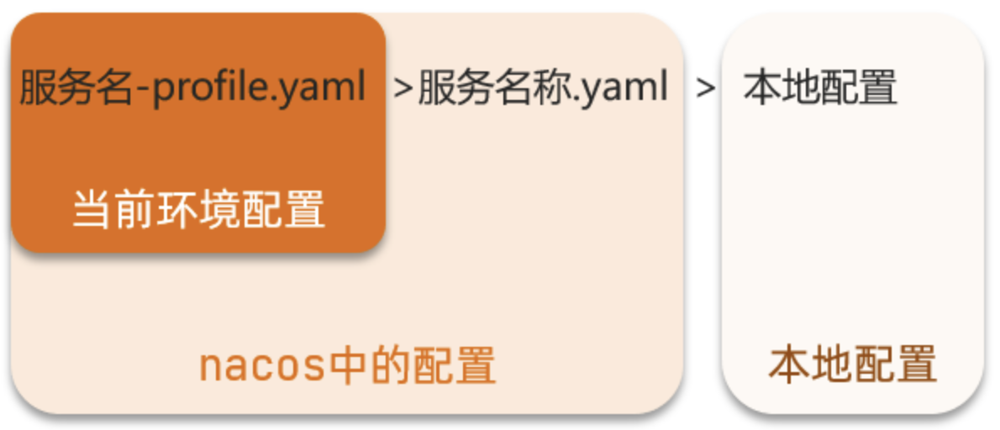

# 1. Nacos概述

> alibaba推出的注册和配置中心。他是一个单独的软件，官网下载直接运行即可，项目通过一些配置即可被管理。

# 2. 注册中心

## 2.1 注册中心简单入门

1.依赖

```xml
<!--父项目-->
<dependency>
    <groupId>com.alibaba.cloud</groupId>
    <artifactId>spring-cloud-alibaba-dependencies</artifactId>
    <version>2.2.6.RELEASE</version>
    <type>pom</type>
    <scope>import</scope>
</dependency>
```

```xml
<!--子项目-->
<dependency>
    <groupId>com.alibaba.cloud</groupId>
    <artifactId>spring-cloud-starter-alibaba-nacos-discovery</artifactId>
</dependency>
```

```yaml
spring:
  cloud:
    nacos:
      server-addr: localhost:8848 #注册中心地址
```

## 2.2 集群

> 服务可能存在多个地方，访问这些项目肯定在同一地区会更快点，nacos是通过集群来进行管理，这时访问当地服务会优先。


```yaml
spring:
  cloud:
    nacos:
      server-addr: localhost:8848
      discovery:
        cluster-name: HZ # 集群名称
```

> 配置集群还需要更改赋值均衡策略，默认策略不支持同集群访问。Nacos提供了NacosRule策略。

```yaml
mall-user:
  ribbon:
    NFLoadBalancerRuleClassName: com.alibaba.cloud.nacos.ribbon.NacosRule # 负载均衡规则 
```

## 2.3 权重配置

> 因为机器的不同，所以相同服务访问速度存在差别，这是可以通过权重来设置访问偏向值。

在nacos控制台找到服务，点击编辑，可以在设置里面修改权重，为0的话此服务不会被访问。


## 2.4 环境隔离

> nacos提供了namespace来实现环境的隔离。namespace之间相互隔离，服务之间不可见。


nacos有个默认空间，此空间是默认值。


点击新建命名空间即可:


微服务配置，重启即可：

```yaml
spring:
  cloud:
    nacos:
      server-addr: localhost:8848
      discovery:
        cluster-name: SH
        namespace: 02d2e7ec-66de-441d-bef8-f1a7e03b6fd2 # 命名空间，填ID
```


## 2.5 服务类型

Nacos的服务实例分为两种类型：

- 临时实例：如果实例宕机超过一定时间，会从服务列表剔除，默认的类型。
- 非临时实例：如果实例宕机，不会从服务列表剔除，也可以叫永久实例。

```yaml
spring:
  cloud:
    nacos:
      discovery:
        ephemeral: false # 设置为非临时实例
```


临时实例：采用心跳检测服务健康

非临时实例：采用主动询问检测服务健康

# 3. 配置中心

> Nacos除了可以做注册中心，同样可以做配置管理来使用。


**核心配置（不会变的）还是放在项目中的，经常变的放在配置中心**

## 3.1 拉取配置

> 配置中心在配置中，不加载配置文件怎么拉取配置了，但是加载配置了拉取的配置又如何应用了。这就存在一个悖论，Spring提供了一个
> bootstrap.yml配置文件来解决这一问题。

工作流程：


## 3.2 实践

1.新建bootstrap.properties配置文件

```yaml
# bootstrap.properties

# 环境
spring.profiles.active=dev

  # 服务名称
spring.application.name=mall-gateway

  # 配置文件后缀
spring.cloud.nacos.config.file-extension=yaml

  # 注册中心地址
spring.cloud.nacos.config.server-addr=localhost:8848

  # 命名空间，nacos提供
spring.cloud.nacos.config.namespace=02d2e7ec-66de-441d-bef8-f1a7e03b6fd2
```

2.添加依赖

```xml

<dependencies>
    <dependency>
        <groupId>com.alibaba.cloud</groupId>
        <artifactId>spring-cloud-starter-alibaba-nacos-config</artifactId>
    </dependency>
    <!--SpringCloudAlibaba2020版本后需要添加-->
    <dependency>
        <groupId>org.springframework.cloud</groupId>
        <artifactId>spring-cloud-starter-bootstrap</artifactId>
    </dependency>
</dependencies>
```

3.nacos添加配置文件

打开nacos网页界面，选择配置管理>配置列表>创建配置：


4.运行查看即可，可以通过以下方式注入配置值：

```java
// 方式一：启动项目时查看

@SpringBootApplication
public class GatewayApplication {
    public static void main(String[] args) {
        ConfigurableApplicationContext context = SpringApplication.run(GatewayApplication.class, args);
        // 通过上下文获得配置内容
        System.out.println("mall.name=" + context.getEnvironment().getProperty("mall.name"));
        System.out.println("mall.age=" + context.getEnvironment().getProperty("mall.age"));
        System.out.println("mall.email=" + context.getEnvironment().getProperty("mall.email"));
    }
}
```

```java
// 方式二：通过@Value值注入

@SpringBootApplication
public class GatewayApplication {
    public static void main(String[] args) {
        SpringApplication.run(GatewayApplication.class, args);
    }

    // 偷懒写法，类似新建一个controller类
    @Controller
    @ResponseBody
    class ConfigTest {
        // 注入配置属性值
        @Value("${mall.name}")
        String mallName;

        // 通过请求可以得到配置值
        @GetMapping("/config")
        @ResponseBody
        public String configTest() {
            return mallName;
        }
    }
}
```

```java
// 方式三：通过@ConfigurationProperties(prefix = "mall")注解来接收配置内容

@SpringBootApplication
public class UserApplication {
    public static void main(String[] args) {
        SpringApplication.run(UserApplication.class, args);
    }

    // 偷懒写法，类似新建一个controller类
    @Controller
    @ResponseBody
    class ConfigTest {
        // 注入配置属性对象
        @Autowired
        ConfigPojo configPojo;

        // 通过请求可以得到配置值
        @GetMapping("/config")
        @ResponseBody
        public ConfigPojo configTest() {
            return configPojo;
        }
    }

    @Data
    @Component
    // 配置数据前缀
    @ConfigurationProperties(prefix = "mall")
    class ConfigPojo {
        String name;
        Integer age;
        String email;
    }
}
```

## 3.3 配置共享

> 在加载配置文件时，项目不仅仅会加载指定配置文件，还会同步共享配置，共享配置是以服务名为名的文件，查看加载日：


- 环境配置文件：`[spring.application.name]-[spring.profiles.active].yaml`
- 共享配置文件：`[spring.application.name].yaml`

直接在nacos发布共享配置文件即可。

## 3.4 配置文件优先级



# 4. 集群搭建

官网集群图：


本次计划图：


| 节点   | ip         | port  |
| ------ | --------- | ----- |
| nacos1 | 127.0.0.1 | 12041 |
| nacos2 | 127.0.0.1 | 12042 |
| nacos3 | 127.0.0.1 | 12043 |

搭建集群的基本步骤：

- 搭建数据库，初始化数据库表结构
- 下载nacos安装包
- 配置nacos
- 启动nacos集群
- nginx反向代理

## 4.1 搭建数据库


