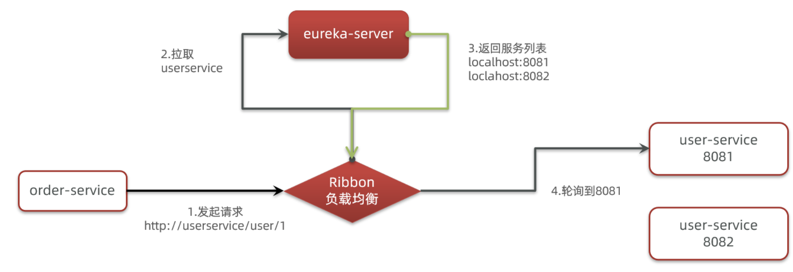
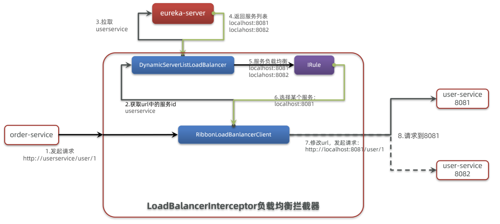

# 1. Ribbon概述

> Ribbon主要负责赋值均衡，那么RestTemplate是如何远程调用，如何负载均衡的了。

> 远程调用主要代码：`restTemplate.getForObject("http://topics/category/name/1", String.class);`



> 以上图片只是简单的描述了如何实现远程，下图详细介绍



- 拦截我们的RestTemplate请求http://mall-user/user/1
- RibbonLoadBalancerClient会从请求url中获取服务名称，也就是mall-user
- DynamicServerListLoadBalancer根据mall-user到eureka拉取服务列表
- eureka返回列表，localhost:8081、localhost:8082
- IRule利用内置负载均衡规则，从列表中选择一个，例如localhost:8081
- RibbonLoadBalancerClient修改请求地址，用localhost:8081替代userservice，得到http://localhost:8081/user/1，发起真实请求

## 1.1 负载均衡策略

| **内置负载均衡规则类**       | **规则描述**                                                 |
| ------------------------- | ------------------------------------------------------------ |
| RoundRobinRule            | 简单轮询服务列表来选择服务器。它是Ribbon默认的负载均衡规则。 |
| AvailabilityFilteringRule | 对以下两种服务器进行忽略： （1）在默认情况下，这台服务器如果3次连接失败，这台服务器就会被设置为“短路”状态。短路状态将持续30秒，如果再次连接失败，短路的持续时间就会几何级地增加。 （2）并发数过高的服务器。如果一个服务器的并发连接数过高，配置了AvailabilityFilteringRule规则的客户端也会将其忽略。并发连接数的上限，可以由客户端的<clientName>.<clientConfigNameSpace>.ActiveConnectionsLimit属性进行配置。 |
| WeightedResponseTimeRule  | 为每一个服务器赋予一个权重值。服务器响应时间越长，这个服务器的权重就越小。这个规则会随机选择服务器，这个权重值会影响服务器的选择。 |
| **ZoneAvoidanceRule**     | 以区域可用的服务器为基础进行服务器的选择。使用Zone对服务器进行分类，这个Zone可以理解为一个机房、一个机架等。而后再对Zone内的多个服务做轮询。 |
| BestAvailableRule         | 忽略那些短路的服务器，并选择并发数较低的服务器。             |
| RandomRule                | 随机选择一个可用的服务器。                                   |
| RetryRule                 | 重试机制的选择逻辑                                           |

## 1.2 自定义负载均衡策略

```java

@EnableDiscoveryClient
@SpringBootApplication
public class OrderApplication {

    public static void main(String[] args) {
        SpringApplication.run(OrderApplication.class, args);
    }

    @Bean
    public IRule randomRule() {
        return new RandomRule();
    }
}
```

```yaml
mall-user: # 给某个微服务配置负载均衡规则
  ribbon:
    NFLoadBalancerRuleClassName: com.netflix.loadbalancer.RandomRule # 负载均衡规则
```

## 1.3 关闭懒加载

```yaml
ribbon:
  eager-load:
    enabled: true
    clients: mall-user
```