# 1. 分布式事务

单机事务：本地事务，也就是传统的**单机事务**。在传统数据库事务中，必须要满足四个原则：

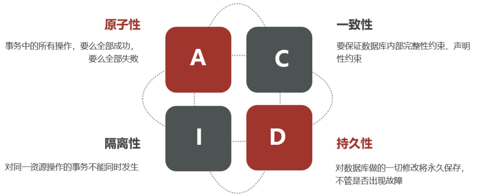

**分布式事务**，就是指不是在单个服务或单个数据库架构下，产生的事务。

- 跨数据源的分布式事务
- 跨服务的分布式事务
- 综合情况

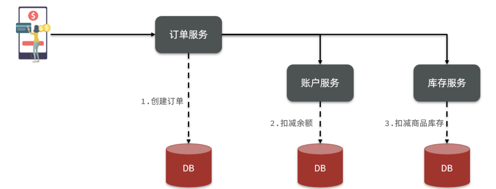

# 2. 理论知识

> 解决分布式事务问题，需要一些分布式系统的基础知识作为理论指导。

## 2.1 CAP定理

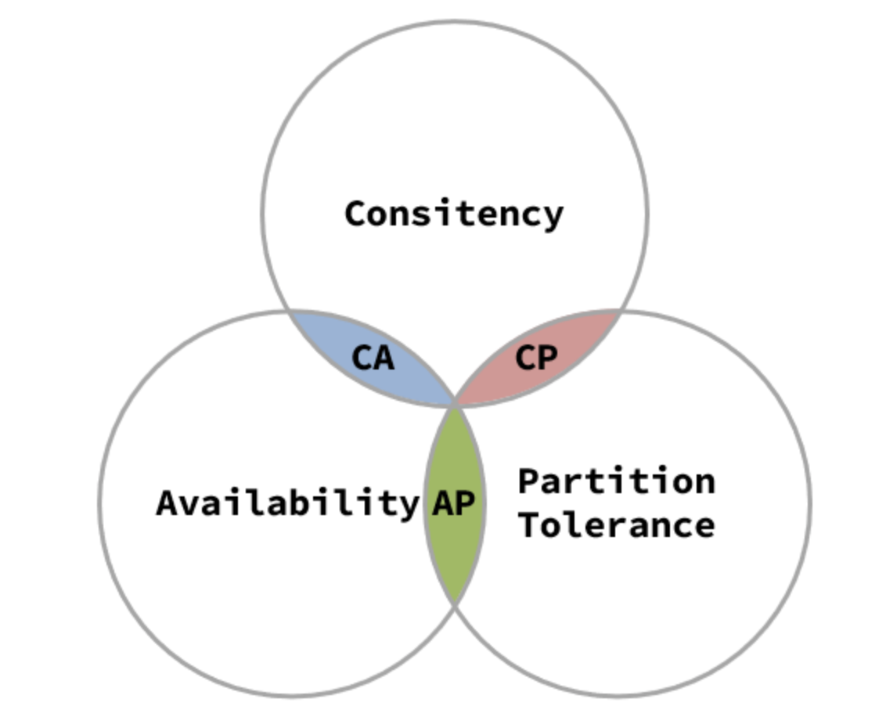

- Consistency（一致性）
- Availability（可用性）
- Partition tolerance （分区容错性）

### 2.1.1 一致性

> 用户访问分布式系统中的任意节点，得到的数据必须一致。

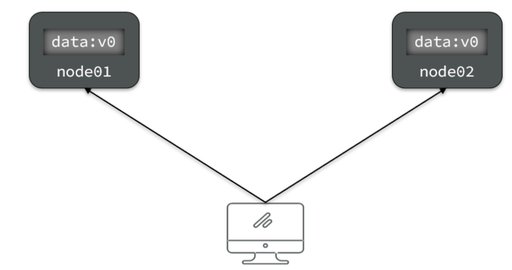

其中一节点发生数据修改。
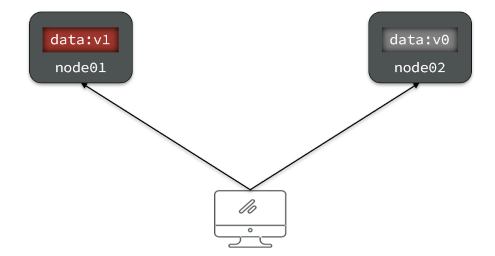

当节点数据发生改变后，需要进行数据同步。
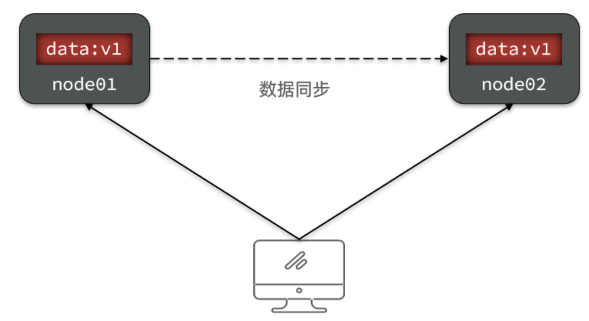

### 2.1.2 可用性

> 用户访问集群中的任意健康节点，必须能得到响应，而不是超时或拒绝。

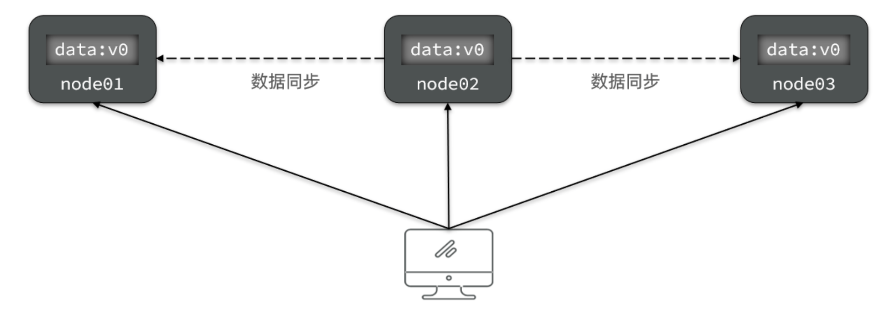

### 2.1.3 分区容错性

> 因为网络故障或其它原因导致分布式系统中的部分节点与其它节点失去连接，形成独立分区。

**Tolerance（容错）**：在集群出现分区时，整个系统也要持续对外提供服务

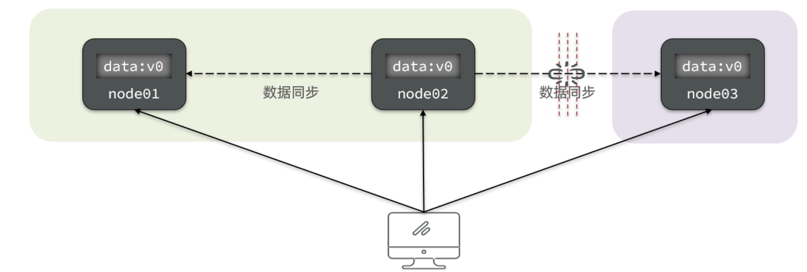

### 2.1.4 CAP的矛盾

在分布式系统中，系统间的网络不能100%保证健康，一定会有故障的时候，而服务有必须对外保证服务。因此Partition Tolerance不可避免。

如果此时要保证**一致性**，就必须等待网络恢复，完成数据同步后，整个集群才对外提供服务，服务处于阻塞状态，不可用。

如果此时要保证**可用性**，就不能等待网络恢复，那node01、node02与node03之间就会出现数据不一致。

也就是说，在P一定会出现的情况下，A和C之间只能实现一个。

### 2.1.4 BASE理论

BASE理论是对CAP的一种解决思路，包含三个思想：

- **Basically Available** **（基本可用）**：分布式系统在出现故障时，允许损失部分可用性，即保证核心可用。
- **Soft State（软状态）：**在一定时间内，允许出现中间状态，比如临时的不一致状态。
- **Eventually Consistent（最终一致性）**：虽然无法保证强一致性，但是在软状态结束后，最终达到数据一致。

## 2.2 解决分布式事务的思路

分布式事务最大的问题是各个子事务的一致性问题，因此可以借鉴CAP定理和BASE理论，有两种解决思路：

- AP模式：各子事务分别执行和提交，允许出现结果不一致，然后采用弥补措施恢复数据即可，实现最终一致。
- CP模式：各个子事务执行后互相等待，同时提交，同时回滚，达成强一致。但事务等待过程中，处于弱可用状态。

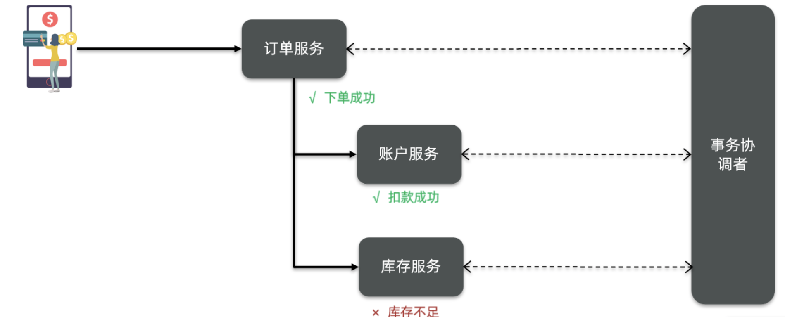

这里的子系统事务，称为**分支事务**；有关联的各个分支事务在一起称为**全局事务**。

# 3. Seata

> Seata是 2019 年 1 月份蚂蚁金服和阿里巴巴共同开源的分布式事务解决方案。致力于提供高性能和简单易用的分布式事务服务，为用户打造一站式的分布式解决方案。
> [Seata官网](http://seata.io/)

## 3.1 Seata架构

Seata事务管理中有三个重要的角色：

- **TC (Transaction Coordinator) -** **事务协调者：**维护全局和分支事务的状态，协调全局事务提交或回滚。
- **TM (Transaction Manager) -** **事务管理器：**定义全局事务的范围、开始全局事务、提交或回滚全局事务。
- **RM (Resource Manager) -** **资源管理器：**管理分支事务处理的资源，与TC交谈以注册分支事务和报告分支事务的状态，并驱动分支事务提交或回滚。

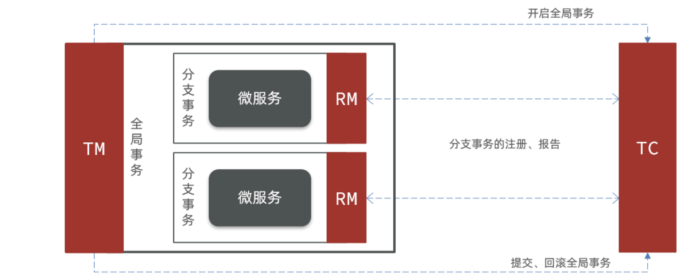

Seata基于上述架构提供了四种不同的分布式事务解决方案：

- XA模式：强一致性分阶段事务模式，牺牲了一定的可用性，无业务侵入
- TCC模式：最终一致的分阶段事务模式，有业务侵入
- AT模式：最终一致的分阶段事务模式，无业务侵入，也是Seata的默认模式
- SAGA模式：长事务模式，有业务侵入

无论哪种方案，都离不开TC，也就是事务的协调者。

## 3.2 部署Seata

> 版本1.2.4

### 3.2.1 修改配置文件

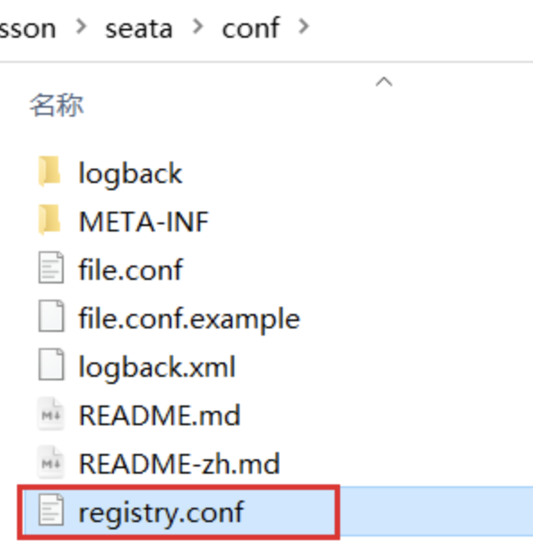

```conf
registry {
  # tc服务的注册中心类，这里选择nacos，也可以是eureka、zookeeper等
  type = "nacos"

  nacos {
    # seata tc 服务注册到 nacos的服务名称，可以自定义
    application = "seata-tc-server"
    serverAddr = "127.0.0.1:8848"
    group = "DEFAULT_GROUP"
    namespace = ""
    cluster = "SH"
    username = "nacos"
    password = "nacos"
  }
}

config {
  # 读取tc服务端的配置文件的方式，这里是从nacos配置中心读取，这样如果tc是集群，可以共享配置
  type = "nacos"
  # 配置nacos地址等信息
  nacos {
    serverAddr = "127.0.0.1:8848"
    namespace = ""
    group = "SEATA_GROUP"
    username = "nacos"
    password = "nacos"
    dataId = "seataServer.properties"
  }
}
```

### 3.2.2 nacos添加配置

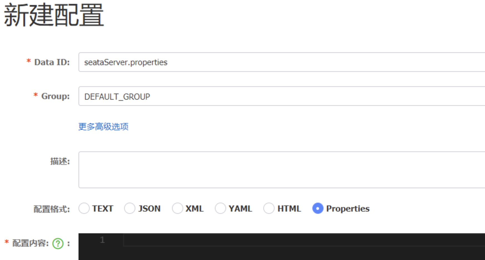

```properties
# 数据存储方式，db代表数据库
store.mode=db
store.db.datasource=druid
store.db.dbType=mysql
store.db.driverClassName=com.mysql.jdbc.Driver
store.db.url=jdbc:mysql://127.0.0.1:3306/seata?useUnicode=true&rewriteBatchedStatements=true
store.db.user=root
store.db.password=123
store.db.minConn=5
store.db.maxConn=30
store.db.globalTable=global_table
store.db.branchTable=branch_table
store.db.queryLimit=100
store.db.lockTable=lock_table
store.db.maxWait=5000
# 事务、日志等配置
server.recovery.committingRetryPeriod=1000
server.recovery.asynCommittingRetryPeriod=1000
server.recovery.rollbackingRetryPeriod=1000
server.recovery.timeoutRetryPeriod=1000
server.maxCommitRetryTimeout=-1
server.maxRollbackRetryTimeout=-1
server.rollbackRetryTimeoutUnlockEnable=false
server.undo.logSaveDays=7
server.undo.logDeletePeriod=86400000
# 客户端与服务端传输方式
transport.serialization=seata
transport.compressor=none
# 关闭metrics功能，提高性能
metrics.enabled=false
metrics.registryType=compact
metrics.exporterList=prometheus
metrics.exporterPrometheusPort=9898
```

### 3.2.3 创建数据库

> 创建数据库seata。

表如下：

```sql

SET NAMES utf8mb4;
SET FOREIGN_KEY_CHECKS = 0;

-- ----------------------------
-- 分支事务表
-- ----------------------------
DROP TABLE IF EXISTS `branch_table`;
CREATE TABLE `branch_table`
(
    `branch_id`         bigint(20)                                               NOT NULL,
    `xid`               varchar(128) CHARACTER SET utf8 COLLATE utf8_general_ci  NOT NULL,
    `transaction_id`    bigint(20)                                               NULL DEFAULT NULL,
    `resource_group_id` varchar(32) CHARACTER SET utf8 COLLATE utf8_general_ci   NULL DEFAULT NULL,
    `resource_id`       varchar(256) CHARACTER SET utf8 COLLATE utf8_general_ci  NULL DEFAULT NULL,
    `branch_type`       varchar(8) CHARACTER SET utf8 COLLATE utf8_general_ci    NULL DEFAULT NULL,
    `status`            tinyint(4)                                               NULL DEFAULT NULL,
    `client_id`         varchar(64) CHARACTER SET utf8 COLLATE utf8_general_ci   NULL DEFAULT NULL,
    `application_data`  varchar(2000) CHARACTER SET utf8 COLLATE utf8_general_ci NULL DEFAULT NULL,
    `gmt_create`        datetime(6)                                              NULL DEFAULT NULL,
    `gmt_modified`      datetime(6)                                              NULL DEFAULT NULL,
    PRIMARY KEY (`branch_id`) USING BTREE,
    INDEX `idx_xid` (`xid`) USING BTREE
) ENGINE = InnoDB
  CHARACTER SET = utf8
  COLLATE = utf8_general_ci
  ROW_FORMAT = Compact;

-- ----------------------------
-- 全局事务表
-- ----------------------------
DROP TABLE IF EXISTS `global_table`;
CREATE TABLE `global_table`
(
    `xid`                       varchar(128) CHARACTER SET utf8 COLLATE utf8_general_ci  NOT NULL,
    `transaction_id`            bigint(20)                                               NULL DEFAULT NULL,
    `status`                    tinyint(4)                                               NOT NULL,
    `application_id`            varchar(32) CHARACTER SET utf8 COLLATE utf8_general_ci   NULL DEFAULT NULL,
    `transaction_service_group` varchar(32) CHARACTER SET utf8 COLLATE utf8_general_ci   NULL DEFAULT NULL,
    `transaction_name`          varchar(128) CHARACTER SET utf8 COLLATE utf8_general_ci  NULL DEFAULT NULL,
    `timeout`                   int(11)                                                  NULL DEFAULT NULL,
    `begin_time`                bigint(20)                                               NULL DEFAULT NULL,
    `application_data`          varchar(2000) CHARACTER SET utf8 COLLATE utf8_general_ci NULL DEFAULT NULL,
    `gmt_create`                datetime                                                 NULL DEFAULT NULL,
    `gmt_modified`              datetime                                                 NULL DEFAULT NULL,
    PRIMARY KEY (`xid`) USING BTREE,
    INDEX `idx_gmt_modified_status` (`gmt_modified`, `status`) USING BTREE,
    INDEX `idx_transaction_id` (`transaction_id`) USING BTREE
) ENGINE = InnoDB
  CHARACTER SET = utf8
  COLLATE = utf8_general_ci
  ROW_FORMAT = Compact;

SET FOREIGN_KEY_CHECKS = 1;
```

### 3.2.4 启动Seata

进入bin目录下：`seata-server.sh`

进入nacos注册中心查看服务是否注册上。

## 3.3 微服务集成Seata

### 3.3.1 添加依赖

```xml

<dependencies>
    <!--分布式事务seata-->
    <dependency>
        <groupId>com.alibaba.cloud</groupId>
        <artifactId>spring-cloud-starter-alibaba-seata</artifactId>
        <exclusions>
            <!--版本较低，1.3.0，因此排除-->
            <exclusion>
                <artifactId>seata-spring-boot-starter</artifactId>
                <groupId>io.seata</groupId>
            </exclusion>
        </exclusions>
    </dependency>
    <dependency>
        <groupId>io.seata</groupId>
        <artifactId>seata-spring-boot-starter</artifactId>
        <!--seata starter 采用1.4.2版本-->
        <version>1.4.2</version>
    </dependency>
</dependencies>
```

### 3.3.2 添加配置

```yaml
seata:
  registry: # TC服务注册中心的配置，微服务根据这些信息去注册中心获取tc服务地址
    type: nacos # 注册中心类型 nacos
    nacos:
      server-addr: 127.0.0.1:8848 # nacos地址
      namespace: "" # namespace，默认为空
      group: DEFAULT_GROUP # 分组，默认是DEFAULT_GROUP
      application: seata-tc-server # seata服务名称
      username: nacos
      password: nacos
  tx-service-group: seata-demo # 事务组名称
  service:
    vgroup-mapping: # 事务组与cluster的映射关系
      seata-demo: SH
```

# 4. 实践四种不同模式事务

## 4.1 XA模式

> XA是规范，目前主流数据库都实现了这种规范，实现的原理都是基于两阶段提交。

正常两个阶段：


异常两个阶段：
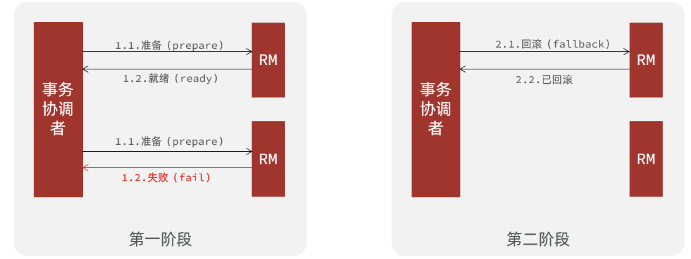

一阶段：

- 事务协调者通知每个事物参与者执行本地事务
- 本地事务执行完成后报告事务执行状态给事务协调者，此时事务不提交，继续持有数据库锁

二阶段：

- 事务协调者基于一阶段的报告来判断下一步操作
    - 如果一阶段都成功，则通知所有事务参与者，提交事务
    - 如果一阶段任意一个参与者失败，则通知所有事务参与者回滚事务

### 4.1.1 Seata的XA模式

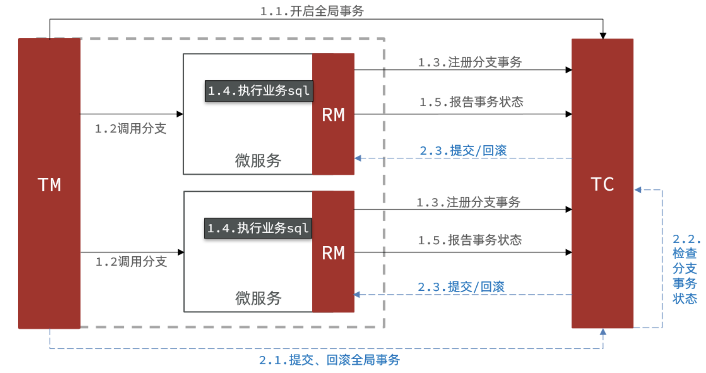

RM一阶段的工作：

1. 注册分支事务到TC
2. 执行分支业务sql但不提交
3. 报告执行状态到TC

TC二阶段的工作：

- TC检测各分支事务执行状态
    - 如果都成功，通知所有RM提交事务
    - 如果有失败，通知所有RM回滚事务

RM二阶段的工作：

- 接收TC指令，提交或回滚事务

### 4.1.2 XA模式优缺点

XA模式的优点是什么？

- 事务的强一致性，满足ACID原则。
- 常用数据库都支持，实现简单，并且没有代码侵入

XA模式的缺点是什么？

- 因为一阶段需要锁定数据库资源，等待二阶段结束才释放，性能较差
- 依赖关系型数据库实现事务

### 4.1.3 实现XA模式

配置：所有参与分布式事务的服务配置

微服务配置：

```yaml
# 略...
seata:
  registry: # TC服务注册中心的配置，微服务根据这些信息去注册中心获取tc服务地址
    type: nacos # 注册中心类型 nacos
    nacos:
      server-addr: 127.0.0.1:8848 # nacos地址
      namespace: "" # namespace，默认为空
      group: DEFAULT_GROUP # 分组，默认是DEFAULT_GROUP
      application: seata-server # seata服务名称
      username: nacos
      password: nacos
  tx-service-group: seata-demo # 事务组名称
  service:
    vgroup-mapping:
      seata-demo: SH  # 集群名称
  data-source-proxy-mode: XA

```

给发起全局事务的入口方法添加@GlobalTransactional注解:

```java

@Service
public class OrderServiceImpl implements OrderService {

    @Autowired
    OrderDao orderDao;

    @Autowired
    UserClient userClient;

    @Override
    @GlobalTransactional  // 全局事务
    public boolean save(OrderUser orderUser) {
        try {
            Order order = new Order();
            BeanUtils.copyProperties(orderUser, order);
            User user = orderUser.getUser();
            orderDao.insert(order);
            userClient.save(user);
        } catch (FeignException e) {
            log.error("下单失败，原因:{}", e.contentUTF8(), e);
            throw new RuntimeException(e.contentUTF8(), e);
        }
        return false;
    }
}
```

当所有微服务都正确执行，所有事物才会被提交。当有一个出现异常，所有事物都不能提交。

## 4.2 AT模式

> AT模式同样是分阶段提交的事务模型，不过缺弥补了XA模型中资源锁定周期过长的缺陷。

### 4.2.1 Seata的AT模式

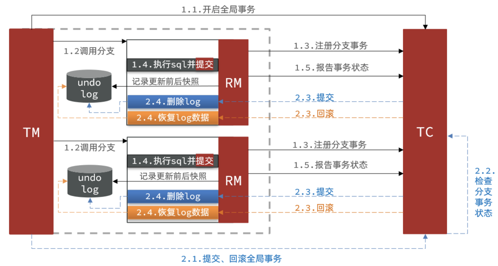

阶段一RM的工作：

- 注册分支事务
- 记录undo-log（数据快照）
- 执行业务sql并提交
- 报告事务状态

阶段二提交时RM的工作：

- 删除undo-log即可

阶段二回滚时RM的工作：

- 根据undo-log恢复数据到更新前


