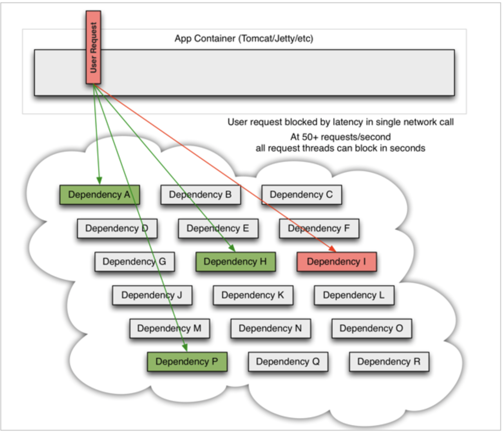

# 1. 概述

## 1.1 服务雪崩问题

当一个请求依赖多个服务，服务正常则无关紧要。当一个服务出现问题，如下图I服务出现问题。此时服务机会被阻塞。



线程被阻塞，无法短时间释放就会导致大量的线程被阻塞在服务器中：


服务器的线程是有限的，当资源耗尽就会出现其他服务也不能正常使用，随着时间的推移产生级联瘫痪，类似雪崩一样一发不可收拾。


## 1.2 雪崩问题处理

- 超时处理：设定超时时间，请求超过一定时间没有响应就返回错误信息，不会无休止等待
- 仓壁模式：我们可以限定每个业务能使用的线程数，避免耗尽整个tomcat的资源，因此也叫线程隔离。
- 断路器模式：由**断路器**统计业务执行的异常比例，如果超出阈值则会**熔断**该业务，拦截访问该业务的一切请求。
- **流量控制**：限制业务访问的QPS，避免服务因流量的突增而故障。

## 1.3 初识Sentinel

> Sentinel是阿里巴巴开源的一款微服务流量控制组件。 [官网地址](https://sentinelguard.io/zh-cn/index.html)

特征：

- **丰富的应用场景**：Sentinel 承接了阿里巴巴近 10 年的双十一大促流量的核心场景，例如秒杀（即突发流量控制在系统容量可以承受的范围）、消息削峰填谷、集群流量控制、实时熔断下游不可用应用等。
- **完备的实时监控**：Sentinel 同时提供实时的监控功能。您可以在控制台中看到接入应用的单台机器秒级数据，甚至 500 台以下规模的集群的汇总运行情况。
- **广泛的开源生态**：Sentinel 提供开箱即用的与其它开源框架/库的整合模块，例如与 Spring Cloud、Dubbo、gRPC 的整合。您只需要引入相应的依赖并进行简单的配置即可快速地接入 Sentinel。
- **完善的** **SPI** **扩展点**：Sentinel 提供简单易用、完善的 SPI 扩展接口。您可以通过实现扩展接口来快速地定制逻辑。例如定制规则管理、适配动态数据源等。

## 1.4 整合Sentinel

1.依赖

```xml
<!--sentinel-->
<dependency>
    <groupId>com.alibaba.cloud</groupId>
    <artifactId>spring-cloud-starter-alibaba-sentinel</artifactId>
</dependency>
```

2.配置

```yaml
server:
  port: 8088
spring:
  cloud:
    sentinel:
      transport:
        dashboard: localhost:8080
```

3.访问服务接口后就会触发Sentinel监控，访问后打开http://localhost:8080即可

# 2. 流量控制

> 雪崩问题虽然有四种方案，但是限流是避免服务因突发的流量而发生故障，是对微服务雪崩问题的预防。

## 2.1 簇点链路

> 当请求进入微服务时，首先会访问DispatcherServlet，然后进入Controller、Service、Mapper，这样的一个调用链就叫做**簇点链路**。簇点链路中被监控的每一个接口就是一个**资源**。
>
> 默认情况下sentinel会监控SpringMVC的每一个端点（Endpoint，也就是controller中的方法），因此SpringMVC的每一个端点（Endpoint）就是调用链路中的一个资源。

在sentinel中可以对资源进行设置：

- 流控：流量控制
- 降级：降级熔断
- 热点：热点参数限流，是限流的一种
- 授权：请求的权限控制

## 2.2 流量控制

设置QPS：


在添加限流规则时，点击高级选项，可以选择三种**流控模式**：

- 直接：统计当前资源的请求，触发阈值时对当前资源直接限流，也是默认的模式
- 关联：统计与当前资源相关的另一个资源，触发阈值时，对当前资源限流
- 链路：统计从指定链路访问到本资源的请求，触发阈值时，对指定链路限流


