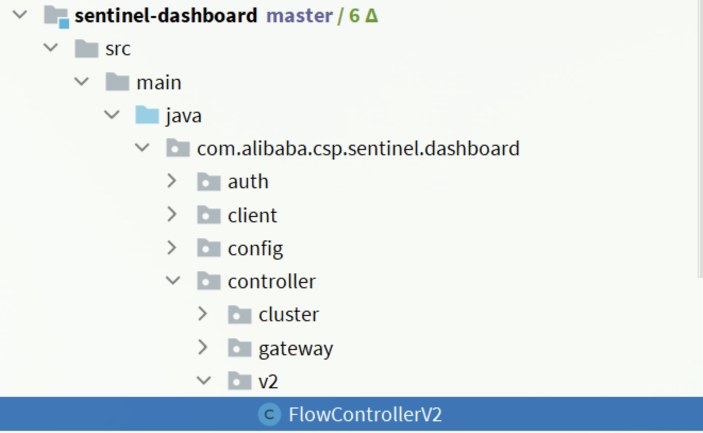

# 1. 概述

## 1.1 服务雪崩问题

当一个请求依赖多个服务，服务正常则无关紧要。当一个服务出现问题，如下图I服务出现问题。此时服务机会被阻塞。


线程被阻塞，无法短时间释放就会导致大量的线程被阻塞在服务器中：


服务器的线程是有限的，当资源耗尽就会出现其他服务也不能正常使用，随着时间的推移产生级联瘫痪，类似雪崩一样一发不可收拾。


## 1.2 雪崩问题处理

- 超时处理：设定超时时间，请求超过一定时间没有响应就返回错误信息，不会无休止等待
- 仓壁模式：我们可以限定每个业务能使用的线程数，避免耗尽整个tomcat的资源，因此也叫线程隔离。
- 断路器模式：由**断路器**统计业务执行的异常比例，如果超出阈值则会**熔断**该业务，拦截访问该业务的一切请求。
- **流量控制**：限制业务访问的QPS，避免服务因流量的突增而故障。

## 1.3 初识Sentinel

> Sentinel是阿里巴巴开源的一款微服务流量控制组件。 [官网地址](https://sentinelguard.io/zh-cn/index.html)
>
> 测试工具可以使用 [Apache Jmeter](https://jmeter.apache.org/download_jmeter.cgi)

特征：

- **丰富的应用场景**：Sentinel 承接了阿里巴巴近 10 年的双十一大促流量的核心场景，例如秒杀（即突发流量控制在系统容量可以承受的范围）、消息削峰填谷、集群流量控制、实时熔断下游不可用应用等。
- **完备的实时监控**：Sentinel 同时提供实时的监控功能。您可以在控制台中看到接入应用的单台机器秒级数据，甚至 500 台以下规模的集群的汇总运行情况。
- **广泛的开源生态**：Sentinel 提供开箱即用的与其它开源框架/库的整合模块，例如与 Spring Cloud、Dubbo、gRPC 的整合。您只需要引入相应的依赖并进行简单的配置即可快速地接入 Sentinel。
- **完善的** **SPI** **扩展点**：Sentinel 提供简单易用、完善的 SPI 扩展接口。您可以通过实现扩展接口来快速地定制逻辑。例如定制规则管理、适配动态数据源等。

## 1.4 整合Sentinel

1.依赖

```xml
<!--sentinel-->
<dependency>
    <groupId>com.alibaba.cloud</groupId>
    <artifactId>spring-cloud-starter-alibaba-sentinel</artifactId>
</dependency>
```

2.配置

```yaml
server:
  port: 8088
spring:
  cloud:
    sentinel:
      transport:
        dashboard: localhost:8080
```

3.访问服务接口后就会触发Sentinel监控，访问后打开http://localhost:8080即可

# 2. 流量控制

> 雪崩问题虽然有四种方案，但是限流是避免服务因突发的流量而发生故障，是对微服务雪崩问题的预防。

## 2.1 簇点链路

> 当请求进入微服务时，首先会访问DispatcherServlet，然后进入Controller、Service、Mapper，这样的一个调用链就叫做**簇点链路**。簇点链路中被监控的每一个接口就是一个**资源**。
>
> 默认情况下sentinel会监控SpringMVC的每一个端点（Endpoint，也就是controller中的方法），因此SpringMVC的每一个端点（Endpoint）就是调用链路中的一个资源。

在sentinel中可以对资源进行设置：

- 流控：流量控制
- 降级：降级熔断
- 热点：热点参数限流，是限流的一种
- 授权：请求的权限控制

## 2.2 流量控制

设置QPS：直连为默认方式


在添加限流规则时，点击高级选项，可以选择三种**流控模式**：

- 直接：统计当前资源的请求，触发阈值时对当前资源直接限流，也是默认的模式
- 关联：统计与当前资源相关的另一个资源，触发阈值时，对当前资源限流
- 链路：统计从指定链路访问到本资源的请求，触发阈值时，对指定链路限流

### 2.2.1 关联设置


当对`/write`的访问量达到设置值，也会触发`/read`的流量限制。

### 2.2.1 链路设置


`/test1`和`/test2`同时访问`/common`，现在只限制`/test2`发过来的请求。

**当不是远程调用时，sentinel是无法统计被调用的service方法的，这时需要手动添加资源**

```java
public class CommonServiceImpl implements CommonService {
    // 手动添加资源
    @SentinelResource("common")
    public void queryGoods() {
        System.err.println("查询商品");
    }
}
```

**sentinel默认为进入SpringMvc所有请求都设置了相同的root资源，这样会导致链路模式失效，通过以下配置修改**

```yaml
spring:
  cloud:
    sentinel:
      web-context-unify: false # 关闭context整合
```

## 2.3 控流效果

在高级选项中包括以下三个选项:

- 快速失败：达到阈值后，新的请求会被立即拒绝并抛出FlowException异常。是默认的处理方式。
- warm up：预热模式，对超出阈值的请求同样是拒绝并抛出异常。但这种模式阈值会动态变化，从一个较小值逐渐增加到最大阈值。
- 排队等待：让所有的请求按照先后次序排队执行，两个请求的间隔不能小于指定时长

### 2.3.1 warm up

阈值一般是一个微服务能承担的最大QPS，但是一个服务刚刚启动时，一切资源尚未初始化（**冷启动**），如果直接将QPS跑到最大值，可能导致服务瞬间宕机。

warm up也叫**预热模式**，是应对服务冷启动的一种方案。请求阈值初始值是`maxThreshold / coldFactor`，持续指定时长后，逐渐提高到maxThreshold值。而coldFactor的默认值是3.

例如，我设置QPS的maxThreshold为10，预热时间为5秒，那么初始阈值就是 10 / 3 ，也就是3，然后在5秒后逐渐增长到10.

### 2.3.2 排队等待

> 排队等待则是让所有请求进入一个队列中，然后按照阈值允许的时间间隔依次执行。后来的请求必须等待前面执行完成，如果请求预期的等待时间超出最大时长，则会被拒绝。

工作原理:

例如：QPS = 5，意味着每200ms处理一个队列中的请求；timeout = 2000，意味着**预期等待时长**超过2000ms的请求会被拒绝并抛出异常。

那什么叫做预期等待时长呢？

比如现在一下子来了12 个请求，因为每200ms执行一个请求，那么：

- 第6个请求的**预期等待时长** = 200 * （6 - 1） = 1000ms
- 第12个请求的预期等待时长 = 200 * （12-1） = 2200ms

## 2.4 热点参数限流

> 之前的限流是统计访问某个资源的所有请求，判断是否超过QPS阈值。而热点参数限流是**分别统计参数值相同的请求**，判断是否超过QPS阈值。

例如根据订单id进行查询：请求的每次连接不同


示例：

```java
public class OrderController {
    @Autowired
    OrderService orderService;

    // 标记这是一个热点请求
    @SentinelResource("hot")
    @GetMapping("/order/{id}")
    public Order getOrderById(@PathVariable long id) {
        return orderService.queryOrderById(id);
    }
}
```


# 3. 隔离和降级

> 限流是一种预防措施，虽然限流可以尽量避免因高并发而引起的服务故障，但服务还会因为其它原因而故障。而要将这些故障控制在一定范围，
> 避免雪崩，就要靠**线程隔离**（舱壁模式）和**熔断降级**手段

**线程隔离**：调用者在调用服务提供者时，给每个调用的请求分配独立线程池，出现故障时，最多消耗这个线程池内资源，避免把调用者的所有资源耗尽。

**熔断降级**：是在调用方这边加入断路器，统计对服务提供者的调用，如果调用的失败比例过高，则熔断该业务，不允许访问该服务的提供者了。


## 3.1 Sentinel整合Feign

### 3.1.1 添加配置

```yaml
feign:
  sentinel:
    enabled: true # 开启feign对sentinel的支持
```

### 3.1.2 失败处理类

给FeignClient编写失败后的降级逻辑

- 方式一：FallbackClass，无法对远程调用的异常做处理
- 方式二：FallbackFactory，可以对远程调用的异常做处理，我们选择这种

```java
// 异常处理类
@Slf4j
public class OrderFallbackFactory implements FallbackFactory<OrderClient> {
    @Override
    public OrderClient create(Throwable cause) {
        return id -> {
            log.error("查询订单异常", cause);
            return new Order();
        };
    }
}

// feign客户端添加降级处理方式
@FeignClient(value = "mall-order", fallbackFactory = OrderFallbackFactory.class)
public interface OrderClient {

    /**
     * 通过user id获得user信息
     *
     * @param id id
     * @return User
     */
    @GetMapping("/order/{id}")
    Order findById(@PathVariable("id") long id);
}
```

### 3.1.3 装配处理类

```java

@Configuration
public class SentinelConfig {
    @Bean
    public OrderFallbackFactory orderFallbackFactory() {
        return new OrderFallbackFactory();
    }
}
```

> 重启项目再访问查询，就可以在控制台上查看到新的簇点链路。

## 3.2 隔离

线程隔离有两种方式实现：

- 线程池隔离
- 信号量隔离（Sentinel默认采用）

**线程池隔离**：给每个服务调用业务分配一个线程池，利用线程池本身实现隔离效果。

**信号量隔离**：不创建线程池，而是计数器模式，记录业务使用的线程数量，达到信号量上限时，禁止新的请求。


## 3.3 熔断降级

> 熔断降级是解决雪崩问题的重要手段。其思路是由**断路器**统计服务调用的异常比例、慢请求比例，如果超出阈值则会**熔断**该服务。即拦截访问该服务的一切请求；而当服务恢复时，断路器会放行访问该服务的请求。


状态机包括三个状态：

- closed：关闭状态，断路器放行所有请求，并开始统计异常比例、慢请求比例。超过阈值则切换到open状态
- open：打开状态，服务调用被**熔断**，访问被熔断服务的请求会被拒绝，快速失败，直接走降级逻辑。Open状态5秒后会进入half-open状态
- half-open：半开状态，放行一次请求，根据执行结果来判断接下来的操作。
    - 请求成功：则切换到closed状态
    - 请求失败：则切换到open状态

断路器熔断策略有三种：慢调用、异常比例、异常数

### 3.3.1 慢调用

> **慢调用**：业务的响应时长（RT）大于指定时长的请求认定为慢调用请求。在指定时间内，如果请求数量超过设定的最小数量，慢调用比例大于设定的阈值，则触发熔断。


### 3.3.1 异常比例和异常数

> **异常比例或异常数**：统计指定时间内的调用，如果调用次数超过指定请求数，并且出现异常的比例达到设定的比例阈值（或超过指定异常数），则触发熔断。

异常比例设置：


异常数设置：


# 4. 授权规则

> 授权规则可以对请求方来源做判断和控制。

授权规则可以对调用方的来源做控制，有白名单和黑名单两种方式。

- 白名单：来源（origin）在白名单内的调用者允许访问
- 黑名单：来源（origin）在黑名单内的调用者不允许访问


- 资源名：就是受保护的资源，例如/order/{orderId}

- 流控应用：是来源者的名单，
    - 如果是勾选白名单，则名单中的来源被许可访问。
    - 如果是勾选黑名单，则名单中的来源被禁止访问。


我们允许请求从gateway到order-service，不允许浏览器访问order-service，那么白名单中就要填写**网关的来源名称（origin）**。

1.编写判断授权规则

```java
// 在order微服务中
@Component
public class OrderWarrant implements RequestOriginParser {
    @Override
    public String parseOrigin(HttpServletRequest httpServletRequest) {
        // 1.获取请求头
        String origin = httpServletRequest.getHeader("origin");
        // 2.非空判断
        if (StringUtils.isEmpty(origin)) {
            origin = "blank";
        }
        return origin;
    }
}
```

2.gateway配置请求头

```yaml
spring:
  cloud:
    gateway:
      default-filters:
        - AddRequestHeader=origin,gateway
      routes:
      # ...略
```

3.sentinel设置白名单


# 5. 自定义异常结果

> 默认情况下，发生限流、降级、授权拦截时，都会抛出异常到调用方。异常结果都是flow limmiting（限流）。这样不够友好，无法得知是限流还是降级还是授权拦截。

自定义异常类需要实现一下类：

```java
public interface BlockExceptionHandler {
    /**
     * 处理请求被限流、降级、授权拦截时抛出的异常：BlockException
     * e：被sentinel拦截时抛出的异常
     */
    void handle(HttpServletRequest request, HttpServletResponse response, BlockException e) throws Exception;
}
```

异常子类：

| **异常**             | **说明**           |
| -------------------- | ------------------ |
| FlowException        | 限流异常           |
| ParamFlowException   | 热点参数限流的异常 |
| DegradeException     | 降级异常           |
| AuthorityException   | 授权规则异常       |
| SystemBlockException | 系统规则异常       |

在order微服务中:

```java

@Component
public class SentinelExceptionHandler implements BlockExceptionHandler {
    @Override
    public void handle(HttpServletRequest request, HttpServletResponse response, BlockException e) throws Exception {
        String msg = "未知异常";
        int status = 429;

        if (e instanceof FlowException) {
            msg = "请求被限流了";
        } else if (e instanceof ParamFlowException) {
            msg = "请求被热点参数限流";
        } else if (e instanceof DegradeException) {
            msg = "请求被降级了";
        } else if (e instanceof AuthorityException) {
            msg = "没有权限访问";
            status = 401;
        }

        response.setContentType("application/json;charset=utf-8");
        response.setStatus(status);
        response.getWriter().println("{\"msg\": " + msg + ", \"status\": " + status + "}");
    }
}
```

# 6. 规则持久化

> sentinel的所有规则都是内存存储，重启后所有规则都会丢失。在生产环境下，我们必须确保这些规则的持久化，避免丢失。

规则是否能持久化，取决于规则管理模式，sentinel支持三种规则管理模式：

- 原始模式：Sentinel的默认模式，将规则保存在内存，重启服务会丢失。
- pull模式
- push模式

## 6.1 pull模式

> pull模式：控制台将配置的规则推送到Sentinel客户端，而客户端会将配置规则保存在本地文件或数据库中。以后会定时去本地文件或数据库中查询，更新本地规则。


## 6.2 push模式

> push模式：控制台将配置规则推送到远程配置中心，例如Nacos。Sentinel客户端监听Nacos，获取配置变更的推送消息，完成本地配置更新。


## 6.3 持久化示例

### 6.3.1 添加依赖

在order微服务中

```xml

<dependency>
    <groupId>com.alibaba.csp</groupId>
    <artifactId>sentinel-datasource-nacos</artifactId>
</dependency>
```

### 6.3.2 添加配置

在order微服务中

```yaml
spring:
  cloud:
    sentinel:
      datasource:
        flow:
          nacos:
            server-addr: localhost:8848 # nacos地址
            dataId: orderservice-flow-rules
            groupId: SENTINEL_GROUP
            rule-type: flow # 还可以是：degrade、authority、param-flow
```

### 6.3.3 修改sentinel源代码

> SentinelDashboard默认不支持nacos的持久化，需要修改源码。

1.在sentinel-dashboard源码的pom文件中，nacos的依赖默认的scope是test，只能在测试时使用，这里要去除


```xml
<!--修改后-->
<dependency>
    <groupId>com.alibaba.csp</groupId>
    <artifactId>sentinel-datasource-nacos</artifactId>
</dependency>
```

2.添加nacos支持

> 在sentinel-dashboard的test包下，已经编写了对nacos的支持，我们需要将其拷贝到main下。


3.修改nacos类 然后，还需要修改测试代码中的NacosConfig类：


在sentinel-dashboard的application.properties中添加nacos地址配置：

```properties
nacos.addr=localhost:8848
```

4.配置nacos数据源



5.修改前端页面


放开注释：

修改其中的文本：


6.重新编译、打包项目


7.启动

启动方式跟官方一样：

```sh
java -jar sentinel-dashboard.jar
```

如果要修改nacos地址，需要添加参数：

```sh
java -jar -Dnacos.addr=localhost:8848 sentinel-dashboard.jar
```


