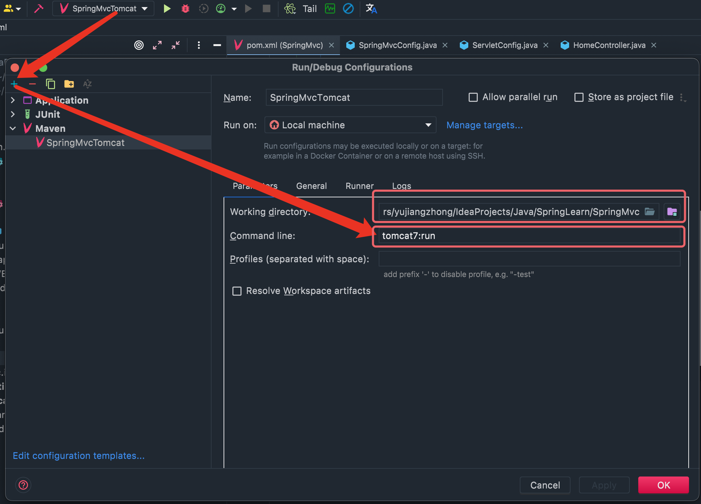

# 1. 入门示例

1. 添加依赖
```xml
<dependencies>
    <dependency>
        <groupId>javax.servlet</groupId>
        <artifactId>servlet-api</artifactId>
        <version>2.5</version>
        <scope>provided</scope>
    </dependency>
    <dependency>
        <groupId>org.springframework</groupId>
        <artifactId>spring-webmvc</artifactId>
        <version>5.2.10.RELEASE</version>
    </dependency>
</dependencies>
```

2. 添加SpringMvc容器配置
```java
@Configuration
@ComponentScan("cn.fishland.controller")
@Import({ServletConfig.class})
public class SpringMvcConfig {
}
```

3. 添加web.xml代替配置类
```java
// 配置类代替web.xml文件
public class ServletConfig extends AbstractDispatcherServletInitializer {

    // 获得SpringMvc配置文件
    @Override
    protected WebApplicationContext createServletApplicationContext() {
        AnnotationConfigWebApplicationContext context = new AnnotationConfigWebApplicationContext();
        context.register(SpringMvcConfig.class);
        return context;
    }

    // SpringMvc拦截的所有请求
    @Override
    protected String[] getServletMappings() {
        return new String[]{"/"};
    }

    // Spring配置文件
    @Override
    protected WebApplicationContext createRootApplicationContext() {
        return null;
    }
}
```

4. 创建Controller
```java
@Controller
public class HomeController {
    @RequestMapping("/test")
    @ResponseBody
    public String mvcTest() {
        return "{'msg':'request mvc test success'}";
    }
}
```

5. 运行测试

添加tomcat插件
```xml
<plugins>
    <plugin>
        <groupId>org.apache.tomcat.maven</groupId>
        <artifactId>tomcat7-maven-plugin</artifactId>
        <version>2.1</version>
        <configuration>
            <port>80</port>
            <path>/</path>
        </configuration>
    </plugin>
</plugins>
```

执行运行命令：`tomcat7:run`

也可以配置运行：



# 2. Spring和SpringMvc分开加载业务bean

1. 通过详细包配置分开
```java
@Configuration
// 通过详细包配置
@ComponentScan({"cn.fishland.service", "cn.fishland.dao"})
public class SpringConfig {
}
```

2. 通过排除配置进行配置
```java
@Configuration
// 通过属性配置排除不需要加载的bean
@ComponentScan(value = "cn.fishland",
        excludeFilters = @ComponentScan.Filter(
                type = FilterType.ANNOTATION,
                classes = Controller.class))
public class SpringConfig {
}
```
- excludeFilters：bean扫描时过滤的规则
  - type：配置排除规则
    - ANNOTATION：按照注解排除
    - ASSIGNABLE_TYPE:按照指定的类型过滤
    - ASPECTJ:按照Aspectj表达式排除，基本上不会用
    - REGEX:按照正则表达式排除
    - CUSTOM:按照自定义规则排除
  - classes：规则具体条件

# 3. 加载Spring配置

```java
// 配置类代替web.xml文件
public class ServletConfig extends AbstractDispatcherServletInitializer {

    // 获得SpringMvc配置文件
    @Override
    protected WebApplicationContext createServletApplicationContext() {
        AnnotationConfigWebApplicationContext context = new AnnotationConfigWebApplicationContext();
        context.register(SpringMvcConfig.class);
        return context;
    }

    // SpringMvc拦截的所有请求
    @Override
    protected String[] getServletMappings() {
        return new String[]{"/"};
    }

    // Spring配置文件
    @Override
    protected WebApplicationContext createRootApplicationContext() {
        AnnotationConfigWebApplicationContext context = new AnnotationConfigWebApplicationContext();
        context.register(SpringConfig.class);
        return context;
    }
}
```

加载配置简化版：
```java
// 简化配置类
public class ServletConfig extends AbstractAnnotationConfigDispatcherServletInitializer {

    @Override
    protected Class<?>[] getRootConfigClasses() {
        return new Class[]{SpringConfig.class};
    }

    @Override
    protected Class<?>[] getServletConfigClasses() {
        return new Class[]{SpringMvcConfig.class};
    }

    @Override
    protected String[] getServletMappings() {
        return new String[]{"/"};
    }
}
```

# 4. 接收请求参数

## 4.1 单个参数

参数名和controller形参名一样即可：

`http://localhost/test?name=fish`

```java
@Controller
public class HomeController {
    @RequestMapping("/test")
    @ResponseBody
    // 形参名称和请求参数名称相同即可
    public String mvcTest(String name) {
        System.out.println("test request name=" + name);
        return "{'msg':'request mvc test success'}";
    }
}
```

## 4.2 多个参数

1. 多个形参

`http://localhost/test?name=fish&age=18`

```java
@Controller
public class HomeController {
    @RequestMapping("/test1")
    @ResponseBody
    public String mvcTest1(String name, int age) {
        System.out.println("test request name=" + name);
        System.out.println("test request age=" + age);
        return "{'msg':'request mvc test success'}";
    }
}
```

2. 实体类接收
```java
@Controller
public class HomeController {
    @RequestMapping("/test3")
    @ResponseBody
    public String mvcTest3(User user) {
        System.out.println(user);
        return "{'msg':'request mvc test success'}";
    }
}
```

`http://localhost/test3?name=fish&age=18`

3. 级联传参
```java
@Controller
public class HomeController {
    @RequestMapping("/test4")
    @ResponseBody
    public String mvcTest4(User user) {
        System.out.println(user);
        return "{'msg':'request mvc test success'}";
    }
}
```

`http://localhost/test4?name=fish&age=18&role.roleName=admin&role.roleType=1`

## 4.3 集合
数组：
```java
@Controller
public class HomeController {
    @RequestMapping("/test5")
    @ResponseBody
    public String mvcTest5(String[] likes) {
        System.out.println(Arrays.toString(likes));
        return "{'msg':'request mvc test success'}";
    }
}

```

`http://localhost/test5?likes=likes1&likes=likes2&likes=likes3`

集合：
```java
@Controller
public class HomeController {
    @RequestMapping("/test6")
    @ResponseBody
    // 集合需要添加@RequestParam注解
    public String mvcTest6(@RequestParam List<String> likes) {
        System.out.println(likes);
        return "{'msg':'request mvc test success'}";
    }
}
```

`http://localhost/test6?likes=likes1&likes=likes2&likes=likes3`

## 4.4 名称不相同
```java
@Controller
public class HomeController {
    @RequestMapping("/test7")
    @ResponseBody
    // 添加@RequestParam注解，指定请求参数名称即可
    public String mvcTest7(@RequestParam("userName") String name) {
        System.out.println("name=" + name);
        return "{'msg':'request mvc test success'}";
    }
}
```

`http://localhost/test7?userName=fish`

## 4.5 请求中文乱码

修改tomcat编码处理Get中文乱码：
```xml
<plugins>
  <plugin>
    <groupId>org.apache.tomcat.maven</groupId>
    <artifactId>tomcat7-maven-plugin</artifactId>
    <version>2.1</version>
    <configuration>
      <port>80</port>
      <path>/</path>
      <!--添加中文字符集-->
      <uriEncoding>UTF-8</uriEncoding>
    </configuration>
  </plugin>
</plugins>
```

处理Post中文乱码问题：
```java
// 在配置类中添加过滤器
public class ServletConfig extends AbstractAnnotationConfigDispatcherServletInitializer {

  @Override
  protected Class<?>[] getRootConfigClasses() {
    return new Class[]{SpringConfig.class};
  }

  @Override
  protected Class<?>[] getServletConfigClasses() {
    return new Class[]{SpringMvcConfig.class};
  }

  @Override
  protected String[] getServletMappings() {
    return new String[]{"/"};
  }

  @Override
  protected Filter[] getServletFilters() {
    // 添加字符过滤器
    CharacterEncodingFilter characterEncodingFilter = new CharacterEncodingFilter();
    characterEncodingFilter.setEncoding("UTF-8");
    return new Filter[]{characterEncodingFilter};
  }
}
```
## 4.6 Json参数

添加Json依赖：
```xml
<dependency>
    <groupId>com.fasterxml.jackson.core</groupId>
    <artifactId>jackson-databind</artifactId>
    <version>2.9.0</version>
</dependency>
```

主配置类开启Json转换:
```java
@Configuration
@ComponentScan("cn.fishland.controller")
@Import({ServletConfig.class})
// 开启json数据类型自动转换
@EnableWebMvc
public class SpringMvcConfig {
}
```

Controller编写：
```java
@Controller
public class HomeController {
    @RequestMapping("/test9")
    @ResponseBody
    // 需要添加@RequestBody注解将Json转换成对象
    public String mvcTest9(@RequestBody Role role) {
        System.out.println(role);
        return "{'msg':'request mvc test success'}";
    }
}
```

## 4.7 日期参数
```java
@Controller
public class HomeController {
    @RequestMapping("/test10")
    @ResponseBody
    // 添加参数解析非默认日期格式，默认是可以解析yyyy/MM/dd的.
    public String mvcTest10(@DateTimeFormat(pattern = "yyyy-MM-dd") Date date) {
        System.out.println(date);
        return "{'msg':'request mvc test success'}";
    }
}
```

# 5. 数据响应

1. 响应数据
```java
@Controller
public class HomeController {
    @RequestMapping("/test11")
    // 配置改注解表示当前请求返回的是文本数据
    @ResponseBody
    public String mvcTest11() {
        System.out.println("mvcTest11 run...");
        return "page.jsp";
    }
}
```

2. 响应界面
```java
@Controller
public class HomeController {
    @RequestMapping("/test11")
    // 去掉@ResponseBody注解表示返回的String将被解析成页面名称，并把页面返回。
    // @ResponseBody
    public String mvcTest11() {
        System.out.println("mvcTest11 run...");
        return "page.jsp";
    }
}
```

# 6. Rest编程风格

## 6.1 各个请求方法Controller
```java
@Controller
@ResponseBody
@RequestMapping("/user")
public class UserController {

    /**
     * 新增User使用POST请求
     */
    @RequestMapping(value = "/add",method = RequestMethod.POST)
    public String add(User user) {
        System.out.println("user=" + user + " add...");
        return "{'msg':'add user success'}";
    }

    /**
     * 删除User不需要传参，可以从请求路径中获得参数。请求方法DELETE
     * `@PathVariable`获得路径参数
     */
    @RequestMapping(value = "/delete/{id}",method = RequestMethod.DELETE)
    public String delete(@PathVariable("id")int userId) {
        System.out.println("delete user id=" + userId + " ...");
        return "{'msg':'delete user success'}";
    }

    /**
     * 修改User请求方法PUT
     */
    @RequestMapping(value = "/update",method = RequestMethod.PUT)
    public String update(@RequestBody User user) {
        System.out.println("update user=" + user + " ...");
        return "{'msg':'update user success'}";
    }

    /**
     * 删除User不需要传参，可以从请求路径中获得参数。请求方法PUT
     * `@PathVariable`获得路径参数，占位符名称和形参相同就不需要改
     */
    @RequestMapping(value = "/get/{id}",method = RequestMethod.GET)
    public String get(@PathVariable int id) {
        System.out.println("get user id=" + id + " ...");
        return "{'msg':'get user success'}";
    }
}
```

## 6.2 简写版
```java
//@Controller
//@ResponseBody
// 以上两个注解合集
@RestController
@RequestMapping("/user")
public class UserController {

    /**
     * 新增User使用POST请求
     */
    // @RequestMapping(value = "/add", method = RequestMethod.POST)
    @PostMapping //以上注解替换，不再添加url，通过请求方式辨别功能
    public String add(@RequestBody User user) {
        System.out.println("user=" + user + " add...");
        return "{'msg':'add user success'}";
    }

    /**
     * 删除User不需要传参，可以从请求路径中获得参数。请求方法DELETE
     * `@PathVariable`获得路径参数
     */
//    @RequestMapping(value = "/delete/{id}", method = RequestMethod.DELETE)
    @DeleteMapping("/{id}") // 需要参数，所有需要添加url
    public String delete(@PathVariable("id") int userId) {
        System.out.println("delete user id=" + userId + " ...");
        return "{'msg':'delete user success'}";
    }

    /**
     * 修改User请求方法PUT
     */
//    @RequestMapping(value = "/update", method = RequestMethod.PUT)
    @PutMapping
    public String update(@RequestBody User user) {
        System.out.println("update user=" + user + " ...");
        return "{'msg':'update user success'}";
    }

    /**
     * 删除User不需要传参，可以从请求路径中获得参数。请求方法PUT
     * `@PathVariable`获得路径参数
     */
//    @RequestMapping(value = "/get/{id}", method = RequestMethod.GET)
    @GetMapping("/{id}")
    public String get(@PathVariable int id) {
        System.out.println("get user id=" + id + " ...");
        return "{'msg':'get user success'}";
    }
}
```

# 7. 开放静态资源

编写配置类：
```java
@Configuration
public class WebConfig extends WebMvcConfigurationSupport {

    @Override
    protected void addResourceHandlers(ResourceHandlerRegistry registry) {
        // 第一个为拦截的请求url，第二个为本地访问url
        registry.addResourceHandler("/pages/**").addResourceLocations("/pages/");
        registry.addResourceHandler("/js/**").addResourceLocations("/js/");
        registry.addResourceHandler("/css/**").addResourceLocations("/css/");
        registry.addResourceHandler("/plugins/**").addResourceLocations("/plugins/");
    }
}
```

主配置扫描：
```java
@Configuration
@ComponentScan({"cn.fishland.controller", "cn.fishland.config"})
@Import(ServletConfig.class)
// 开启json数据类型自动转换
@EnableWebMvc
public class SpringMvcConfig {
}
```


