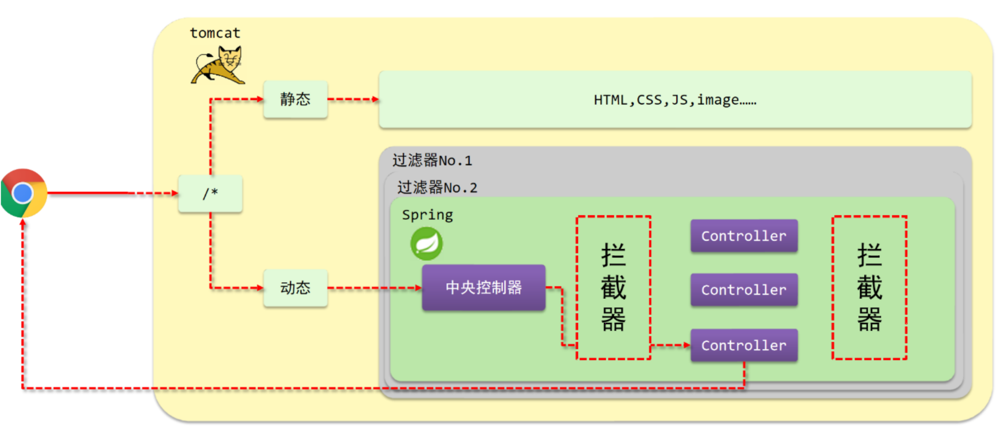
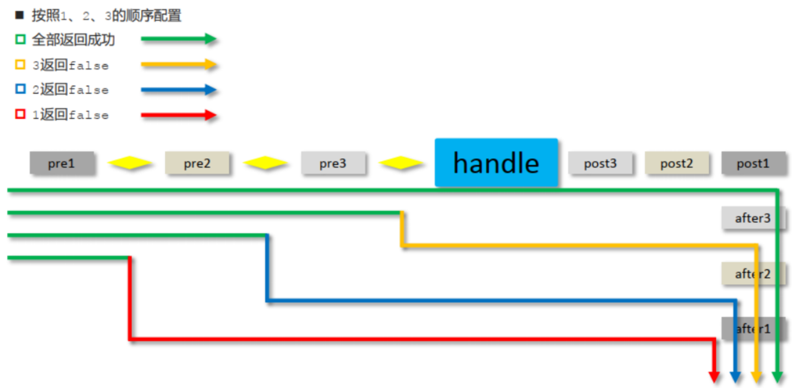

# 1. SSM整合

> 看以下项目示例代码

[]()

# 2. 统一返回结果

```java
public class RequestResult {
    private Object data;
    private Integer code;
    private String msg;

    public RequestResult() {
    }

    public RequestResult(Object data, Integer code, String msg) {
        this.data = data;
        this.code = code;
        this.msg = msg;
    }

    public Object getData() {
        return data;
    }

    public void setData(Object data) {
        this.data = data;
    }

    public Integer getCode() {
        return code;
    }

    public void setCode(Integer code) {
        this.code = code;
    }

    public String getMsg() {
        return msg;
    }

    public void setMsg(String msg) {
        this.msg = msg;
    }

    @Override
    public String toString() {
        return "RequestResult{" +
                "data=" + data +
                ", code=" + code +
                ", msg='" + msg + '\'' +
                '}';
    }

    public static class Code {
        public static final Integer SAVE_OK = 20011;
        public static final Integer DELETE_OK = 20021;
        public static final Integer UPDATE_OK = 20031;
        public static final Integer GET_OK = 20041;
        public static final Integer SAVE_ERR = 20010;
        public static final Integer DELETE_ERR = 20020;
        public static final Integer UPDATE_ERR = 20030;
        public static final Integer GET_ERR = 20040;
    }

}

@RestController
@RequestMapping("/tag")
public class TagController {

    @Autowired
    TagService tagService;

    @PostMapping
    public RequestResult save(@RequestBody Tag tag) {
        tagService.save(tag);
        RequestResult requestResult = new RequestResult();
        requestResult.setCode(RequestResult.Code.SAVE_OK);
        requestResult.setMsg("save tag success");
        return requestResult;
    }

    @GetMapping
    public RequestResult getAll() throws Exception {
        List<Tag> all = tagService.getAll();
        RequestResult requestResult = new RequestResult();
        requestResult.setCode(RequestResult.Code.GET_OK);
        requestResult.setMsg("save tag success");
        requestResult.setData(all);
        return requestResult;
    }

    @GetMapping("/{id}")
    public RequestResult getTagById(@PathVariable long id) throws Exception {
        Tag tag = tagService.getById(id);
        RequestResult requestResult = new RequestResult();
        requestResult.setCode(RequestResult.Code.GET_OK);
        requestResult.setMsg("save tag success");
        requestResult.setData(tag);
        return requestResult;
    }
}
```

# 3. 统一异常处理

> 在一个项目中随处都可能出现异常，主要的异常分为以下几种：
> 1. 业务异常：用户输入错误的数据格式，用户故意传递错误参数
> 2. 系统异常：比如服务器或者数据库宕机等
> 3. 其他异常：文件未找到等
> 
> 对应的异常处理：
> 1. 业务异常：返回友好的提示，警告用户
> 2. 系统异常：发送固定消息，安抚用户。发送特点消息通知（邮件或短信）系统维护人员，并记录日志。
> 3. 其他异常：发送固定消息，安抚用户。发送特点消息通知系统维护人员，并记录日志。
> 
> 在哪里统一处理异常了：
> 
> 在变形层统一管理，将异常分类处理，通过AOP实现统一处理。

## 3.1 简单示例

1.创建异常处理类：
```java
// 表示这是处理rest的controller的通知类
@RestControllerAdvice
public class AppExceptionAdvice {

    // 处理的异常类型
    @ExceptionHandler(Exception.class)
    public RequestResult exceptionHandle(Exception e) {
        // 此处可以发消息（短信或邮件）通知维护人员
        System.out.println("exceptionHandle get exception=" + e.getMessage());
        return new RequestResult(null, RequestResult.Code.GET_ERR, "系统出现异常，请稍后再试...");
    }
}
```

2.SpringMvc配置文件扫描通知：
```java
@EnableWebMvc
@Configuration
// 扫描advice
@ComponentScan({"cn.fishland.controller", "cn.fishland.config", "cn.fishland.advice"})
public class SpringMvcConfig {
}
```

3.添加异常：
```java
@RestController
@RequestMapping("/tag")
public class TagController {

    @Autowired
    TagService tagService;

    @GetMapping("/{id}")
    public RequestResult getTagById(@PathVariable long id) throws Exception {
        // 手动添加异常
        int x = 1 / 0;
        Tag tag = tagService.getById(id);
        RequestResult requestResult = new RequestResult();
        requestResult.setCode(RequestResult.Code.GET_OK);
        requestResult.setMsg("save tag success");
        requestResult.setData(tag);
        return requestResult;
    }
}
```

## 3.2 分异常处理

自定义分类异常
```java
public class SystemException extends RuntimeException {
    private Integer code;

    public SystemException(String message, Integer code) {
        super(message);
        this.code = code;
    }

    public SystemException(String message, Integer code, Throwable cause) {
        super(message, cause);
        this.code = code;
    }

    public Integer getCode() {
        return code;
    }

    public void setCode(Integer code) {
        this.code = code;
    }
}

public class UserException extends RuntimeException {
    private Integer code;

    public UserException(String message, Integer code) {
        super(message);
        this.code = code;
    }

    public UserException(String message, Throwable cause, Integer code) {
        super(message, cause);
        this.code = code;
    }

    public Integer getCode() {
        return code;
    }

    public void setCode(Integer code) {
        this.code = code;
    }
}
```

异常处理通知类添加通知：
```java
// rest风格控制器通知类
@RestControllerAdvice
public class AppExceptionAdvice {

    // 处理的异常
    @ExceptionHandler(Exception.class)
    public RequestResult exceptionHandle(Exception e) {
        // 此处可以发消息（短信或邮件）通知维护人员
        System.out.println("exceptionHandle get exception=" + e.getMessage());
        return new RequestResult(null, RequestResult.Code.GET_ERR, "系统出现异常，请稍后再试...");
    }

    //@ExceptionHandler用于设置当前处理器类对应的异常类型，处理系统错误通知
    @ExceptionHandler(SystemException.class)
    public RequestResult doSystemException(SystemException ex) {
        // 记录日志
        // 发送消息给运维
        // 发送邮件给开发人员,ex对象发送给开发人员
        return new RequestResult(null, ex.getCode(), ex.getMessage());
    }

    // 处理用户错误通知
    @ExceptionHandler(UserException.class)
    public RequestResult doBusinessException(UserException ex) {
        return new RequestResult(null, ex.getCode(), ex.getMessage());
    }
}
```

service层异常处理：
```java
@Service
public class TagServiceImpl implements TagService {

    @Autowired
    TagDao tagDao;

    @Override
    public List<Tag> getAll() {
        return tagDao.selectAll();
    }

    @Override
    public Boolean save(Tag tag) {
        return tagDao.insert(tag) == 1;
    }

    @Override
    public Tag getById(long id) {
        // 模拟业务异常
        if (id == 1) {
            throw new UserException("请输入正确的id", RequestResult.Code.USER_ERR);
        }
        try {
            int x = 1 / 0;
        } catch (Exception e) {
            // 模拟系统异常
            throw new SystemException("系统出现错误，请稍后再试", RequestResult.Code.SYSTEM_ERR, e);
        }
        return tagDao.selectById(id);
    }
}
```

# 4. 拦截器

> 拦截器工作图



> 拦截器和过滤器的不同
> 
> 1. 归属不同：Filter属于Servlet技术，Interceptor属于SpringMVC技术
> 2. 拦截内容不同：Filter对所有访问进行增强，Interceptor仅针对SpringMVC的访问进行增强


## 4.1 拦截器简单示例

1.创建拦截器：
```java
// 需要Spring来管理此类
@Component
public class TagControllerInterceptor implements HandlerInterceptor {

    @Override
    public boolean preHandle(HttpServletRequest request, HttpServletResponse response, Object handler) throws Exception {
        System.out.println("preHandle...");
        return true;
    }

    @Override
    public void postHandle(HttpServletRequest request, HttpServletResponse response, Object handler, ModelAndView modelAndView) throws Exception {
        System.out.println("postHandle...");
    }

    @Override
    public void afterCompletion(HttpServletRequest request, HttpServletResponse response, Object handler, Exception ex) throws Exception {
        System.out.println("afterCompletion...");
    }
}
```
2.Spring配置扫描此类：
```java
// Spring配置类
@Configuration
@EnableTransactionManagement
@PropertySource("classpath:jdbc.properties")
@Import({JdbcConfig.class, MybatisConfig.class})
// 扫描拦截器
@ComponentScan({"cn.fishland.service", "cn.fishland.interceptor"})
public class SpringConfig {
}
```

3.SpringMvc配置拦截器：
```java
@Configuration
public class WebConfig extends WebMvcConfigurationSupport {

    // 注入拦截器
    @Autowired
    TagControllerInterceptor tagControllerInterceptor;

    @Override
    protected void addResourceHandlers(ResourceHandlerRegistry registry) {
        // 第一个为拦截的请求url，第二个为本地访问url
        registry.addResourceHandler("/pages/**").addResourceLocations("/pages/");
        registry.addResourceHandler("/js/**").addResourceLocations("/js/");
        registry.addResourceHandler("/css/**").addResourceLocations("/css/");
        registry.addResourceHandler("/plugins/**").addResourceLocations("/plugins/");
    }

    // 拦截器拦截的请求url
    @Override
    protected void addInterceptors(InterceptorRegistry registry) {
        registry.addInterceptor(tagControllerInterceptor).addPathPatterns("/tag/*").addPathPatterns("/tag");
    }
}
```

拦截器方法运行顺序：


## 4.2 拦截器参数

1. 前置方法
```java
@Component
public class TagControllerInterceptor implements HandlerInterceptor {
    @Override
    public boolean preHandle(HttpServletRequest request,
                             HttpServletResponse response,
                             Object handler) throws Exception {
        System.out.println("preHandle...");
        return true;
    }
}
```

> 在原始方法执行前执行
> 1. request：请求对象
> 2. response：响应对象
> 3. handler：原始的方法method对象

5. 后置方法
```java
@Component
public class TagControllerInterceptor implements HandlerInterceptor {
    @Override
    public void postHandle(HttpServletRequest request,
                           HttpServletResponse response,
                           Object handler,
                           ModelAndView modelAndView) throws Exception {
        System.out.println("postHandle...");
    }
}
```

> 原方法执行成功后执行
> 1. request：请求对象
> 2. response：响应对象
> 3. handler：原始的方法method对象
> 4. modelAndView：原始方法返回的数据和页面信息

3. 完成后方法
```java
@Component
public class TagControllerInterceptor implements HandlerInterceptor {
    @Override
    public void afterCompletion(HttpServletRequest request,
                                HttpServletResponse response,
                                Object handler,
                                Exception ex) throws Exception {
        System.out.println("afterCompletion...");
    }
}
```

> 原始方法之后执行，无论原始方法是否执行
> 1. request：请求对象
> 2. response：响应对象
> 3. handler：原始的方法method对象
> 4. ex：获得原始方法可能出现的异常信息对象

## 4.3 多拦截器执行顺序

> 当一个控制器方法出现多个拦截器，执行顺序是先进后出，类似栈。顺序就是配置的顺序。




```java
@Configuration
public class WebConfig extends WebMvcConfigurationSupport {

    // 注入拦截器
    @Autowired
    TagControllerInterceptor tagControllerInterceptor;

    @Override
    protected void addResourceHandlers(ResourceHandlerRegistry registry) {
        // 第一个为拦截的请求url，第二个为本地访问url
        registry.addResourceHandler("/pages/**").addResourceLocations("/pages/");
        registry.addResourceHandler("/js/**").addResourceLocations("/js/");
        registry.addResourceHandler("/css/**").addResourceLocations("/css/");
        registry.addResourceHandler("/plugins/**").addResourceLocations("/plugins/");
    }

    // 拦截器拦截的请求url
    @Override
    protected void addInterceptors(InterceptorRegistry registry) {
        registry.addInterceptor(tagControllerInterceptor).addPathPatterns("/tag/*").addPathPatterns("/tag");
        registry.addInterceptor(xxxInterceptor).addPathPatterns("/tag/*").addPathPatterns("/tag");
        registry.addInterceptor(xxxInterceptor).addPathPatterns("/tag/*").addPathPatterns("/tag");
        // ...
    }
}
```