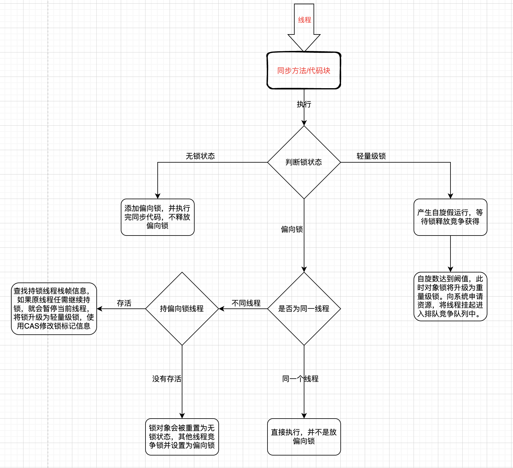

[TOC]
# 多线程

## sleep和wait区别
sleep:暂停当前运行，短暂暂停不会释放锁。
wait:暂停当前运行，暂停结束释放锁。

## sleep()和yield()的区别
1. sleep不考虑线程优先级，yield优先级越高机会越大。
2. sleep执行线程进入阻塞状态，yield执行线程进入就绪状态。
3. sleep()方法声明抛出 InterruptedException，而yield()方法没有声明任何异常。
4. yield让出了对CPU的占用权。

## interrupt、interrupted和isInterrupted
interrupt：设置线程的中断状态为中断。（当前线程）
- 标记中断的线程不会即可中断，需要用户监视线程的状态并做出处理。被标记中断状态线程会抛出异常interruptedException

interrupted：静态方法，查看线程的中断状态并清除状态。

isInterrupted：返回线程的中断状态true和false。

## notify()和notifyAll()
notify：随机唤醒一个阻塞线程，唤醒由虚拟机决定，参加锁的竞争。

notifyAll：唤醒全部阻塞方法，参加锁的竞争。

## 并发编程三要素
- 原子性：原子性指的是一个或多个操作，要么全部执行并且不会被打断，要么全不执行。
- 可见性：当多线程操作共享数据时，一个线程修改数据，另一个线程可以查看修改后的数据。
- 有序性：程序的执行顺序按照代码的先后顺序执行。

解决方法：
- 原子性：使用多线同步synchronize和锁Lock。
- 可见性：synchronize、volatile、lock。
- 顺序性：Happens-Before。

## 实现可见性的方法
synchronized或者lock：对即将修改的数据进行加锁，同一时刻只允许一个线程进行操作。

## 多线程价值
1. 发挥多核CPU：用多线程充分发挥CPU优势，同一时刻可以执行多件事。
2. 防止阻塞：当在类似网络请求的网络请求中，服务方未能及时响应。这时就会造成线程等待，后续就要等待。多线程可以切换任务避免这种情况。
3. 优化编程：将需求分开编程，再通过多线程分别执行。

## 创建线程方式
- 继承Thread，实现run方法。
- 实现Runnable接口，实现run方法。
- 实现Callable接口，实现call方法。
- 匿名内部类。

## 创建方式对比
### Runnable和Callable
- Runnable和Callable是接口，不但可以实现此接口，还可以集成其他的父类，增加扩展性。
- Callable重写的call方法，Runnable重写的run方法。
- Callable执行完可以返回值（Future对象接收），也可以抛出异常。Runnable不可以。
- 获得当前线程需要使用Thread.currentThread()。

2. Thread多线程
获得当前线程使用this。

## 多线程状态
- NEW: 初始状态，线程被创建出来但没有被调用 start() 。
- RUNNABLE: 运行状态，线程被调用了 start()等待运行的状态。
- BLOCKED ：阻塞状态，需要等待锁释放。
- WAITING：等待状态，表示该线程需要等待其他线程做出一些特定动作（通知或中断）。
- TIME_WAITING：超时等待状态，可以在指定的时间后自行返回而不是像 WAITING 那样一直等待。
- TERMINATED：终止状态，表示该线程已经运行完毕。
  

## 线程池
### 是什么
线程池就是创建多个线程，等到任务来的时候，使用多线程执行任务。完成后将线程放回线程池中等待下次调用。当频繁需要使用线程时可以使用线程池。

### 创建方法
1. 使用ThreadPoolExecutor构造方法创建（推荐）（主要参数：核心数，最大数，超时时长，时间单位，任务队列）
2. Executor框架的工具类Executors来实现

### 优点
1. 重复使用线程，减少线程频繁创建线程的开销。
2. 控制多线程数量，避免资源浪费和线程过多导致系统堵塞。
3. 提供定时执行，定期执行等方法。

## CyclicBarrier和CountDownLatch
- CountDownLatch等待所有线程执行countDown方法后，当前线程才执行。
- CyclicBarrier是等待所有线程进入wait方法后，所有线程在同时执行。
- CountDownLatch计数器只能执行一次，CyclicBarrier可以通过reset方法重置计数。
- CyclicBarrier还可以获得阻塞数，是否被中断。

## volatile
1. 保证变量的可见性
2. 禁止指令重排序（单例模型）

# synchronized
主要解决多线程之间访问资源的同步性。可以保证关键字修饰的方法和代码块同一时刻只能一个线程访问。早期版本synchronized比较重量级，1.6后优化较大。

## 修饰方式 | 如何使用
1. 属性方法（对象锁）
2. 静态方法（类锁）
3. 代码块（对象/类锁）

## synchronized底层实现原理
两者本质都是对monitor监视器锁的获取。

### 修饰代码块
1. synchronized底层是通过monitor指令来完成同步。
2. 每个对象都会有一个monitor监视锁，每个被synchronized修饰过的代码当他的monitor被占用时就会处于锁定状态，并且尝试获取monitor的所有权。
3. 尝试获得所有权的过程
   1. 判断monitor进入数是否为0，是的话当前线程进入monitor，并将进入数设置1，当前线程为monitor的所有者。
   2. 当前线程已获得所有权，当重新进入时就会进入数+1。
   3. 如果其他线程占用monitor，当前线程获得monitor需要阻塞等待，直到进入数为0，再尝试获取所有权。

### 修饰方法
synchronized 修饰的方法并没有 monitorenter 指令和 monitorexit 指令，取得代之的确实是 ACC_SYNCHRONIZED 标识，该标识指明了该方法是一个
同步方法。JVM 通过该 ACC_SYNCHRONIZED 访问标志来辨别一个方法是否声明为同步方法，从而执行相应的同步调用。

## synchronized底层做了哪些优化（imperfect）
JDK1.6 对锁的实现引入了大量的优化，如偏向锁、轻量级锁、自旋锁、适应性自旋锁、锁消除、锁粗化等技术来减少锁操作的开销。
锁主要存在四种状态，依次是：无锁状态、偏向锁状态、轻量级锁状态、重量级锁状态，他们会随着竞争的激烈而逐渐升级。注意锁可以升级不可降级，这种策略是为了提高获得锁和释放锁的效率。

## synchronized锁膨胀升级过程
**锁只能升级不能降级，但是偏向锁可以改变成无锁状态。**

### 相关锁介绍
偏向锁：记录第一次获得锁的线程，类似可重入锁。

轻量级锁：类似自旋锁，竞争线程不挂起，进行无意义循环并尝试获得锁。

重量级锁：类似悲观锁，未获得锁线程被挂起，进入系统排队系统等待竞争。

### 过程


## synchronized修饰构造方法
构造方法不能使用synchronized关键字。构造方法本身就是同步方法，不需要同步修饰符。

## synchronized可重入锁
当一个线程成功执行synchronized修饰的方法，此方法再调用其他synchronized修饰的方法就会出现问题。

设计方面：当前线程调用其他线程持有对象锁的方法时，就会发生阻塞。当调用当前线程持有的对象锁对象方法时，如果是可重入锁，则直接成功，否则失败阻塞。

synchronized是一个可重入锁。


# 综合问题

## 双重检验锁实现的单例模式
```java
public class Demo{
    private volatile static Demo demo;
    public static Demo getInstance() {
        if (demo == null) {
            synchronized (Demo.class){
                if (demo == null) {
                    demo = new Demo();
                }
            }
        }
    } 
}
```

细节：静态变量需要添加volatile，防止指令重排序。
指令重排序：
1. 为demo分配空间
2. 初始化demo
3. 将demo指向分配的空间

系统可能会安装1-3-2顺序执行，volatile可以防止出现这种现象。

## CAS实现
CAS是一种无锁算法，在不使用锁情况下实现多线程数据同步。

算法涉及到三个操作数：
- 需要读写的内存位置V
- 需要进行比较的预期值A
- 需要写入的新值U

CAS具体执行时，当且仅当预期值A符合内存地址V中存储的值时，就用新值U替换掉旧值，并写入到内存地址V中。否则自旋重写读取进行更新。

CAS产生的问题：
1. ABA问题：CAS需要在操作值的时候检查内存值是否发生变化，没有发生变化才会更新内存值。但是如果内存值原来是A，后来变成了B，然后又变成了A，那么
CAS进行检查时会发现值没有发生变化，但是实际上是有变化的。ABA问题的解决思路就是在变量前面添加版本号，每次变量更新的时候都把版本号加一，
这样变化过程就从“A－B－A”变成了“1A－2B－3A”。

2. 循环时间长开销大：CAS算法需要不断地自旋来读取最新的内存值，长时间读取不到就会造成不必要的CPU开销。
3. 只能保证一个共享变量的原子操作：jdk的AtomicReference来保证应用对象之间的原子性，可以把多个变量放在一个对象里来进行CAS操作，解决了这一问题。

## 并发编程优缺点

优点：
1. 充分利用多核CPU的计算能力。
2. 方便进行业务拆分，提升应用性能。

缺点：
1. 并发不一定总是提高性能。
2. 会导致内存泄漏、上下文切换、线程安全和死锁问题。

## 并发、并行和串行
- 并发：多任务使用同一CPU按时间片段轮流执行。（并非同时运行，速度错觉）
- 并行：多CPU/核同时运行，多软件同时处理。（真同时运行）
- 串行：任务排队执行。

## 用户线程和守护线程
用户线程：运行在前台，执行具体的任务。

守护线程：非守护线程的佣人，同用户线程生死。


## Java多线程调度
- 分时调度
- 抢占调度（使用）

## 两个线程共享数据
两个线程共享变量，需要保证变量的线程安全。

## SpringMVC和Servlet线程安全
SpringMVC：不是线程安全
Servlet：不是线程安全

## Java中保证线程安全
1. 使用原子类
2. 使用synchronize自动锁
3. 使用手动锁

## 线程优先级
每个线程都有优先级，一般来说，优先级越高的线程执行优先级就越高。但这依赖线程调度的实现，最终实现依赖底层系统调度。优先级从1-10，越大优先级就越大。

## 线程构造方法和静态块是被哪个线程调用
是被new这个线程类的当前线程调用，run方法才是被创建线程调用。

## 线程间通信

实现：
- 使用wait、notify、notifyAll
- 使用Condition进行线程通信

原理：
JMM，java内存模型，将多线程共享资源都存在一个主内存中。时时进行资源刷新。