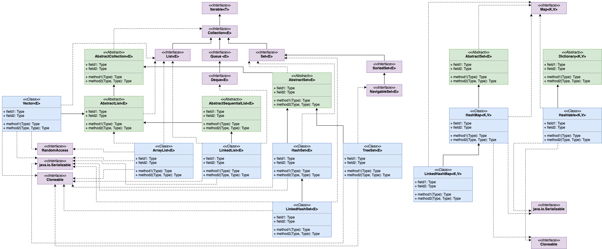

# 1. ArrayList

## 1.1 常用方法步骤

### 1.1.2 构造函数

---
1. 无参: 直接创建一个null数组，是**懒加载**，当第一次使用后在创建默认大小数组。
2. 集合数组：先获得数组（toArray()）集合为空直接赋值为空，集合不为空且类型与ArrayList相同直接相等，不为空且类型不相同使用Arrays.copyOf赋值。
3. 初始容量大小(int类型)：参数<0抛出异常，>0直接创建参数大小数组，=0赋值空数组。

### 1.1.2 add(E e)

---
1. 传递minCap = size+1，判断当前容量。
2. 判断是否为默认空数组，等于返回默认容量和参数最大值minCap。
3. 操作数+1，minCap大于当前容量则进行第4步，否则直接进行第7步。
4. 扩充容量为当前**1.5倍左右（位运算>>1）**，取扩充后值和minCap最大值。
5. 如果值大于默认最大值，则取int最大值（2^31 - 1）。如果为负数则直接抛出异常结束任务。
6. 使用Arrays.copyOf将原数组扩大到指定大小，这是一个本地方法。
7. 赋值值到当前数组位置（size），size进行加一。
8. 返回true，操作结束。

### 1.1.3 add(int index, E e)

---
1. 检测index是否在0~size范围内
2. 检测是否需要扩充容量
3. 使用System.arraycopy对需要插入数据向后移动一位。
4. 向需要插入位置赋值，size+1，结束

### 1.1.4 addAll(Collection<? extend E> c)

---
1. 集合转换成数组，并获得数组长度。
2. 检测是否需要扩容，最小值为当前size+插入机和大小。
3. 使用System.arraycopy把数组内容添加进去。从指定位置插入，指定插入数量为插入集合大小。
4. size+=插入集合大小。
5. 返回是否成功。（插入数不等于0）

### 1.1.5 addAll(int index, Collection<? extends E> c)

---
1. 检测索引是否越界。
2. 获得集合数组和长度。
3. 检测容量是否需要扩容。
4. 判断是否为尾部插入（size和index是否相同），尾部插入即同addAll(Collection<? extend E> c)相同。不相同使用System.arraycopy将插入位置后数据向后移动插入集合大小。
5. 使用System.arraycopy将插入数组赋值进去。
6. size+=插入集合大小。 
7. 返回是否成功。（插入数不等于0）

### 1.1.6 E set(int index, E e)

---
1. 检测索引是否大于size。
2. 获得原数据。
3. 设置索引位置为当前数据。
4. 返回老数据。

### 1.1.7 E remove(int index)

---
1. 检测索引是否大于size，操作数加一，获得老数据。
2. 判断是否为尾部移除，true直接size--，设置老位置为null，返回老数据。
3. 不为尾部删除，使用System.arraycopy将索引下一位置数据向前移动一位。在设置size--，设置老位置为null，返回老数据。

### 1.1.8 E remove(Object o)

---
1. 需要判断o是否为空。
2. true：通过for循环找到第一个符合条件的，然后调用fastRome.
3. false:同上。判断条件换成使用equals。

### 1.1.9 fastRemove(int index)

---
1. 操作数加一，判断是否为最后删除。
2. true：size--位置赋值为null即可。false：将需要删除位置后的数据向前移动一位，然后size--位置赋值null。

### 1.1.10 private class Itr implements Iterator<E>

```java
private class Itr implements Iterator<E> {
    int cursor;       // 下一个数据的索引
    int lastRet = -1; // 最后出现的数据索引，初始化为-1
    int expectedModCount = modCount; // 调用时当前类的操作数，是否能操作数据的重要判断条件。

    Itr() {}

    public boolean hasNext() {
        return cursor != size;
    }

    @SuppressWarnings("unchecked")
    public E next() {
        checkForComodification();
        int i = cursor;
        if (i >= size)
            throw new NoSuchElementException();
        Object[] elementData = ArrayList.this.elementData;
        if (i >= elementData.length)
            throw new ConcurrentModificationException();
        cursor = i + 1;
        return (E) elementData[lastRet = i];
    }

    public void remove() {
        if (lastRet < 0)
            throw new IllegalStateException();
        checkForComodification();

        try {
            ArrayList.this.remove(lastRet);
            cursor = lastRet;
            lastRet = -1;
            expectedModCount = modCount;
        } catch (IndexOutOfBoundsException ex) {
            throw new ConcurrentModificationException();
        }
    }

    @Override
    @SuppressWarnings("unchecked")
    public void forEachRemaining(Consumer<? super E> consumer) {    // 1.8后新增的方法，对剩余元素进行操作，操作规则在实现consumer接口的实例中。
        Objects.requireNonNull(consumer);
        final int size = ArrayList.this.size;
        int i = cursor;
        if (i >= size) {
            return;
        }
        final Object[] elementData = ArrayList.this.elementData;
        if (i >= elementData.length) {
            throw new ConcurrentModificationException();
        }
        while (i != size && modCount == expectedModCount) {
            consumer.accept((E) elementData[i++]);
        }
        // update once at end of iteration to reduce heap write traffic
        cursor = i;
        lastRet = i - 1;
        checkForComodification();
    }

    final void checkForComodification() {
        if (modCount != expectedModCount)
            throw new ConcurrentModificationException();
    }
}
```

# 2. HashMap

## 1.1 主要变量
```java
// 默认初始容量
static final int DEFAULT_INITIAL_CAPACITY = 1 << 4; // = 16

// 最大容量
static final int MAXIMUM_CAPACITY = 1 << 30;

// 负载因子，决定了hash冲突多少的值
static final float DEFAULT_LOAD_FACTOR = 0.75f;

// 转化为红黑树的阙值
static final int TREEIFY_THRESHOLD = 8;

// 去红黑树阙值
static final int UNTREEIFY_THRESHOLD = 6;

// 转化为红黑树最小容量值
static final int MIN_TREEIFY_CAPACITY = 64;

/*内部字段，不可以序列化字段*/
// 存放数据集合
transient Node<K,V>[] table;
// 键集合
transient Set<Map.Entry<K,V>> entrySet;
// 集合大小
transient int size;
// 操作数
transient int modCount;

// 临界值
int threshold;
// 负载因子
final float loadFactor;
```

## 1.2 内部类

### 1.2.1 static class Node<K,V> implements Map.Entry<K,V>

```java
// 主要变量
final int hash; // 键hash
final K key; // 键值
V value; // 值
Node<K,V> next; // 下一个节点实例
```

### 1.2.2 abstract class HashIterator

#### 1.2.2.1 主要变量

Node<K,V> next;        // 下一个节点
Node<K,V> current;     // 当前节点
int expectedModCount;  // 接收当前操作数
int index;             // 索引

#### 1.2.2.2 主要方法
1. hasNext：判断是否由下一个Node
2. nextNode：获得下一个节点，先通过索引获得链表或树，然后再next获得下一个节点。返回的是Node
3. remove：删除节点。

**KeyIterator、ValueIterator、EntryIterator都是继承HashIterator，通过调用HashIterator.nextNode完成相关操作。**


## 1.3 常用方法

### 1.3.1 构造函数

---
1. 无参：全部使用默认值，只赋值默认负载因子给局部不变量。
2. 指定容量参数：调用指定容量参数和赋值因子构造，负载因子传递默认值。
3. 指定容量和负载因子：
   1. 容量<0抛出异常
   2. 容量大于最大值取最大值
   3. 负载因子<0或为NaN抛出异常
   4. 赋值负载因子，调用`tableSizeFor()`方法获得临界值（未初始化时可表示为初始容量，初始化后此值为容量*负载因子所得）

### 1.3.2 final Node<K,V>[] resize()
HashMap的扩容方法，主要分为两部分，一确定新的容量和临界值，二扩容后老数据是否需要移动位置。

---
1. 获得table，oldCap，oldThr的值
2. 或oldCap大于0：大于最大值直接返回，不能再扩容，小于最大值则值newCap为`oldCap<<1`,如果newCap值小于最大值且大于默认值，则newThr为`oldThr<<1`。
3. 或oldThr大于0：表示初始值放在oldThr中。
4. 2,3步都不成立，newCap设置为默认值，newThr设置为默认值*默认负载因子。
5. newThr为零的话，`newThr=newCap*loadFactor`;
6. 临界值等于newThr，创建一个新的数组newTable，大小为newCap。
7. 判断oldTab是否存在值，不存在直接返回新数组。
8. 存在的话需要进行for循环，把元素重写分布在新数组中。
9. 获得节点为空进行下一个，不为空执行下一步。
10. 判断是否为链表（当前位置Node是否存在hash冲突），不存在这直接通过`hash & (newCap -1)`计算出新数组索引位置（仅限于容量是2的n次幂）。存在进行下一步。
11. 判断是否为红黑树，是的话进行红黑树的操作。否则下一步。
12. 为链表，通过`(hash & oldCap) == 0`判断扩容后位置是否改变，不改变第一个存loHead，之后一直存loTail。改变的话第一个存hiTail，之后存hiTail。
13. 循环结束，loTail.next=null然后loHead放原位，hiTail.next=null然后hiHead放在**当前位置加上OldCap位置**上（这就是为什么每次扩容都是2的n次幂的原因，膜拜~）。
14. 返回新数组。

### 1.3.3 static final int tableSizeFor(int cap)

---
先看代码：
```java
// 大佬就是牛，通过此方法可以保证容量是2的n次幂
static final int tableSizeFor(int cap) {
    int n = cap - 1; // 可以避免容量被扩大一倍，例如传递参数为16，不减一最总容量是32，加了就是16，类似页数计算(count+pageNum-1)/pageNum
    n |= n >>> 1;   // 位运算|，两者为0都为0
    n |= n >>> 2;
    n |= n >>> 4;
    n |= n >>> 8;
    n |= n >>> 16; // 以上代码巧妙的把给定数的二进制位最高位之后都补成1，然后结果再加一就会得到向上取最大2的n次幂数。膜拜~
    return (n < 0) ? 1 : (n >= MAXIMUM_CAPACITY) ? MAXIMUM_CAPACITY : n + 1;
}
```

### 1.3.4 public V put(K key, V value)
返回oldVal

---
1. 调用putVal方法。
2. 判断table是否未初始化，true则调用resize进行容量调整。
3. 获得当前位置元素，如果为空则创建Node实例并通过(n-1)&hash获得索引，根据索引赋值。
4. 不为空，则需要进行以下三种情况处理：
   1. 与原数据hash和key均相同，且`onlyIfAbsent==false`或`val==null`，就覆盖原位置数值。否则不作任何。
   2. 当前位置为TreeNode，则通过TreeNode进行红黑树操作。
   3. 当前为链表，进行for循环，如果Node存在链表中，则直接第1步。直到`Node.next==null`则直接创建对象加入链表，如果链表大小超过`TREEIFY_THRESHOLD`，则直接调用`treeifyBin`方法判断是否需要转换成红黑树。
5. 操作+1，判断size是否超过临界值，超过则需要调用resize进行容量调整。

### 1.3.4 public void putAll(Map<? extends K, ? extends V> m)

直接调用的是`final void putMapEntries(Map<? extends K, ? extends V> m, boolean evict)`方法，所以这里介绍的也就是putMapEntries方法。

---
1. 判断原数组是否为空，不为空且m.size大于临界值就会调用resize进行容量调整。
2. 原数组等于零，通过`m.size/loadFactor+1`获得粗略容量，如果这个值大于阙值则会通过tableSizeFor方法或者最近2N次幂数容量，否则不在任何操作。
3. 通过for循环调用putVal进行赋值。


# 3. ConcurrentHashMap

线程安全的HashMap

## 3.1 不同版本

- 1.8前：分段Segment数组，默认为16段，一旦初始化不能改变。二级hash表。
- 1.8后：乐观锁+synchronized，节点集合添加volatile，并且只在hash冲突才会synchronized包裹。

# 4. TreeMap

key必须实现Comparable接口。

# 5. HashSet

key进行hash比较，相同再进行equals比较，所以自定义类需要重写这两个方法。

# **. 集合综合比较

集合主要分为两大类：双列集合Map和单列集合Collection


❎

|集合类|有序|重复|同步|底层|特点|
|---|---|---|---|---|---|
|ArrayList|✅|✅|❎|数组|查询快，增删慢|
|Vector|✅|✅|✅|数组|古老类，查询快，增删慢|
|LinkedList|✅|✅|❎|双向列表|查询慢，增删快|
|HashSet|❎|❎|❎|Hash表，依靠HashMap实现|存取速度快|
|TreeSet|❎|❎|❎|二叉树数据结构|自动排序|
|LinkedHashSet|✅|❎|❎|hash表，双向链表|LinkedHashMap实现|
|Queue|✅|✅|❎|数组或链表|顺序执行|
|HashMap|❎|❎|❎|数组+红黑树|存取快|
|HashTable|❎|❎|✅|Hash表|键值都不允许null|
|TreeMap|❎|❎|❎|二叉树|排序|


