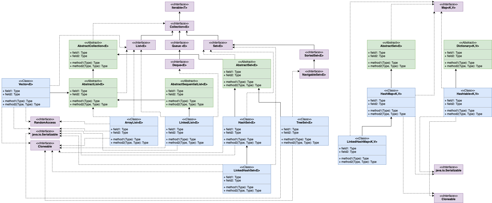

# 1. ArrayList

## 1.1 常用方法步骤

### 1.1.2 构造函数

---
1. 无参: 直接创建一个null数组，是**懒加载**，当第一次使用后在创建默认大小数组。
2. 集合数组：先获得数组（toArray()）集合为空直接赋值为空，集合不为空且类型与ArrayList相同直接相等，不为空且类型不相同使用Arrays.copyOf赋值。
3. 初始容量大小(int类型)：参数<0抛出异常，>0直接创建参数大小数组，=0赋值空数组。

### 1.1.2 add(E e)

---
1. 传递minCap = size+1，判断当前容量。
2. 判断是否为默认空数组，等于返回默认容量和参数最大值minCap。
3. 操作数+1，minCap大于当前容量则进行第4步，否则直接进行第7步。
4. 扩充容量为当前**1.5倍左右（位运算>>1）**，取扩充后值和minCap最大值。
5. 如果值大于默认最大值，则取int最大值（2^31 - 1）。如果为负数则直接抛出异常结束任务。
6. 使用Arrays.copyOf将原数组扩大到指定大小，这是一个本地方法。
7. 赋值值到当前数组位置（size），size进行加一。
8. 返回true，操作结束。

### 1.1.3 add(int index, E e)

---
1. 检测index是否在0~size范围内
2. 检测是否需要扩充容量
3. 使用System.arraycopy对需要插入数据向后移动一位。
4. 向需要插入位置赋值，size+1，结束

### 1.1.4 addAll(Collection<? extend E> c)

---
1. 集合转换成数组，并获得数组长度。
2. 检测是否需要扩容，最小值为当前size+插入机和大小。
3. 使用System.arraycopy把数组内容添加进去。从指定位置插入，指定插入数量为插入集合大小。
4. size+=插入集合大小。
5. 返回是否成功。（插入数不等于0）

### 1.1.5 addAll(int index, Collection<? extends E> c)

---
1. 检测索引是否越界。
2. 获得集合数组和长度。
3. 检测容量是否需要扩容。
4. 判断是否为尾部插入（size和index是否相同），尾部插入即同addAll(Collection<? extend E> c)相同。不相同使用System.arraycopy将插入位置后数据向后移动插入集合大小。
5. 使用System.arraycopy将插入数组赋值进去。
6. size+=插入集合大小。 
7. 返回是否成功。（插入数不等于0）

### 1.1.6 E set(int index, E e)

---
1. 检测索引是否大于size。
2. 获得原数据。
3. 设置索引位置为当前数据。
4. 返回老数据。

### 1.1.7 E remove(int index)

---
1. 检测索引是否大于size，操作数加一，获得老数据。
2. 判断是否为尾部移除，true直接size--，设置老位置为null，返回老数据。
3. 不为尾部删除，使用System.arraycopy将索引下一位置数据向前移动一位。在设置size--，设置老位置为null，返回老数据。

### 1.1.8 E remove(Object o)

---
1. 需要判断o是否为空。
2. true：通过for循环找到第一个符合条件的，然后调用fastRome.
3. false:同上。判断条件换成使用equals。

### 1.1.9 fastRemove(int index)

---
1. 操作数加一，判断是否为最后删除。
2. true：size--位置赋值为null即可。false：将需要删除位置后的数据向前移动一位，然后size--位置赋值null。

### 1.1.10 private class Itr implements Iterator<E>

```java
private class Itr implements Iterator<E> {
    int cursor;       // 下一个数据的索引
    int lastRet = -1; // 最后出现的数据索引，初始化为-1
    int expectedModCount = modCount; // 调用时当前类的操作数，是否能操作数据的重要判断条件。

    Itr() {}

    public boolean hasNext() {
        return cursor != size;
    }

    @SuppressWarnings("unchecked")
    public E next() {
        checkForComodification();
        int i = cursor;
        if (i >= size)
            throw new NoSuchElementException();
        Object[] elementData = ArrayList.this.elementData;
        if (i >= elementData.length)
            throw new ConcurrentModificationException();
        cursor = i + 1;
        return (E) elementData[lastRet = i];
    }

    public void remove() {
        if (lastRet < 0)
            throw new IllegalStateException();
        checkForComodification();

        try {
            ArrayList.this.remove(lastRet);
            cursor = lastRet;
            lastRet = -1;
            expectedModCount = modCount;
        } catch (IndexOutOfBoundsException ex) {
            throw new ConcurrentModificationException();
        }
    }

    @Override
    @SuppressWarnings("unchecked")
    public void forEachRemaining(Consumer<? super E> consumer) {    // 1.8后新增的方法，对剩余元素进行操作，操作规则在实现consumer接口的实例中。
        Objects.requireNonNull(consumer);
        final int size = ArrayList.this.size;
        int i = cursor;
        if (i >= size) {
            return;
        }
        final Object[] elementData = ArrayList.this.elementData;
        if (i >= elementData.length) {
            throw new ConcurrentModificationException();
        }
        while (i != size && modCount == expectedModCount) {
            consumer.accept((E) elementData[i++]);
        }
        // update once at end of iteration to reduce heap write traffic
        cursor = i;
        lastRet = i - 1;
        checkForComodification();
    }

    final void checkForComodification() {
        if (modCount != expectedModCount)
            throw new ConcurrentModificationException();
    }
}
```

# 2. HashMap

## 1.1 主要变量
```java
// 默认初始容量
static final int DEFAULT_INITIAL_CAPACITY = 1 << 4; // = 16

// 最大容量
static final int MAXIMUM_CAPACITY = 1 << 30;

// 负载因子，决定了hash冲突多少的值
static final float DEFAULT_LOAD_FACTOR = 0.75f;

// 转化为红黑树的阙值
static final int TREEIFY_THRESHOLD = 8;

// 去红黑树阙值
static final int UNTREEIFY_THRESHOLD = 6;

// 转化为红黑树最小容量值
static final int MIN_TREEIFY_CAPACITY = 64;

/*内部字段，不可以序列化字段*/
// 存放数据集合
transient Node<K,V>[] table;
// 键集合
transient Set<Map.Entry<K,V>> entrySet;
// 集合大小
transient int size;
// 操作数
transient int modCount;

// 临界值
int threshold;
// 负载因子
final float loadFactor;
```

## 1.2 内部类

### 1.2.1 static class Node<K,V> implements Map.Entry<K,V>

```java
// 主要变量
final int hash; // 键hash
final K key; // 键值
V value; // 值
Node<K,V> next; // 下一个节点实例
```

### 1.2.2 abstract class HashIterator

#### 1.2.2.1 主要变量

Node<K,V> next;        // 下一个节点
Node<K,V> current;     // 当前节点
int expectedModCount;  // 接收当前操作数
int index;             // 索引

#### 1.2.2.2 主要方法
1. hasNext：判断是否由下一个Node
2. nextNode：获得下一个节点，先通过索引获得链表或树，然后再next获得下一个节点。返回的是Node
3. remove：删除节点。

**KeyIterator、ValueIterator、EntryIterator都是继承HashIterator，通过调用HashIterator.nextNode完成相关操作。**


## 1.3 常用方法

### 1.3.1 构造函数

---
1. 无参：全部使用默认值，只赋值默认负载因子给局部不变量。
2. 指定容量参数：调用指定容量参数和赋值因子构造，负载因子传递默认值。
3. 指定容量和负载因子：
   1. 容量<0抛出异常
   2. 容量大于最大值取最大值
   3. 负载因子<0或为NaN抛出异常
   4. 赋值负载因子，调用`tableSizeFor()`方法获得临界值（未初始化时可表示为初始容量，初始化后此值为容量*负载因子所得）

### 1.3.2 final Node<K,V>[] resize()
HashMap的扩容方法，主要分为两部分，一确定新的容量和临界值，二扩容后老数据是否需要移动位置。

---
1. 获得table，oldCap，oldThr的值
2. 或oldCap大于0：大于最大值直接返回，不能再扩容，小于最大值则值newCap为`oldCap<<1`,如果newCap值小于最大值且大于默认值，则newThr为`oldThr<<1`。
3. 或oldThr大于0：表示初始值放在oldThr中。
4. 2,3步都不成立，newCap设置为默认值，newThr设置为默认值*默认负载因子。
5. newThr为零的话，`newThr=newCap*loadFactor`;
6. 临界值等于newThr，创建一个新的数组newTable，大小为newCap。
7. 判断oldTab是否存在值，不存在直接返回新数组。
8. 存在的话需要进行for循环，把元素重写分布在新数组中。
9. 获得节点为空进行下一个，不为空执行下一步。
10. 判断是否为链表（当前位置Node是否存在hash冲突），不存在这直接通过`hash & (newCap -1)`计算出新数组索引位置（仅限于容量是2的n次幂）。存在进行下一步。
11. 判断是否为红黑树，是的话进行红黑树的操作。否则下一步。
12. 为链表，通过`(hash & oldCap) == 0`判断扩容后位置是否改变，不改变第一个存loHead，之后一直存loTail。改变的话第一个存hiTail，之后存hiTail。
13. 循环结束，loTail.next=null然后loHead放原位，hiTail.next=null然后hiHead放在**当前位置加上OldCap位置**上（这就是为什么每次扩容都是2的n次幂的原因，膜拜~）。
14. 返回新数组。

### 1.3.3 static final int tableSizeFor(int cap)

---
先看代码：
```java
// 大佬就是牛，通过此方法可以保证容量是2的n次幂
static final int tableSizeFor(int cap) {
    int n = cap - 1; // 可以避免容量被扩大一倍，例如传递参数为16，不减一最总容量是32，加了就是16，类似页数计算(count+pageNum-1)/pageNum
    n |= n >>> 1;   // 位运算|，两者为0都为0
    n |= n >>> 2;
    n |= n >>> 4;
    n |= n >>> 8;
    n |= n >>> 16; // 以上代码巧妙的把给定数的二进制位最高位之后都补成1，然后结果再加一就会得到向上取最大2的n次幂数。膜拜~
    return (n < 0) ? 1 : (n >= MAXIMUM_CAPACITY) ? MAXIMUM_CAPACITY : n + 1;
}
```

### 1.3.4 public V put(K key, V value)
返回oldVal

---
1. 调用putVal方法。
2. 判断table是否未初始化，true则调用resize进行容量调整。
3. 获得当前位置元素，如果为空则创建Node实例并通过(n-1)&hash获得索引，根据索引赋值。
4. 不为空，则需要进行以下三种情况处理：
   1. 与原数据hash和key均相同，且`onlyIfAbsent==false`或`val==null`，就覆盖原位置数值。否则不作任何。
   2. 当前位置为TreeNode，则通过TreeNode进行红黑树操作。
   3. 当前为链表，进行for循环，如果Node存在链表中，则直接第1步。直到`Node.next==null`则直接创建对象加入链表，如果链表大小超过`TREEIFY_THRESHOLD`，则直接调用`treeifyBin`方法判断是否需要转换成红黑树。
5. 操作+1，判断size是否超过临界值，超过则需要调用resize进行容量调整。

### 1.3.4 public void putAll(Map<? extends K, ? extends V> m)

直接调用的是`final void putMapEntries(Map<? extends K, ? extends V> m, boolean evict)`方法，所以这里介绍的也就是putMapEntries方法。

---
1. 判断原数组是否为空，不为空且m.size大于临界值就会调用resize进行容量调整。
2. 原数组等于零，通过`m.size/loadFactor+1`获得粗略容量，如果这个值大于阙值则会通过tableSizeFor方法或者最近2N次幂数容量，否则不在任何操作。
3. 通过for循环调用putVal进行赋值。


# 3. ConcurrentHashMap

线程安全的HashMap

## 3.1 不同版本

- 1.8前：分段Segment数组，默认为16段，一旦初始化不能改变。二级hash表。
- 1.8后：乐观锁+synchronized，节点集合添加volatile，并且只在hash冲突才会synchronized包裹。

# 4. TreeMap

key必须实现Comparable接口。

# 5. HashSet

key进行hash比较，相同再进行equals比较，所以自定义类需要重写这两个方法。

# 6. 集合综合比较

集合主要分为两大类：双列集合Map和单列集合Collection



|集合类|有序|重复|同步|底层|特点|
|---|---|---|---|---|---|
|ArrayList|✅|✅|❎|数组|查询快，增删慢|
|Vector|✅|✅|✅|数组|古老类，查询快，增删慢|
|LinkedList|✅|✅|❎|双向列表|查询慢，增删快|
|HashSet|❎|❎|❎|Hash表，依靠HashMap实现|存取速度快|
|TreeSet|❎|❎|❎|二叉树数据结构|自动排序|
|LinkedHashSet|✅|❎|❎|hash表，双向链表|LinkedHashMap实现|
|Queue|✅|✅|❎|数组或链表|顺序执行|
|HashMap|❎|❎|❎|数组+红黑树|存取快|
|HashTable|❎|❎|✅|Hash表|键值都不允许null|
|TreeMap|❎|❎|❎|二叉树|排序|


# 7. 集合总结

## 7.1 ArrayList

数据结构：数组（Object[]）
线程安全：不安全
存储空值：允许存储null，可以多个
元素重复：重复
随机访问：可以。
> 实现标志接口RandomAccess，数组为连续物理内存，可以实现随机访问。

增删数据时间复杂度：首O(n),中间O(n),尾O(1)
初始容量：10（无参构造创建时，为空数组对象，向集合添加第一个元素才扩容到10）
单次扩容：原容量1.5倍**左右**（oldSize+（oldSize>>1））。
> 并非绝对为1.5倍，当最小需要容量时，最终的扩容数量为最小需要容量。

最大容量：MaxInt-8
重要方法： `System.arraycopy()`数组的移动操作，`、Arrays.copyOf()`数组的复制操作。
特殊方法：ensureCapacity需要存入大量数据时，先调用此方法进行扩容，避免多次扩容，提高性能。
扩容步骤：见以下核心代码
```java
package java.util;

import java.util.function.Consumer;
import java.util.function.Predicate;
import java.util.function.UnaryOperator;


public class ArrayList<E> extends AbstractList<E>
        implements List<E>, RandomAccess, Cloneable, java.io.Serializable
{
    private static final long serialVersionUID = 8683452581122892189L;

    /**
     * 默认初始容量大小
     */
    private static final int DEFAULT_CAPACITY = 10;

    /**
     * 空数组（用于空实例）。
     */
    private static final Object[] EMPTY_ELEMENTDATA = {};

     //用于默认大小空实例的共享空数组实例。
      //我们把它从EMPTY_ELEMENTDATA数组中区分出来，以知道在添加第一个元素时容量需要增加多少。
    private static final Object[] DEFAULTCAPACITY_EMPTY_ELEMENTDATA = {};

    /**
     * 保存ArrayList数据的数组
     */
    transient Object[] elementData; // non-private to simplify nested class access

    /**
     * ArrayList 所包含的元素个数
     */
    private int size;

    /**
     * 带初始容量参数的构造函数（用户可以在创建ArrayList对象时自己指定集合的初始大小）
     */
    public ArrayList(int initialCapacity) {
        if (initialCapacity > 0) {
            //如果传入的参数大于0，创建initialCapacity大小的数组
            this.elementData = new Object[initialCapacity];
        } else if (initialCapacity == 0) {
            //如果传入的参数等于0，创建空数组
            this.elementData = EMPTY_ELEMENTDATA;
        } else {
            //其他情况，抛出异常
            throw new IllegalArgumentException("Illegal Capacity: "+
                                               initialCapacity);
        }
    }

    /**
     *默认无参构造函数
     *DEFAULTCAPACITY_EMPTY_ELEMENTDATA 为0.初始化为10，也就是说初始其实是空数组 当添加第一个元素的时候数组容量才变成10
     */
    public ArrayList() {
        this.elementData = DEFAULTCAPACITY_EMPTY_ELEMENTDATA;
    }

    /**
     * 构造一个包含指定集合的元素的列表，按照它们由集合的迭代器返回的顺序。
     */
    public ArrayList(Collection<? extends E> c) {
        //将指定集合转换为数组
        elementData = c.toArray();
        //如果elementData数组的长度不为0
        if ((size = elementData.length) != 0) {
            // 如果elementData不是Object类型数据（c.toArray可能返回的不是Object类型的数组所以加上下面的语句用于判断）
            if (elementData.getClass() != Object[].class)
                //将原来不是Object类型的elementData数组的内容，赋值给新的Object类型的elementData数组
                elementData = Arrays.copyOf(elementData, size, Object[].class);
        } else {
            // 其他情况，用空数组代替
            this.elementData = EMPTY_ELEMENTDATA;
        }
    }

    /**
     * 修改这个ArrayList实例的容量是列表的当前大小。 应用程序可以使用此操作来最小化ArrayList实例的存储。
     */
    public void trimToSize() {
        modCount++;
        if (size < elementData.length) {
            elementData = (size == 0)
              ? EMPTY_ELEMENTDATA
              : Arrays.copyOf(elementData, size);
        }
    }
//下面是ArrayList的扩容机制
//ArrayList的扩容机制提高了性能，如果每次只扩充一个，
//那么频繁的插入会导致频繁的拷贝，降低性能，而ArrayList的扩容机制避免了这种情况。
    /**
     * 如有必要，增加此ArrayList实例的容量，以确保它至少能容纳元素的数量
     * @param   minCapacity   所需的最小容量
     */
    public void ensureCapacity(int minCapacity) {
        //如果是true，minExpand的值为0，如果是false,minExpand的值为10
        int minExpand = (elementData != DEFAULTCAPACITY_EMPTY_ELEMENTDATA)
            // any size if not default element table
            ? 0
            // larger than default for default empty table. It's already
            // supposed to be at default size.
            : DEFAULT_CAPACITY;
        //如果最小容量大于已有的最大容量
        if (minCapacity > minExpand) {
            ensureExplicitCapacity(minCapacity);
        }
    }
   //1.得到最小扩容量
   //2.通过最小容量扩容
    private void ensureCapacityInternal(int minCapacity) {
        if (elementData == DEFAULTCAPACITY_EMPTY_ELEMENTDATA) {
              // 获取“默认的容量”和“传入参数”两者之间的最大值
            minCapacity = Math.max(DEFAULT_CAPACITY, minCapacity);
        }

        ensureExplicitCapacity(minCapacity);
    }
  //判断是否需要扩容
    private void ensureExplicitCapacity(int minCapacity) {
        modCount++;

        // overflow-conscious code
        if (minCapacity - elementData.length > 0)
            //调用grow方法进行扩容，调用此方法代表已经开始扩容了
            grow(minCapacity);
    }

    /**
     * 要分配的最大数组大小
     */
    private static final int MAX_ARRAY_SIZE = Integer.MAX_VALUE - 8;

    /**
     * ArrayList扩容的核心方法。
     */
    private void grow(int minCapacity) {
        // oldCapacity为旧容量，newCapacity为新容量
        int oldCapacity = elementData.length;
        //将oldCapacity 右移一位，其效果相当于oldCapacity /2，
        //我们知道位运算的速度远远快于整除运算，整句运算式的结果就是将新容量更新为旧容量的1.5倍，
        int newCapacity = oldCapacity + (oldCapacity >> 1);
        //然后检查新容量是否大于最小需要容量，若还是小于最小需要容量，那么就把最小需要容量当作数组的新容量，
        if (newCapacity - minCapacity < 0)
            newCapacity = minCapacity;
        //再检查新容量是否超出了ArrayList所定义的最大容量，
        //若超出了，则调用hugeCapacity()来比较minCapacity和 MAX_ARRAY_SIZE，
        //如果minCapacity大于MAX_ARRAY_SIZE，则新容量则为Interger.MAX_VALUE，否则，新容量大小则为 MAX_ARRAY_SIZE。
        if (newCapacity - MAX_ARRAY_SIZE > 0)
            newCapacity = hugeCapacity(minCapacity);
        // minCapacity is usually close to size, so this is a win:
        elementData = Arrays.copyOf(elementData, newCapacity);
    }
    //比较minCapacity和 MAX_ARRAY_SIZE
    private static int hugeCapacity(int minCapacity) {
        if (minCapacity < 0) // overflow
            throw new OutOfMemoryError();
        return (minCapacity > MAX_ARRAY_SIZE) ?
            Integer.MAX_VALUE :
            MAX_ARRAY_SIZE;
    }

    /**
     *返回此列表中的元素数。
     */
    public int size() {
        return size;
    }

    /**
     * 如果此列表不包含元素，则返回 true 。
     */
    public boolean isEmpty() {
        //注意=和==的区别
        return size == 0;
    }

    /**
     * 如果此列表包含指定的元素，则返回true 。
     */
    public boolean contains(Object o) {
        //indexOf()方法：返回此列表中指定元素的首次出现的索引，如果此列表不包含此元素，则为-1
        return indexOf(o) >= 0;
    }

    /**
     *返回此列表中指定元素的首次出现的索引，如果此列表不包含此元素，则为-1
     */
    public int indexOf(Object o) {
        if (o == null) {
            for (int i = 0; i < size; i++)
                if (elementData[i]==null)
                    return i;
        } else {
            for (int i = 0; i < size; i++)
                //equals()方法比较
                if (o.equals(elementData[i]))
                    return i;
        }
        return -1;
    }

    /**
     * 返回此列表中指定元素的最后一次出现的索引，如果此列表不包含元素，则返回-1。.
     */
    public int lastIndexOf(Object o) {
        if (o == null) {
            for (int i = size-1; i >= 0; i--)
                if (elementData[i]==null)
                    return i;
        } else {
            for (int i = size-1; i >= 0; i--)
                if (o.equals(elementData[i]))
                    return i;
        }
        return -1;
    }

    /**
     * 返回此ArrayList实例的浅拷贝。 （元素本身不被复制。）
     */
    public Object clone() {
        try {
            ArrayList<?> v = (ArrayList<?>) super.clone();
            //Arrays.copyOf功能是实现数组的复制，返回复制后的数组。参数是被复制的数组和复制的长度
            v.elementData = Arrays.copyOf(elementData, size);
            v.modCount = 0;
            return v;
        } catch (CloneNotSupportedException e) {
            // 这不应该发生，因为我们是可以克隆的
            throw new InternalError(e);
        }
    }

    /**
     *以正确的顺序（从第一个到最后一个元素）返回一个包含此列表中所有元素的数组。
     *返回的数组将是“安全的”，因为该列表不保留对它的引用。 （换句话说，这个方法必须分配一个新的数组）。
     *因此，调用者可以自由地修改返回的数组。 此方法充当基于阵列和基于集合的API之间的桥梁。
     */
    public Object[] toArray() {
        return Arrays.copyOf(elementData, size);
    }

    /**
     * 以正确的顺序返回一个包含此列表中所有元素的数组（从第一个到最后一个元素）;
     *返回的数组的运行时类型是指定数组的运行时类型。 如果列表适合指定的数组，则返回其中。
     *否则，将为指定数组的运行时类型和此列表的大小分配一个新数组。
     *如果列表适用于指定的数组，其余空间（即数组的列表数量多于此元素），则紧跟在集合结束后的数组中的元素设置为null 。
     *（这仅在调用者知道列表不包含任何空元素的情况下才能确定列表的长度。）
     */
    @SuppressWarnings("unchecked")
    public <T> T[] toArray(T[] a) {
        if (a.length < size)
            // 新建一个运行时类型的数组，但是ArrayList数组的内容
            return (T[]) Arrays.copyOf(elementData, size, a.getClass());
            //调用System提供的arraycopy()方法实现数组之间的复制
        System.arraycopy(elementData, 0, a, 0, size);
        if (a.length > size)
            a[size] = null;
        return a;
    }

    // Positional Access Operations

    @SuppressWarnings("unchecked")
    E elementData(int index) {
        return (E) elementData[index];
    }

    /**
     * 返回此列表中指定位置的元素。
     */
    public E get(int index) {
        rangeCheck(index);

        return elementData(index);
    }

    /**
     * 用指定的元素替换此列表中指定位置的元素。
     */
    public E set(int index, E element) {
        //对index进行界限检查
        rangeCheck(index);

        E oldValue = elementData(index);
        elementData[index] = element;
        //返回原来在这个位置的元素
        return oldValue;
    }

    /**
     * 将指定的元素追加到此列表的末尾。
     */
    public boolean add(E e) {
        ensureCapacityInternal(size + 1);  // Increments modCount!!
        //这里看到ArrayList添加元素的实质就相当于为数组赋值
        elementData[size++] = e;
        return true;
    }

    /**
     * 在此列表中的指定位置插入指定的元素。
     *先调用 rangeCheckForAdd 对index进行界限检查；然后调用 ensureCapacityInternal 方法保证capacity足够大；
     *再将从index开始之后的所有成员后移一个位置；将element插入index位置；最后size加1。
     */
    public void add(int index, E element) {
        rangeCheckForAdd(index);

        ensureCapacityInternal(size + 1);  // Increments modCount!!
        //arraycopy()这个实现数组之间复制的方法一定要看一下，下面就用到了arraycopy()方法实现数组自己复制自己
        System.arraycopy(elementData, index, elementData, index + 1,
                         size - index);
        elementData[index] = element;
        size++;
    }

    /**
     * 删除该列表中指定位置的元素。 将任何后续元素移动到左侧（从其索引中减去一个元素）。
     */
    public E remove(int index) {
        rangeCheck(index);

        modCount++;
        E oldValue = elementData(index);

        int numMoved = size - index - 1;
        if (numMoved > 0)
            System.arraycopy(elementData, index+1, elementData, index,
                             numMoved);
        elementData[--size] = null; // clear to let GC do its work
      //从列表中删除的元素
        return oldValue;
    }

    /**
     * 从列表中删除指定元素的第一个出现（如果存在）。 如果列表不包含该元素，则它不会更改。
     *返回true，如果此列表包含指定的元素
     */
    public boolean remove(Object o) {
        if (o == null) {
            for (int index = 0; index < size; index++)
                if (elementData[index] == null) {
                    fastRemove(index);
                    return true;
                }
        } else {
            for (int index = 0; index < size; index++)
                if (o.equals(elementData[index])) {
                    fastRemove(index);
                    return true;
                }
        }
        return false;
    }

    /*
     * Private remove method that skips bounds checking and does not
     * return the value removed.
     */
    private void fastRemove(int index) {
        modCount++;
        int numMoved = size - index - 1;
        if (numMoved > 0)
            System.arraycopy(elementData, index+1, elementData, index,
                             numMoved);
        elementData[--size] = null; // clear to let GC do its work
    }

    /**
     * 从列表中删除所有元素。
     */
    public void clear() {
        modCount++;

        // 把数组中所有的元素的值设为null
        for (int i = 0; i < size; i++)
            elementData[i] = null;

        size = 0;
    }

    /**
     * 按指定集合的Iterator返回的顺序将指定集合中的所有元素追加到此列表的末尾。
     */
    public boolean addAll(Collection<? extends E> c) {
        Object[] a = c.toArray();
        int numNew = a.length;
        ensureCapacityInternal(size + numNew);  // Increments modCount
        System.arraycopy(a, 0, elementData, size, numNew);
        size += numNew;
        return numNew != 0;
    }

    /**
     * 将指定集合中的所有元素插入到此列表中，从指定的位置开始。
     */
    public boolean addAll(int index, Collection<? extends E> c) {
        rangeCheckForAdd(index);

        Object[] a = c.toArray();
        int numNew = a.length;
        ensureCapacityInternal(size + numNew);  // Increments modCount

        int numMoved = size - index;
        if (numMoved > 0)
            System.arraycopy(elementData, index, elementData, index + numNew,
                             numMoved);

        System.arraycopy(a, 0, elementData, index, numNew);
        size += numNew;
        return numNew != 0;
    }

    /**
     * 从此列表中删除所有索引为fromIndex （含）和toIndex之间的元素。
     *将任何后续元素移动到左侧（减少其索引）。
     */
    protected void removeRange(int fromIndex, int toIndex) {
        modCount++;
        int numMoved = size - toIndex;
        System.arraycopy(elementData, toIndex, elementData, fromIndex,
                         numMoved);

        // clear to let GC do its work
        int newSize = size - (toIndex-fromIndex);
        for (int i = newSize; i < size; i++) {
            elementData[i] = null;
        }
        size = newSize;
    }

    /**
     * 检查给定的索引是否在范围内。
     */
    private void rangeCheck(int index) {
        if (index >= size)
            throw new IndexOutOfBoundsException(outOfBoundsMsg(index));
    }

    /**
     * add和addAll使用的rangeCheck的一个版本
     */
    private void rangeCheckForAdd(int index) {
        if (index > size || index < 0)
            throw new IndexOutOfBoundsException(outOfBoundsMsg(index));
    }

    /**
     * 返回IndexOutOfBoundsException细节信息
     */
    private String outOfBoundsMsg(int index) {
        return "Index: "+index+", Size: "+size;
    }

    /**
     * 从此列表中删除指定集合中包含的所有元素。
     */
    public boolean removeAll(Collection<?> c) {
        Objects.requireNonNull(c);
        //如果此列表被修改则返回true
        return batchRemove(c, false);
    }

    /**
     * 仅保留此列表中包含在指定集合中的元素。
     *换句话说，从此列表中删除其中不包含在指定集合中的所有元素。
     */
    public boolean retainAll(Collection<?> c) {
        Objects.requireNonNull(c);
        return batchRemove(c, true);
    }


    /**
     * 从列表中的指定位置开始，返回列表中的元素（按正确顺序）的列表迭代器。
     *指定的索引表示初始调用将返回的第一个元素为next 。 初始调用previous将返回指定索引减1的元素。
     *返回的列表迭代器是fail-fast 。
     */
    public ListIterator<E> listIterator(int index) {
        if (index < 0 || index > size)
            throw new IndexOutOfBoundsException("Index: "+index);
        return new ListItr(index);
    }

    /**
     *返回列表中的列表迭代器（按适当的顺序）。
     *返回的列表迭代器是fail-fast 。
     */
    public ListIterator<E> listIterator() {
        return new ListItr(0);
    }

    /**
     *以正确的顺序返回该列表中的元素的迭代器。
     *返回的迭代器是fail-fast 。
     */
    public Iterator<E> iterator() {
        return new Itr();
    }

```

## 7.2 LinkedList

数据结构：双向链表（1.6前双向循环链表）
线程安全：不安全
存储空值：运行存储null，可以多个
元素重复：重复
随机访问：不可以。
> 主要和底层数据结构有关，由于采用链表，每次访问都需要遍历，就不能随机访问。

增删数据时间复杂度：首O(1),中间O(n),尾O(1)
初始容量：无预留空间，新增临时申请空间。（时间换空间）

最大容量：无上限，只要物理内存足够大。

## 7.3 HashMap

数据结构：数组+链表（哈希冲突），（1.8后数组+链表/红黑树）
> 转换红黑树：链表长度大于8，且长度大于64才会装换，否则对数组进行扩容。

线程安全：不安全
存储空值：允许存储单个null的key值，多个null的value值。
元素重复：重复

增删数据时间复杂度：首O(n),中间O(n),尾O(1)
初始容量：16
单次扩容：2的n次幂
> 当指定的容量不是2的n次幂，也会通过算法得到最近的2的n次幂容量（tableSizeFor方法）。

最大容量：2^32


