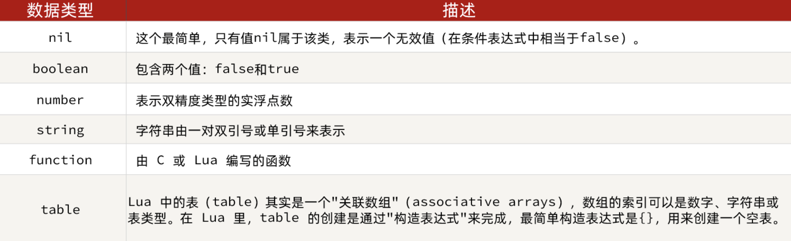
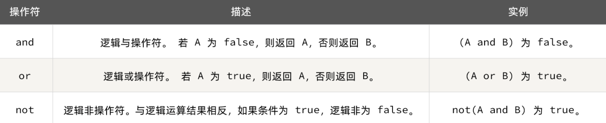

# 1. 概述

> Lua 是一种轻量小巧的脚本语言，用标准C语言编写并以源代码形式开放， 其设计目的是为了嵌入应用程序中，从而为应用程序提供灵活的扩展和定制功能。官网：https://www.lua.org/

# 2. HelloWorld

> centos7上默认安装lua运行环境。

创建文件：`touch test.lua`

输入内容：`vi test.lua`

```lua
print("hello World!")
```

运行测试文件：`lua test.lua`

# 3. 基础语法

## 3.1 数据类型

常见数据类型：


`type(字面量值|变量)`：判断字面量值或变量的类型

## 3.2 变量声明

Lua声明变量的时候无需指定数据类型，而是用local来声明变量为局部变量：

```lua
-- 声明字符串，可以用单引号或双引号，
local str = 'hello'
-- 字符串拼接可以使用 ..
local str2 = 'hello' .. 'world'
-- 声明数字
local num = 21
-- 声明布尔类型
local flag = true
```

声明数组和table：

```lua
-- 声明数组 ，key为角标的 table
local arr = { 'java', 'python', 'lua' }
-- 声明table，类似java的map
local map = { name = 'Jack', age = 21 }
```

Lua中的数组角标是从1开始，访问的时候与Java中类似：

```lua
-- 访问数组，lua数组的角标从1开始
print(arr[1])
```

Lua中的table可以用key来访问：

```lua
-- 访问table
print(map['name'])
print(map.name)
```

## 3.3 循环

遍历数组：

```lua
-- 声明数组
local arr = { 'java', 'python', 'lua' }
-- 遍历数组
for index, value in ipairs(arr) do
    print(index, value)
end
```

遍历普通table：

```lua
-- 声明map，也就是table
local map = { name = 'Jack', age = 21 }
-- 遍历table
for key, value in pairs(map) do
    print(key, value)
end
```

## 3.4 条件判断

语法：

```lua
if (布尔表达式)
then
    --[ 布尔表达式为 true 时执行该语句块 --]
else
    --[ 布尔表达式为 false 时执行该语句块 --]
end
```

表达式中的逻辑运算符用的不是符号，而是单词：



## 3.5 函数

函数语法：

```lua
function 函数名(argument1, argument2, ..., argumentn)
    -- 函数体
    return 返回值
end
```

示例：

```lua
function printArr(arr)
    for index, value in ipairs(arr) do
        print(value)
    end
end
```


