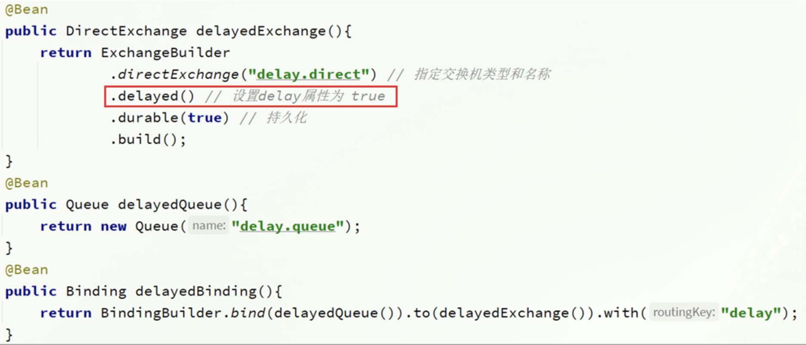

# 1. 消息可靠性

其中的每一步都可能导致消息丢失，常见的丢失原因包括：

- 发送时丢失：
    - 生产者发送的消息未送达exchange
    - 消息到达exchange后未到达queue
- MQ宕机，queue将消息丢失
- consumer接收到消息后未消费就宕机

针对这些问题，RabbitMQ分别给出了解决方案：

- 生产者确认机制
- mq持久化
- 消费者确认机制
- 失败重试机制

## 1.1 生产者确认机制

> RabbitMQ提供了publisher confirm机制来避免消息发送到MQ过程中丢失。这种机制必须给每个消息指定一个**唯一ID**。消息发送到MQ以后，会返回一个结果给发送者，表示消息是否处理成功。

返回结果有两种方式：

- publisher-confirm，发送者确认
    - 消息成功投递到交换机，返回ack
    - 消息未投递到交换机，返回nack
- publisher-return，发送者回执
    - 消息投递到交换机了，但是没有路由到队列。返回ACK，及路由失败原因。

示例：

```yaml
server:
  port: 12491

spring:
  application:
    name: mall-logistics
  rabbitmq:
    host: 127.0.0.1 # 主机名
    port: 5672 # 端口
    virtual-host: / # 虚拟主机
    username: admin # 用户名
    password: admin # 密码
    publisher-confirm-type: correlated  #开启publisher-confirm
    publisher-returns: true #开启publish-return功能
    template:
      mandatory: true #定义消息路由失败时的策略。true，则调用ReturnCallback；false：则直接丢弃消息
```

```java
// 定义returns回执方法
@Slf4j
@Configuration
public class CommonConfig implements ApplicationContextAware {
    @Override
    public void setApplicationContext(ApplicationContext applicationContext) throws BeansException {
        // 获取RabbitTemplate
        RabbitTemplate rabbitTemplate = applicationContext.getBean(RabbitTemplate.class);
        // 设置ReturnCallback
        rabbitTemplate.setReturnCallback((message, replyCode, replyText, exchange, routingKey) -> {
            // 投递失败，记录日志
            log.info("消息发送失败，应答码{}，原因{}，交换机{}，路由键{},消息{}",
                    replyCode, replyText, exchange, routingKey, message.toString());
            // 如果有业务需要，可以重发消息
        });
    }
}
```

```java
// confirm发送确认
@SpringBootTest
public class LogisticsAppTest {

    @Autowired
    private RabbitTemplate rabbitTemplate;

    public void testSendMessage2SimpleQueue() throws InterruptedException {
        // 1.消息体
        String message = "hello, spring amqp!";
        // 2.全局唯一的消息ID，需要封装到CorrelationData中
        CorrelationData correlationData = new CorrelationData(UUID.randomUUID().toString());
        // 3.添加callback
        correlationData.getFuture().addCallback(
                result -> {
                    if (result.isAck()) {
                        // 3.1.ack，消息成功
                        log.debug("消息发送成功, ID:{}", correlationData.getId());
                    } else {
                        // 3.2.nack，消息失败
                        log.error("消息发送失败, ID:{}, 原因{}", correlationData.getId(), result.getReason());
                    }
                },
                ex -> log.error("消息发送异常, ID:{}, 原因{}", correlationData.getId(), ex.getMessage())
        );
        // 4.发送消息
        rabbitTemplate.convertAndSend("task.direct", "task", message, correlationData);

        // 休眠一会儿，等待ack回执
        Thread.sleep(2000);
    }
}
```

## 1.2 消息持久化

> 生产者确认可以确保消息投递到RabbitMQ的队列中，但是消息发送到RabbitMQ以后，如果突然宕机，也可能导致消息丢失。
> 要想确保消息在RabbitMQ中安全保存，必须开启消息持久化机制。

- 交换机持久化
- 队列持久化
- 消息持久化

### 1.2.1 交换机持久化

> RabbitMQ中交换机默认是非持久化的，mq重启后就丢失。

```java
// SpringAMQP
@Configuration
public class CommonConfig {
    @Bean
    public DirectExchange simpleExchange() {
        // 三个参数：交换机名称、是否持久化、当没有queue与其绑定时是否自动删除
        return new DirectExchange("simple.direct", true, false);
    }
}
```

**事实上，默认情况下，由SpringAMQP声明的交换机都是持久化的。**

### 1.2.2 队列持久化

> RabbitMQ中队列默认是非持久化的，mq重启后就丢失。

```java
// SpringAMQP
@Configuration
public class CommonConfig {
    @Bean
    public Queue simpleQueue() {
        // 使用QueueBuilder构建队列，durable就是持久化的
        return QueueBuilder.durable("simple.queue").build();
    }
}
```

**事实上，默认情况下，由SpringAMQP声明的队列都是持久化的。**

### 1.2.3 消息持久化

利用SpringAMQP发送消息时，可以设置消息的属性（MessageProperties），指定delivery-mode：

- 1：非持久化
- 2：持久化

**默认情况下，SpringAMQP发出的任何消息都是持久化的，不用特意指定。**

## 1.3 消费者确认

> RabbitMQ是**阅后即焚**机制，RabbitMQ确认消息被消费者消费后会立刻删除。
> 而RabbitMQ是通过消费者回执来确认消费者是否成功处理消息的：消费者获取消息后，应该向RabbitMQ发送ACK回执，表明自己已经处理消息。

SpringAMQP支持的三种模式：

1. manual：手动ack，需要在业务代码结束后，调用api发送ack。
2. auto：自动ack，由spring监测listener代码是否出现异常，没有异常则返回ack；抛出异常则返回nack。
3. none：关闭ack，MQ假定消费者获取消息后会成功处理，因此消息投递后立即被删除。

默认消费者确认是开启的：

```yaml
spring:
  rabbitmq:
    listener:
      simple:
        acknowledge-mode: none # 关闭ack
```

1. 消息被读取，未被确认处于`unacked`状态。


2. 爬出异常后消息并未被删除，处于`Ready`状态


## 1.4 消息失败重试

> 当消费者出现异常后，消息会不断requeue（重入队）到队列，再重新发送给消费者，然后再次异常，再次requeue，无限循环，导致mq的消息处理飙升，带来不必要的压力.

开启本地重试：

```yaml
spring:
  rabbitmq:
    listener:
      simple:
        retry:
          enabled: true # 开启消费者失败重试
          initial-interval: 1000 # 初识的失败等待时长为1秒
          multiplier: 1 # 失败的等待时长倍数，下次等待时长 = multiplier * last-interval
          max-attempts: 3 # 最大重试次数
          stateless: true # true无状态；false有状态。如果业务中包含事务，这里改为false
```

### 1.4.1 重试失败策略

> 重试失败后消息会被直接丢弃，但有时需求并不能这样处理。

- RejectAndDontRequeueRecoverer：重试耗尽后，直接reject，丢弃消息。默认就是这种方式
- ImmediateRequeueMessageRecoverer：重试耗尽后，返回nack，消息重新入队
- RepublishMessageRecoverer：重试耗尽后，将失败消息投递到指定的交换机

```java
// 示例
@Configuration
public class ErrorMessageConfig {
    @Bean
    public DirectExchange errorMessageExchange() {
        return new DirectExchange("error.direct");
    }

    @Bean
    public Queue errorQueue() {
        return new Queue("error.queue", true);
    }

    @Bean
    public Binding errorBinding(Queue errorQueue, DirectExchange errorMessageExchange) {
        return BindingBuilder.bind(errorQueue).to(errorMessageExchange).with("error");
    }

    @Bean
    public MessageRecoverer republishMessageRecoverer(RabbitTemplate rabbitTemplate) {
        return new RepublishMessageRecoverer(rabbitTemplate, "error.direct", "error");
    }
}
```

# 2. 死信交换机

## 2.1 死信交换机

产生原因：

- 消息被消费者reject或者返回nack。
- 消息超时未消费。
- 队列满了。

**可以为队列绑定死信交换机，当消息出现死信后就会被发送给死信队列，当死信队列绑定队列时，消息将进入队列。**

```java

@Configuration
public class ErrorMessageConfig {
    // 声明普通的 simple.queue队列，并且为其指定死信交换机：dl.direct
    @Bean
    public Queue simpleQueue2() {
        return QueueBuilder.durable("simple.queue") // 指定队列名称，并持久化
                .deadLetterExchange("dl.direct") // 指定死信交换机
                .build();
    }

    // 声明死信交换机 dl.direct
    @Bean
    public DirectExchange dlExchange() {
        return new DirectExchange("dl.direct", true, false);
    }

    // 声明存储死信的队列 dl.queue
    @Bean
    public Queue dlQueue() {
        return new Queue("dl.queue", true);
    }

    // 将死信队列 与 死信交换机绑定
    @Bean
    public Binding dlBinding() {
        return BindingBuilder.bind(dlQueue()).to(dlExchange()).with("simple");
    }
}
```

## 2.2 TTL

> 一个消息被设置超时时，在规定时间未被消费，就会进入死信队列。

- 消息设置超市时长
- 队列设置超市时长

```java
public class rabbitMqTest {
    // 死刑队列
    @RabbitListener(bindings = @QueueBinding(
            value = @Queue(name = "dl.ttl.queue", durable = "true"),
            exchange = @Exchange(name = "dl.ttl.direct"),
            key = "ttl"
    ))
    public void listenDlQueue(String msg) {
        log.info("接收到 dl.ttl.queue的延迟消息：{}", msg);
    }
}
```

```java

@Configuration
public class RabbitMqConfig {
    // 队列设置超市时长
    @Bean
    public Queue ttlQueue() {
        return QueueBuilder.durable("ttl.queue") // 指定队列名称，并持久化
                .ttl(10000) // 设置队列的超时时间，10秒
                .deadLetterExchange("dl.ttl.direct") // 指定死信交换机
                .build();
    }
}
```

```java
// 声明交换机并与队列绑定
@Configuration
public class RabbitMqConfig {
    @Bean
    public DirectExchange ttlExchange() {
        return new DirectExchange("ttl.direct");
    }

    @Bean
    public Binding ttlBinding() {
        return BindingBuilder.bind(ttlQueue()).to(ttlExchange()).with("ttl");
    }
}
```

```java
public class RabbitMqTest {
    @Test
    public void testTTLQueue() {
        // 创建消息
        String message = "hello, ttl queue";
        // 消息ID，需要封装到CorrelationData中
        CorrelationData correlationData = new CorrelationData(UUID.randomUUID().toString());
        // 发送消息
        rabbitTemplate.convertAndSend("ttl.direct", "ttl", message, correlationData);
        // 记录日志
        log.debug("发送消息成功");
    }
}
```

> 消息设置超时时长

```java
public class RabbitMqTest {
    @Test
    public void testTTLMsg() {
        // 创建消息
        Message message = MessageBuilder
                .withBody("hello, ttl message".getBytes(StandardCharsets.UTF_8))
                .setExpiration("5000")
                .build();
        // 消息ID，需要封装到CorrelationData中
        CorrelationData correlationData = new CorrelationData(UUID.randomUUID().toString());
        // 发送消息
        rabbitTemplate.convertAndSend("ttl.direct", "ttl", message, correlationData);
        log.debug("发送消息成功");
    }
}
```

**队列和消息都设置超时时长，任意到规定时间都会变成死信。**

## 2.3 延迟队列

> 利用TTL结合死信交换机，我们实现了消息发出后，消费者延迟收到消息的效果。这种消息模式就称为延迟队列（Delay Queue）模式。

延迟队列的使用场景包括：

- 延迟发送短信
- 用户下单，如果用户在15 分钟内未支付，则自动取消
- 预约工作会议，20分钟后自动通知所有参会人员

**官网退出的插件 [scheduling插件](https://blog.rabbitmq.com/posts/2015/04/scheduling-messages-with-rabbitmq)**

实现：

- 声明一个交换机，添加delayed属性为true。
- 发送消息时，添加x-delay头，值为超时时间。

申明交换机：


或


发送消息：


## 3. 惰性队列

消息堆积问题：

当队列消费者速度小于生产者，这是消息就会发生堆积，直到队列堆积满，后面消息变成死信，就会被丢弃或者直接被丢弃。

解决堆积问题：

扩大消费者是一个方法，但是大量消息占用内存是不可取的。rabbitmq在3.6后推出懒惰队列，将消息直接存到磁盘中，需要消费时才读取并消费，支持数百万条的消息存储。

### 3.1 设置方法一

命令行设置：`rabbitmqctl set_policy Lazy "^lazy-queue$" '{"queue-mode":"lazy"}' --apply-to queues  `
- `rabbitmqctl` ：RabbitMQ的命令行工具
- `set_policy` ：添加一个策略
- `Lazy` ：策略名称，可以自定义
- `"^lazy-queue$"` ：用正则表达式匹配队列的名字
- `'{"queue-mode":"lazy"}'` ：设置队列模式为lazy模式
- `--apply-to queues  `：策略的作用对象，是所有的队列

### 3.1 设置方法二


### 3.1 设置方法三


