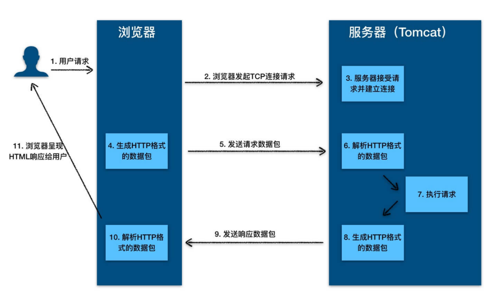
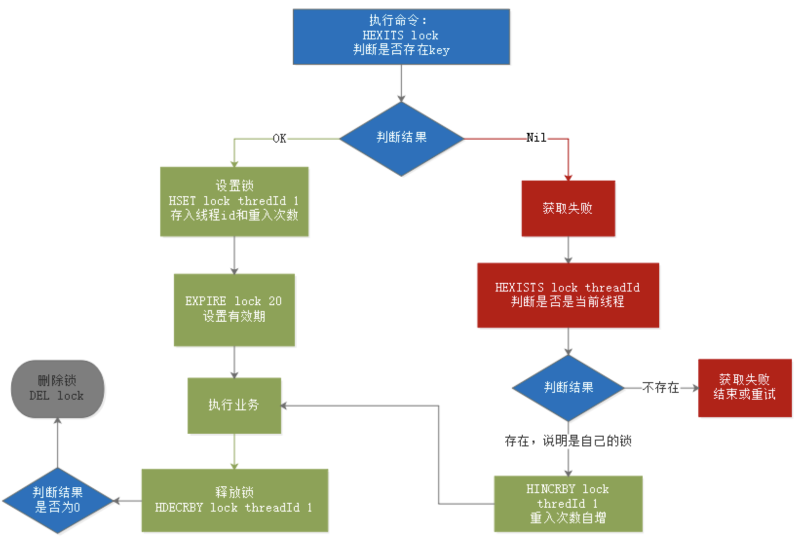
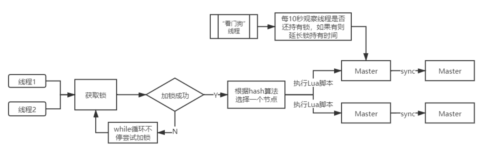

知识点的概述总结

---

# 一、网络

## 1. HTTP

### 1.1 HTTP服务器工作原理（用户通过浏览器输入网站回车后发生了什么）

1. ⽤户通过浏览器进⾏了⼀个操作，⽐如输⼊⽹址并回⻋，或者是点击链接，接着浏览器获取了这个事件。
2. 浏览器向服务端发出 TCP 连接请求。
3. 服务程序接受浏览器的连接请求，并经过 TCP 三次握⼿建⽴连接。
4. 浏览器将请求数据打包成⼀个 HTTP 协议格式的数据包。
5. 浏览器将该数据包推⼊⽹络，数据包经过⽹络传输，最终达到端服务程序。
6. 服务端程序拿到这个数据包后，同样以 HTTP 协议格式解包，获取到客户端的意图。
7. 得知客户端意图后进⾏处理，⽐如提供静态⽂件或者调⽤服务端程序获得动态结果。
8. 服务器将响应结果（可能是 HTML 或者图⽚等）按照 HTTP 协议格式打包。
9. 服务器将响应数据包推⼊⽹络，数据包经过⽹络传输最终达到到浏览器。
10. 浏览器拿到数据包后，以 HTTP 协议的格式解包，然后解析数据，假设这⾥的数据是 HTML。
11. 浏览器将 HTML ⽂件展示在⻚⾯上。

# 二、JavaWeb

## 1. Servlet

### 1.1 什么是Servlet

Servlet 指的是任何实现了 Servlet 接⼝的类。Servlet 主要⽤于处理客户端传来的HTTP 请求，并返回⼀个响应。

# 三、Web容器

## 1. Tomcat

### 1.1 什么是Tomcat

Tomcat就是⼀个Servlet容器，同时具有HTTP服务器的功能。因此Tomcat就是⼀个“HTTP服务器+Servlet容器”，我们也叫它**Web容器**。

- HTTP服务器：处理HTTP请求并响应结果。
- Servlet容器：HTTP服务器将请求交给Servlet容器处理，Servlet容器会将请求转发到具体的Servlet（Servlet容器⽤来加载和管理业务类）

### 1.2 Tomcat如何创建Servlet的

当容器启动时，会读取在 webapps ⽬录下所有的 web 应⽤中的 web.xml ⽂件，然后对 xml ⽂件进⾏解析，并读取 servlet 注册信息。然后，将每个应⽤中
注册的 Servlet 类都进⾏加载，并通过 反射的⽅式实例化。（有时候也是在第⼀次请求时实例化）。

`<load-on-startup>`元素是` <servlet> `元素的⼀个⼦元素，它⽤于指定Servlet被加载的时机和顺序。在 `<load-on-startup>` 元素中，设置的值
必须是⼀个整数。如果这个值是⼀个负数，或者没有设定这个元素，Servlet容器将在客户端⾸次请求这个 Servlet 时加载它;如果这个值是正整数或
0，Servlet
容器将在 Web 应⽤启动时加载并初始化 Servlet，并且` <load-on-startup> `的值越⼩，它对应的Servlet 就越先被加载。

### 1.3 Tomcat文件目录

- /bin：存放 Windows 或 Linux 平台上启动和关闭 Tomcat 的脚本⽂件。
- /conf：存放 Tomcat 的各种全局配置⽂件，其中最重要的是 server.xml。
- /lib：存放 Tomcat 以及所有 Web 应⽤都可以访问的 JAR ⽂件。
- /logs：存放 Tomcat 执⾏时产⽣的⽇志⽂件。
- /work：存放 JSP 编译后产⽣的 Class ⽂件。
- /webapps：Tomcat 的 Web 应⽤⽬录，默认情况下把 Web 应⽤放在这个⽬录下。

# 四、Redis

## 1. 分布式锁

### 1.1 Redis实现

基本与原理：

- 多进程可见：多进程可见，否则就无法实现分布式效果
- 避免死锁：死锁的情况有很多，我们要思考各种异常导致死锁的情况，保证锁可以被释放
- 排它：同一时刻，只能有一个进程获得锁
- 高可用：避免锁服务宕机或处理好宕机的补救措施

分布式锁原理：

1. 根据独特信息到hash类型数据中查询是否存在此锁。
2. 线程信息不存在表示可以获得锁，进行下一步，否则进行第6步。
3. 设置线程信息表示获得锁，并设置重入次数和失效时间。
4. 执行业务。
5. 释放锁，重入锁的释放重入次数减一，无重入直接删除。
6. 判断释放为当前线程持有锁。不存在则失败或重试。
7. 存在则表示是自己的锁，这是就在重入数值进行加一，然后去执行第4步骤。

存在问题及解决方法：

- 产生死锁：设置锁的失效时间。
- 删除他人锁：设置信息时使用独特信息，删除（释放）锁时进行判断。（这一步骤存在非原子性操作，需要使用Lua脚本）
- 锁续期：（redisson看门狗机制）获得锁线程开启守护线程，快到失效时间如果业务线程还未完成就进行续期。
- 重入锁：通过设置重入次数来进行锁的可重入性。

### 1.2 Redisson实现

# 五、Spring

## 1. Spring三级缓存（循环以来解决方法）

