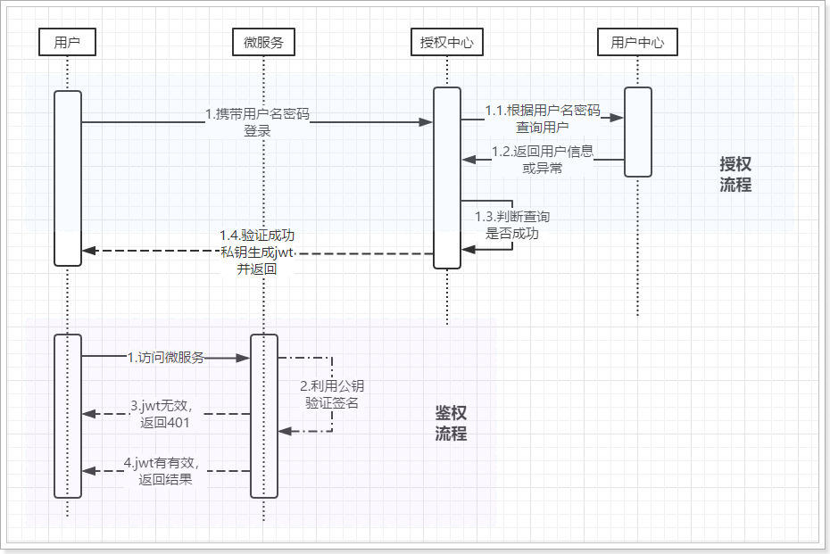

# JWT
Json Web Token是JSON风格轻量级的授权和身份认证规范，可实现无状态、分布式的Web应用授权。

# 数据格式
1. 头部header：对头部base64加密，可解密。
   1. 声明类型
   2. 签名算法
2. 载荷payload：base64加密，可解密
   1. 用户信息：base64加密，可解密
   2. tokenID：jwt唯一表示
   3. 注册声明：token签发时间、签发人和过期时间
3. 签名Signature：签名，是整个数据的认证信息。一般根据前两步的数据，再加上服务的的密钥（secret）（不要泄漏，最好周期性更换），通过加密算法生成。用于验证整个数据完整和可靠性

# JWT授权登录流程

# 非对称加密验签
非对称加密算法RSA：
- 同时生成两个秘钥：公钥和私钥
  - 公钥加密：私钥可破解
  - 私钥加密：公钥和私钥可破解
- 安全，难以破解
- 计算量较大

改变的签名和验签流程：
- 生成RSA密钥对，私钥存放在授权中心，公钥下发给微服务
- 在授权中心利用私钥对JWT签名
- 在微服务利用公钥验证签名有效性

# JWT示例
[auth](https://github.com/xiaoyu2017/ExampleCode/tree/master/auth)