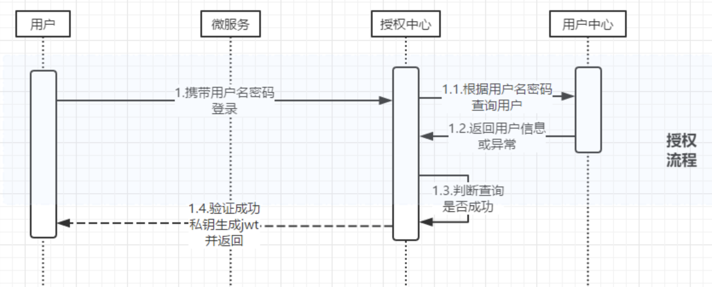
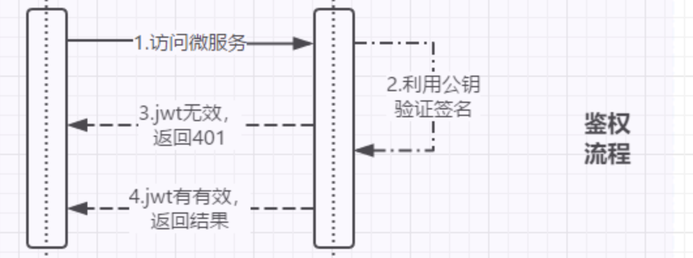

授权中心的主要职责：

- 用户登录鉴权：
    - 接收用户的登录请求，
    - 通过用户中心的接口校验用户名密码
    - 使用私钥生成JWT并返回
- 用户登录状态校验
    - 判断用户是否登录，其实就是token的校验
- 用户登出
    - 用户选择退出登录后，要让token失效
- 用户登录状态刷新
    - 用户登录一段时间后，JWT可能过期，需要刷新有效期

# 1. 实现无状态流程

1. 第一次请求，验证用户信息
2. 验证通过，对用户信息进行加密生成token，返回给客户端，当成凭证。
3. 之后访问都携带凭证。
4. 服务进行解密，判断是否有效。

**token采用JWT+RSA非对称加密**

# 2. JWT了解使用

JWT包含三部分数据：

- Header：头部，通常头部有两部分信息：
    - 声明类型，这里是JWT
    - 签名算法，自定义
      我们会对头部进行base64加密（可解密），得到第一部分数据

- Payload：载荷，就是有效数据，一般包含下面信息：
    - 用户身份信息（注意，这里因为采用base64加密，可解密，因此不要存放敏感信息）
    - tokenID：当前这个JWT的唯一标示
    - 注册声明：如token的签发时间，过期时间，签发人等
      这部分也会采用base64加密，得到第二部分数据

- Signature：签名，是整个数据的认证信息。一般根据前两步的数据，再加上服务的的密钥（secret）（不要泄漏，最好周期性更换），通过加密算法生成。
  用于验证整个数据完整和可靠性

# 3. RSA非对称加密

- 基本原理：同时生成两把密钥：私钥和公钥，私钥隐秘保存，公钥可以下发给信任客户端
    - 私钥加密，持有私钥或公钥才可以解密
    - 公钥加密，持有私钥才可解密
- 优点：安全，难以破解
- 缺点：算法比较耗时

# 4. 授权大致流程

# 5. 刷新Token

cookie即将到期时，重新生成一个token。比如token有效期为30分钟，当用户请求我们时，我们可以判断如果用户的token有效期还剩下15分钟，那么就重新生成token，可以看做上面两种的折中方案。

# 6. Token失效设置

因为是无状态登录，就不存在session删除来失效。

可以通过失效token黑名单来实现：

- 用户进行注销类型操作时（比如退出、修改密码），校验token有效性，并解析token信息
- 把token的id存入redis，并设置有效期为token的剩余有效期
- 校验用户登录状态的接口，除了要正常逻辑外，还必须判断token的id是否存在于redis
- 如果存在，则证明token无效；如果不存在，则证明有效

# 7. 鉴权

