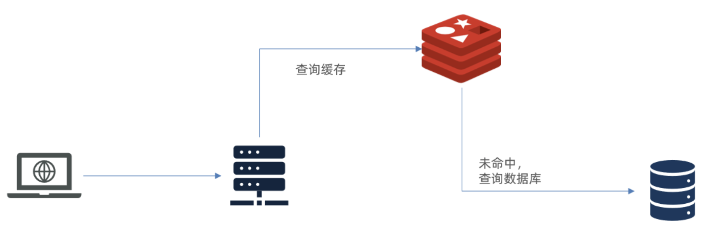
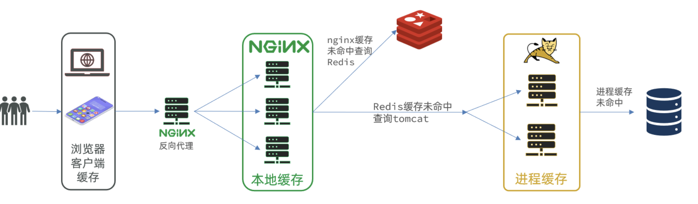

# 1. 多级缓存概述

## 1.1 传统缓存

> 传统缓存策略一般是请求到达Tomcat后，先查询Redis，如果未命中则查询数据库。



存在问题：

- 请求要经过Tomcat处理，Tomcat的性能成为整个系统的瓶颈
- Redis缓存失效时，会对数据库产生冲击

## 1.2 多级缓存

> 多级缓存就是充分利用请求处理的每个环节，分别添加缓存，减轻Tomcat压力，提升服务性能。

- 浏览器访问静态资源时，优先读取浏览器本地缓存
- 访问非静态资源（ajax查询数据）时，访问服务端
- 请求到达Nginx后，优先读取Nginx本地缓存
- 如果Nginx本地缓存未命中，则去直接查询Redis（不经过Tomcat）
- 如果Redis查询未命中，则查询Tomcat
- 请求进入Tomcat后，优先查询JVM进程缓存
- 如果JVM进程缓存未命中，则查询数据库



# 2. Jvm缓存（Caffeine）

> **Caffeine**是一个基于Java8开发的，提供了近乎最佳命中率的高性能的本地缓存库。目前Spring内部的缓存使用的就是Caffeine。GitHub地址：https://github.com/ben-manes/caffeine

## 2.1 基本示例

```java
public class ProjectTest {
    @Test
    public void testBasicOps() {
        // 构建cache对象
        Cache<String, String> cache = Caffeine.newBuilder().build();

        // 存数据
        cache.put("gf", "迪丽热巴");

        // 取数据
        String gf = cache.getIfPresent("gf");
        System.out.println("gf = " + gf);

        // 取数据，包含两个参数：
        // 参数一：缓存的key
        // 参数二：Lambda表达式，表达式参数就是缓存的key，方法体是查询数据库的逻辑
        // 优先根据key查询JVM缓存，如果未命中，则执行参数二的Lambda表达式
        String defaultGF = cache.get("defaultGF", key -> {
            // 根据key去数据库查询数据
            return "柳岩";
        });
        System.out.println("defaultGF = " + defaultGF);
    }
}
```

## 2.2 缓存清除策略

**基于容量**：设置缓存的数量上限

```java
// 创建缓存对象
Cache<String, String> cache=Caffeine.newBuilder()
        .maximumSize(1) // 设置缓存大小上限为 1
        .build();
```

**基于时间**：设置缓存的有效时间

```java
// 创建缓存对象
Cache<String, String> cache=Caffeine.newBuilder()
        // 设置缓存有效期为 10 秒，从最后一次写入开始计时 
        .expireAfterWrite(Duration.ofSeconds(10))
        .build();
```

**基于引用**：设置缓存为软引用或弱引用，利用GC来回收缓存数据。性能较差，不建议使用。


> **注意**：在默认情况下，当一个缓存元素过期的时候，Caffeine不会自动立即将其清理和驱逐。而是在一次读或写操作后，或者在空闲时间完成对失效数据的驱逐。

## 2.3 实现JVM缓存

配置两个缓存：

```java

@Configuration
public class CaffeineConfig {
    @Bean
    public Cache<Long, Item> itemCache() {
        return Caffeine.newBuilder()
                .initialCapacity(100)
                .maximumSize(10_000)
                .build();
    }

    @Bean
    public Cache<Long, ItemStock> stockCache() {
        return Caffeine.newBuilder()
                .initialCapacity(100)
                .maximumSize(10_000)
                .build();
    }
}
```

添加缓存逻辑：

```java

@RestController
@RequestMapping("item")
public class ItemController {

    @Autowired
    private IItemService itemService;
    @Autowired
    private IItemStockService stockService;
    @Autowired
    private Cache<Long, Item> itemCache;
    @Autowired
    private Cache<Long, ItemStock> stockCache;

    @GetMapping("/{id}")
    public Item findById(@PathVariable("id") Long id) {
        // 根据id到缓存中查找，不存在再调用itemService方法进行查询
        return itemCache.get(id, key -> itemService.query()
                .ne("status", 3).eq("id", key)
                .one()
        );
    }

    @GetMapping("/stock/{id}")
    public ItemStock findStockById(@PathVariable("id") Long id) {
        return stockCache.get(id, key -> stockService.getById(key));
    }
}
```

# 3. 多级缓存实现

> 多级缓存的实现离不开Nginx编程，而Nginx编程又离不开OpenResty。

## 3.1 OpenResty

OpenResty® 是一个基于 Nginx的高性能 Web 平台，用于方便地搭建能够处理超高并发、扩展性极高的动态 Web 应用、Web 服务和动态网关。具备下列特点：

- 具备Nginx的完整功能
- 基于Lua语言进行扩展，集成了大量精良的 Lua 库、第三方模块
- 允许使用Lua**自定义业务逻辑**、**自定义库**

官方网站： https://openresty.org/cn/

### 3.1.1 安装


